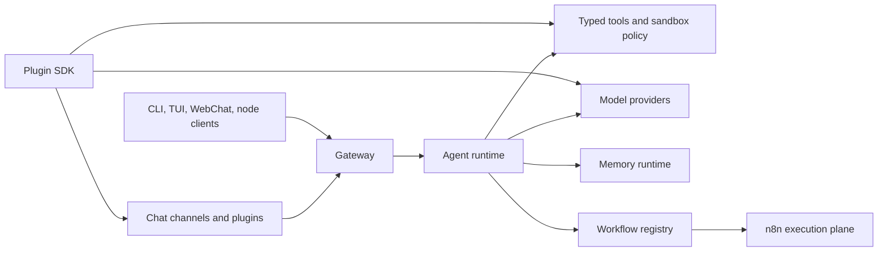

# 🦀 CrawClaw

<p align="center">
  
</p>

<p align="center">
  English · <a href="./README.zh-CN.md">简体中文</a>
</p>

<p align="center">
  <a href="https://github.com/qianleigood/crawclaw/actions/workflows/ci.yml?branch=main"></a>
  <a href="https://github.com/qianleigood/crawclaw/releases"></a>
  <a href="https://www.npmjs.com/package/crawclaw"></a>
  <a href="LICENSE"></a>
</p>

**CrawClaw** is a local-first Gateway for AI agents. It connects messaging
channels, Gateway clients, memory, workflows, host tools, model providers, and
plugins through one runtime you control.

Use it when you want an always-available assistant that can be reached from chat
apps, a terminal UI, WebChat, node integrations, or repeatable workflows while
keeping configuration and runtime state on your own machine.

## Quick Start

Requirements:

- Node **24** recommended
- Node **22.14+** supported
- A model provider account or API key

Install from npm:

```bash
npm install -g crawclaw@latest
```

Run onboarding and install the local Gateway service:

```bash
crawclaw onboard --install-daemon
```

Check the Gateway and open the terminal UI:

```bash
crawclaw gateway status
crawclaw tui
```

Useful docs:

- [Getting Started](https://docs.crawclaw.ai/start/getting-started)
- [Install Overview](https://docs.crawclaw.ai/install)
- [Node.js Install](https://docs.crawclaw.ai/install/node)
- [Channels](https://docs.crawclaw.ai/channels)
- [Model Providers](https://docs.crawclaw.ai/providers)

## Docker Quick Start

Docker is optional. Use it when you want an isolated Gateway container or a
server-style deployment.

From the repo root:

```bash
./scripts/docker/setup.sh
```

That script builds or pulls the image, runs onboarding, writes the Gateway token
state, and starts Docker Compose.

To use the published image:

```bash
export CRAWCLAW_IMAGE="ghcr.io/crawclaw/crawclaw:latest"
./scripts/docker/setup.sh
```

Then open the terminal UI through the CLI container:

```bash
docker compose run --rm crawclaw-cli tui
```

Docker docs:

- [Docker Install](https://docs.crawclaw.ai/install/docker)
- [Docker VM Runtime](https://docs.crawclaw.ai/install/docker-vm-runtime)
- [Sandboxing](https://docs.crawclaw.ai/gateway/sandboxing)

## What CrawClaw Provides

- **Self-hosted Gateway**: one long-running process owns sessions, auth,
  routing, client connections, channel events, and Gateway APIs.
- **Multi-channel messaging**: built-in and plugin-backed channels can connect
  chat apps such as WhatsApp, Telegram, Discord, iMessage, Slack, Matrix, and
  more.
- **Agent runtime**: model calls, streaming, tool calls, subagents, special
  agents, sandboxing, and execution visibility run behind the Gateway.
- **Memory runtime**: durable memory, session summaries, compaction, recall
  planning, and prompt assembly are first-class runtime services.
- **Workflow system**: CrawClaw authors, versions, diffs, and controls workflow
  specs; n8n is used as the durable execution plane.
- **Typed tool substrate**: file operations, shell execution, browser actions,
  media, web, messaging, Gateway operations, and plugin tools are registered as
  typed, policy-controlled tools.
- **Plugin ecosystem**: plugins can add channels, providers, tools, skills,
  browser backends, media capabilities, and setup flows through documented SDK
  contracts.

## Architecture



The central boundary is the **Gateway**. Clients and channels talk to it; the
agent runtime sits behind it; memory, workflows, plugins, and tools integrate
through explicit runtime seams.

### Gateway

The Gateway is the control plane. It owns WebSocket and HTTP surfaces, auth,
pairing, health, sessions, routing, channel events, Gateway clients, and tool
invocation APIs.

Start here:

- [src/gateway](src/gateway)
- [Gateway Architecture](https://docs.crawclaw.ai/concepts/architecture)
- [Gateway Runbook](https://docs.crawclaw.ai/gateway)
- [Gateway Protocol](https://docs.crawclaw.ai/gateway/protocol)

### Agent Runtime

The agent runtime owns model/provider execution, tool registration, subagent
orchestration, special agents, sandboxed execution, streaming glue, and
execution-event emission.

Start here:

- [src/agents](src/agents)
- [src/agents/crawclaw-tools.runtime.ts](src/agents/crawclaw-tools.runtime.ts)
- [src/agents/tools](src/agents/tools)
- [Agent Loop](https://docs.crawclaw.ai/concepts/agent-loop)
- [Tools](https://docs.crawclaw.ai/tools)

### Memory Runtime

Memory is a runtime service, not only a vector-search adapter. It owns context
assembly, compaction, durable extraction and recall, session summaries,
experience recall planning, and maintenance flows.

Start here:

- [src/memory](src/memory)
- [src/memory/engine/memory-runtime.ts](src/memory/engine/memory-runtime.ts)
- [src/memory/orchestration/context-assembler.ts](src/memory/orchestration/context-assembler.ts)
- [Memory Concept](https://docs.crawclaw.ai/concepts/memory)
- [Memory Config](https://docs.crawclaw.ai/reference/memory-config)

### Workflow System

The workflow boundary is deliberate: CrawClaw owns workflow authoring,
versioning, registry operations, visibility, and agent-facing control. n8n owns
durable trigger and execution behavior.

Start here:

- [src/workflows](src/workflows)
- [src/workflows/api.ts](src/workflows/api.ts)
- [src/workflows/n8n-client.ts](src/workflows/n8n-client.ts)
- [src/agents/tools/workflow-tool.ts](src/agents/tools/workflow-tool.ts)
- [n8n Workflow Architecture](https://docs.crawclaw.ai/reference/n8n-workflow-architecture)
- [Learning Loop](https://docs.crawclaw.ai/concepts/learning-loop)

### Plugin And Tool Boundary

Plugins extend CrawClaw without importing core internals. The public boundary is
the plugin SDK, manifest metadata, setup/runtime helpers, and documented
contracts. Tools remain typed and policy-controlled even when they come from
plugins.

Start here:

- [src/plugins](src/plugins)
- [src/plugin-sdk](src/plugin-sdk)
- [extensions](extensions)
- [Plugin Architecture](https://docs.crawclaw.ai/plugins/architecture)
- [Building Plugins](https://docs.crawclaw.ai/plugins/building-plugins)
- [Plugin SDK Overview](https://docs.crawclaw.ai/plugins/sdk-overview)

## Repository Map

| Path                               | Purpose                                                                                     |
| ---------------------------------- | ------------------------------------------------------------------------------------------- |
| [src/gateway](src/gateway)         | Gateway control plane, protocol, auth, health, pairing, and runtime services                |
| [src/agents](src/agents)           | Agent runtime, tools, subagents, sandboxing, provider integration, and execution events     |
| [src/memory](src/memory)           | Durable memory, session summaries, recall, context assembly, and maintenance flows          |
| [src/workflows](src/workflows)     | Workflow registry, versioning, n8n bridge, execution records, and action feed projection    |
| [src/channels](src/channels)       | Core channel implementation details behind the channel/plugin boundary                      |
| [src/plugins](src/plugins)         | Plugin discovery, manifest validation, loader, registry, and contract enforcement           |
| [src/plugin-sdk](src/plugin-sdk)   | Public SDK surface for plugin-facing contracts                                              |
| [extensions](extensions)           | Bundled plugin packages for channels, providers, browser backends, and runtime capabilities |
| [packages](packages)               | Support packages used by the workspace                                                      |
| [skills](skills)                   | Shipped runtime skills                                                                      |
| [skills-optional](skills-optional) | Optional skill catalog content                                                              |
| [docs](docs)                       | Mintlify documentation source                                                               |
| [test](test)                       | Shared test infrastructure and fixtures                                                     |
| [scripts](scripts)                 | Build, install, Docker, release, and maintenance scripts                                    |

Maintainer structure notes:

- [Repository Structure](https://docs.crawclaw.ai/maintainers/repo-structure)
- [Skills Catalog](https://docs.crawclaw.ai/maintainers/skills-catalog)

## Development

Install dependencies:

```bash
pnpm install
```

Run the CLI from source:

```bash
pnpm crawclaw --help
pnpm crawclaw gateway status
```

Common local gates:

```bash
pnpm check
pnpm test
pnpm build
```

Docs-only checks:

```bash
pnpm check:docs
pnpm docs:check-links
```

More detail:

- [Testing](https://docs.crawclaw.ai/help/testing)
- [CLI Reference](https://docs.crawclaw.ai/cli)
- [Configuration](https://docs.crawclaw.ai/gateway/configuration)
- [Security](https://docs.crawclaw.ai/gateway/security)

## License

CrawClaw is MIT licensed. See [LICENSE](LICENSE).
