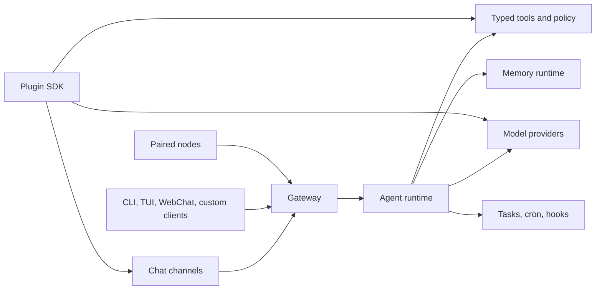

# CrawClaw

<p align="center">
  
</p>

<p align="center">
  English · <a href="./README.zh-CN.md">简体中文</a>
</p>

<p align="center">
  <a href="https://github.com/qianleigood/crawclaw/actions/workflows/ci.yml?branch=main"></a>
  <a href="https://github.com/qianleigood/crawclaw/releases"></a>
  <a href="https://www.npmjs.com/package/crawclaw"></a>
  <a href="LICENSE"></a>
</p>

**CrawClaw** is a self-hosted Gateway for AI agents. It runs one local or server
process that connects chat channels, Gateway clients, model providers, tools,
memory, automation, and plugins through a runtime you control.

Use CrawClaw when you want an always-available assistant that can answer from
Feishu, DingTalk, QQ Bot, Weixin, WebChat, a terminal UI, or your own Gateway
client while keeping configuration and runtime state on your machine.

## Quick Start

Requirements:

- Node **24** recommended
- Node **22.14+** supported
- A model provider account or API key

Install with the recommended script:

```bash
curl -fsSL https://crawclaw.ai/install.sh | bash
```

Windows PowerShell:

```powershell
iwr -useb https://crawclaw.ai/install.ps1 | iex
```

Run onboarding and install the local Gateway service:

```bash
crawclaw onboard --install-daemon
```

Verify the Gateway and start chatting:

```bash
crawclaw gateway status
crawclaw tui
```

Docs:

- [Getting Started](https://docs.crawclaw.ai/start/getting-started)
- [Install](https://docs.crawclaw.ai/install)
- [Onboarding](https://docs.crawclaw.ai/start/wizard)
- [Gateway Runbook](https://docs.crawclaw.ai/gateway)
- [Troubleshooting](https://docs.crawclaw.ai/gateway/troubleshooting)

## Install Options

If you already manage Node yourself, npm and pnpm installs are also supported:

```bash
npm install -g crawclaw@latest
crawclaw onboard --install-daemon
```

```bash
pnpm add -g crawclaw@latest
pnpm approve-builds -g
crawclaw onboard --install-daemon
```

For contributors:

```bash
git clone https://github.com/qianleigood/crawclaw.git
cd crawclaw
pnpm install
pnpm build
pnpm crawclaw onboard
```

Docker is optional and useful for isolated or headless deployments:

```bash
./scripts/docker/setup.sh
docker compose run --rm crawclaw-cli tui
```

More install paths:

- [Docker](https://docs.crawclaw.ai/install/docker)
- [Nix](https://docs.crawclaw.ai/install/nix)
- [Podman](https://docs.crawclaw.ai/install/podman)
- [Cloud and VPS deployments](https://docs.crawclaw.ai/install)
- [Updating](https://docs.crawclaw.ai/install/updating)
- [Uninstall](https://docs.crawclaw.ai/install/uninstall)

## What You Can Connect

CrawClaw is channel-first. QuickStart and the main channel picker prioritize
China-focused channels:

- [DingTalk](https://docs.crawclaw.ai/channels/ddingtalk)
- [Feishu](https://docs.crawclaw.ai/channels/feishu)
- [QQ Bot](https://docs.crawclaw.ai/channels/qqbot)
- [Weixin](https://docs.crawclaw.ai/channels/weixin)

Optional and legacy channels are still available for explicit setup, including
BlueBubbles, Discord, Google Chat, iMessage, IRC, LINE, Matrix, Mattermost,
Microsoft Teams, Nextcloud Talk, Nostr, Signal, Slack, Synology Chat, Telegram,
Tlon, Twitch, Voice Call, WebChat, WhatsApp, Zalo, and Zalo Personal.

Start here:

- [Chat Channels](https://docs.crawclaw.ai/channels)
- [Pairing and allowlists](https://docs.crawclaw.ai/channels/pairing)
- [Channel troubleshooting](https://docs.crawclaw.ai/channels/troubleshooting)
- [WebChat](https://docs.crawclaw.ai/web/webchat)

## What CrawClaw Provides

- **Gateway runtime**: one long-running process owns routing, auth, sessions,
  channel events, WebSocket/HTTP APIs, OpenAI-compatible endpoints, and client
  connections.
- **Agent runtime**: model calls, streaming, tool calls, subagents, sandboxing,
  execution events, and provider orchestration run behind the Gateway.
- **Tools and skills**: built-in tools cover shell execution, file edits,
  browser automation, web search/fetch, messaging, media, cron, sessions, and
  device nodes. Skills teach the agent when and how to use those tools.
- **Memory runtime**: context assembly, compaction, durable extraction, recall,
  session summaries, and maintenance flows are runtime services.
- **Automation**: scheduled tasks, background tasks, task flows, hooks, standing
  orders, and main-session wakes replace ad hoc heartbeat-style automation.
- **Plugin ecosystem**: plugins add channels, providers, tools, skills, speech,
  image generation, browser backends, setup flows, and runtime hooks through the
  plugin SDK.

Useful references:

- [Tools and Plugins](https://docs.crawclaw.ai/tools)
- [Model Providers](https://docs.crawclaw.ai/providers/models)
- [Automation and Tasks](https://docs.crawclaw.ai/automation)
- [Memory](https://docs.crawclaw.ai/concepts/memory)
- [Plugin Architecture](https://docs.crawclaw.ai/plugins/architecture)

## Architecture



The Gateway is the central boundary. Clients and channels connect to it; the
agent runtime sits behind it; tools, providers, memory, automation, plugins, and
nodes integrate through explicit runtime contracts.

Key docs:

- [Gateway Architecture](https://docs.crawclaw.ai/concepts/architecture)
- [Gateway Protocol](https://docs.crawclaw.ai/gateway/protocol)
- [Agent Loop](https://docs.crawclaw.ai/concepts/agent-loop)
- [Configuration](https://docs.crawclaw.ai/gateway/configuration)
- [Security](https://docs.crawclaw.ai/gateway/security)

## Repository Map

| Path                             | Purpose                                                                             |
| -------------------------------- | ----------------------------------------------------------------------------------- |
| [src/gateway](src/gateway)       | Gateway control plane, protocol, auth, health, pairing, and runtime services        |
| [src/agents](src/agents)         | Agent runtime, tools, subagents, sandboxing, provider execution, and events         |
| [src/memory](src/memory)         | Durable memory, recall, summaries, compaction, and context assembly                 |
| [src/workflows](src/workflows)   | Workflow registry, n8n bridge, execution records, and workflow operations           |
| [src/channels](src/channels)     | Core channel implementation behind the channel/plugin boundary                      |
| [src/plugins](src/plugins)       | Plugin discovery, manifests, loading, registry, and contract enforcement            |
| [src/plugin-sdk](src/plugin-sdk) | Public SDK contracts for plugin-facing code                                         |
| [extensions](extensions)         | Bundled plugins for channels, providers, browser backends, speech, media, and tools |
| [packages](packages)             | Workspace support packages                                                          |
| [skills](skills)                 | Shipped runtime skills                                                              |
| [docs](docs)                     | Mintlify documentation source                                                       |
| [test](test)                     | Shared test infrastructure and fixtures                                             |
| [scripts](scripts)               | Install, build, Docker, release, generated baseline, and maintenance scripts        |

Maintainer docs:

- [Repository Structure](https://docs.crawclaw.ai/maintainers/repo-structure)
- [Skills Catalog](https://docs.crawclaw.ai/maintainers/skills-catalog)

## Development

Install dependencies:

```bash
pnpm install
```

Run the CLI from source:

```bash
pnpm crawclaw --help
pnpm crawclaw gateway status
```

Common local checks:

```bash
pnpm check
pnpm test
pnpm build
```

Docs and generated baselines:

```bash
pnpm check:docs
pnpm docs:check-links
pnpm config:docs:check
pnpm plugin-sdk:api:check
```

More:

- [Testing](https://docs.crawclaw.ai/help/testing)
- [CLI Reference](https://docs.crawclaw.ai/cli)
- [Configuration Reference](https://docs.crawclaw.ai/gateway/configuration-reference)
- [Building Plugins](https://docs.crawclaw.ai/plugins/building-plugins)

## License

CrawClaw is MIT licensed. See [LICENSE](LICENSE).
