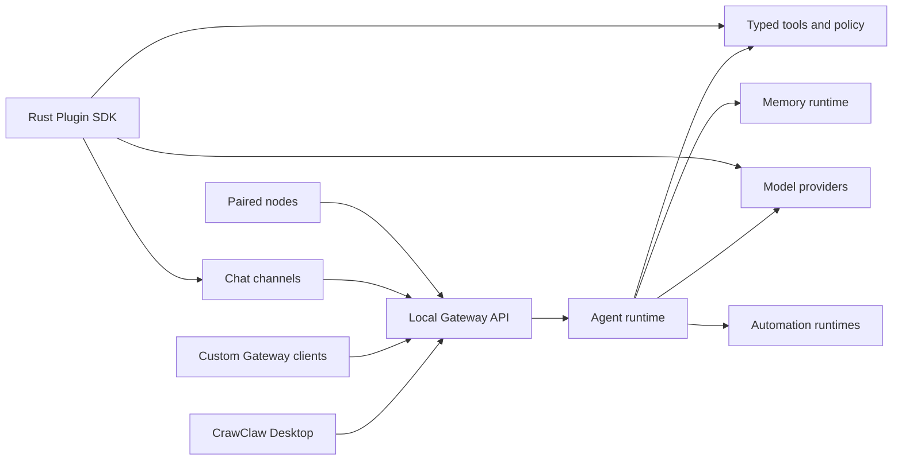

# CrawClaw

<p align="center">
  
</p>

<p align="center">
  English · <a href="./README.zh-CN.md">简体中文</a>
</p>

<p align="center">
  <a href="https://github.com/qianleigood/crawclaw/actions/workflows/ci.yml?branch=main"></a>
  <a href="https://github.com/qianleigood/crawclaw/releases"></a>
  <a href="https://www.npmjs.com/package/crawclaw"></a>
  <a href="LICENSE"></a>
</p>

**CrawClaw** is a local-first desktop workbench and Gateway for AI agents. It
keeps model providers, tools, memory, plugins, chat channels, automation
runtimes, sessions, diagnostics, and logs behind one local control plane.

On Apple platforms, users operate CrawClaw through **CrawClaw Desktop**. The
desktop app owns the local Gateway lifecycle and presents the product surface;
the public `crawclaw` command is no longer a supported user entrypoint.

## Get Started

Install CrawClaw Desktop from
[GitHub Releases](https://github.com/qianleigood/crawclaw/releases). The app
embeds the Rust Gateway/runtime/native-plugin binaries, initializes
`~/.crawclaw`, starts the local Gateway, and opens the desktop workbench against
that Gateway.

Requirements:

- macOS for CrawClaw Desktop
- A model provider account or API key
- Optional local automation runtimes such as n8n or ComfyUI

Useful docs:

- [Getting Started](https://docs.crawclaw.ai/start/getting-started)
- [Desktop Install](https://docs.crawclaw.ai/install/desktop)
- [Gateway Protocol](https://docs.crawclaw.ai/gateway/protocol)
- [Gateway Troubleshooting](https://docs.crawclaw.ai/gateway/troubleshooting)

## Product Surfaces

### Desktop Workbench

CrawClaw Desktop is the daily control surface for local agent work. It manages
configuration, model providers, plugins, channel pairing, permissions,
sessions, memory, diagnostics, logs, and Gateway health without requiring users
to manage separate runtime processes by hand.

### Automation

The Automation workspace brings local workflows into the same product shell:

- **ComfyUI** workflows, runs, outputs, and GPU/PyTorch installation profiles
- **n8n** workflow registry and execution history through the workflow core
- **Cron** jobs, run state, logs, and manual execution for built-in scheduling

Runtime installation and health management stay in settings for n8n and ComfyUI.
Cron is built in and does not need a separate runtime environment.

### Gateway API

The local Gateway is the integration boundary. Desktop, paired nodes, channels,
and custom clients connect to one HTTP/WebSocket API for tools, messages,
sessions, model routing, memory, and runtime status.

### Plugins

Plugins extend CrawClaw with channels, providers, tools, skills, speech, image
generation, browser backends, setup flows, and native capability contracts. The
public authoring contract is the Rust Plugin SDK plus manifest metadata.

## What CrawClaw Provides

- **Local-first execution**: one local Gateway owns routing, auth, sessions,
  WebSocket/HTTP APIs, OpenAI-compatible endpoints, and client connections.
- **Model provider routing**: provider configuration, normalization, fallback,
  and policy-aware model access live behind the Gateway.
- **Tools and skills**: typed tools cover shell execution, file edits, browser
  automation, web search/fetch, messaging, media, sessions, and device nodes.
- **Memory runtime**: context assembly, compaction, durable extraction, recall,
  session summaries, and maintenance flows.
- **Channel-first messaging**: supported chat channels and paired nodes are
  exposed through one local control plane.
- **Productized automation**: workflow execution and runtime installation for
  n8n, ComfyUI, and built-in Cron are surfaced in Desktop.

Start here:

- [Tools and Plugins](https://docs.crawclaw.ai/tools)
- [Model Providers](https://docs.crawclaw.ai/providers/models)
- [Memory](https://docs.crawclaw.ai/concepts/memory)
- [Chat Channels](https://docs.crawclaw.ai/channels)
- [Plugin Architecture](https://docs.crawclaw.ai/plugins/architecture)

## Architecture


```mermaid
flowchart LR
  Desktop["CrawClaw Desktop"] --> Gateway["Local Gateway API"]
  Clients["Custom Gateway clients"] --> Gateway
  Channels["Chat channels"] --> Gateway
  Nodes["Paired nodes"] --> Gateway
  Gateway --> Agent["Agent runtime"]
  Agent --> Tools["Typed tools and policy"]
  Agent --> Providers["Model providers"]
  Agent --> Memory["Memory runtime"]
  Agent --> Automation["Automation runtimes"]
  Plugins["Rust Plugin SDK"] --> Channels
  Plugins --> Tools
  Plugins --> Providers
```

The Gateway is the central boundary. Desktop and automation clients connect to
it; the agent runtime sits behind it; tools, providers, memory, plugins,
channels, and nodes integrate through explicit runtime contracts.

Key docs:

- [Gateway Architecture](https://docs.crawclaw.ai/concepts/architecture)
- [Gateway Protocol](https://docs.crawclaw.ai/gateway/protocol)
- [Agent Loop](https://docs.crawclaw.ai/concepts/agent-loop)
- [Configuration](https://docs.crawclaw.ai/gateway/configuration)
- [Security](https://docs.crawclaw.ai/gateway/security)

## Repository Map

| Path                                           | Purpose                                                                             |
| ---------------------------------------------- | ----------------------------------------------------------------------------------- |
| [apps/crawclaw-desktop](apps/crawclaw-desktop) | Tauri desktop app, desktop BFF, settings, automation, and UI workbench              |
| [crates](crates)                               | Rust Gateway, runtime, native-plugin, provider, repo-tooling, and SDK crates        |
| [src](src)                                     | Retained non-runtime metadata, generated JSON, and local boundary notes             |
| [bundled plugin tree](extensions)              | Bundled plugins for channels, providers, browser backends, speech, media, and tools |
| [packages](packages)                           | Reserved workspace support package slot                                             |
| [skills](skills)                               | Shipped runtime skills                                                              |
| [docs](docs)                                   | Mintlify documentation source                                                       |
| [test](test)                                   | Shared test infrastructure and fixtures                                             |
| [scripts](scripts)                             | Shell, Go, and Python build/release/docs helpers                                    |

## Development

Install dependencies and run the desktop app from source:

```bash
pnpm install
pnpm desktop:tauri:stage-runtime
pnpm desktop:tauri:dev
```

Node/npm are repository tooling adapters, not product runtime boundaries. The
Rust runtime and `crawclaw-repo-tools` own the main build, check, release, and
desktop orchestration commands; pnpm remains the compatibility entrypoint for
contributors and CI.

Common local checks:

```bash
pnpm check        # cargo run -q -p crawclaw-repo-tools -- check --profile local
pnpm test
pnpm build        # cargo run --quiet --release -p crawclaw-repo-tools -- build --profile package
```

Docs and generated baselines:

```bash
pnpm check:docs
pnpm docs:check-links
pnpm config:docs:check
```

Release policy:

- [Release Policy](https://docs.crawclaw.ai/reference/RELEASING)
- [Testing](https://docs.crawclaw.ai/help/testing)
- [Configuration Reference](https://docs.crawclaw.ai/gateway/configuration-reference)
- [Building Plugins](https://docs.crawclaw.ai/plugins/building-plugins)

## License

CrawClaw is MIT licensed. See [LICENSE](LICENSE).
