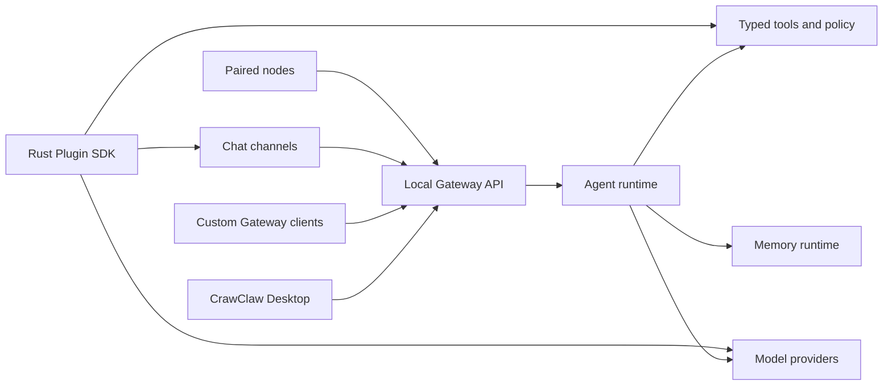

# CrawClaw

<p align="center">
  
</p>

<p align="center">
  English · <a href="./README.zh-CN.md">简体中文</a>
</p>

<p align="center">
  <a href="https://github.com/qianleigood/crawclaw/actions/workflows/ci.yml?branch=main"></a>
  <a href="https://github.com/qianleigood/crawclaw/releases"></a>
  <a href="https://www.npmjs.com/package/crawclaw"></a>
  <a href="LICENSE"></a>
</p>

**CrawClaw** is a local-first desktop Gateway for AI agents. On Apple platforms,
CrawClaw is operated through CrawClaw Desktop: one app owns configuration,
models, plugins, sessions, diagnostics, logs, and the local Gateway lifecycle.

The Gateway API remains the local control plane for automation and integrations.
The public `crawclaw` command is no longer a supported user entrypoint.

## Quick Start

Requirements:

- macOS for the desktop app
- A model provider account or API key

Install **CrawClaw Desktop** from
[GitHub Releases](https://github.com/qianleigood/crawclaw/releases). The desktop
app embeds the Rust Gateway/runtime/native-plugin binaries, initializes
`~/.crawclaw`, starts the local Gateway, and opens the admin UI against that
local Gateway.

Docs:

- [Getting Started](https://docs.crawclaw.ai/start/getting-started)
- [Desktop Install](https://docs.crawclaw.ai/install/desktop)
- [Gateway Protocol](https://docs.crawclaw.ai/gateway/protocol)
- [Gateway Troubleshooting](https://docs.crawclaw.ai/gateway/troubleshooting)

## What You Can Connect

CrawClaw is channel-first. The desktop UI and Gateway API expose supported
channels, tools, model providers, skills, and plugins through one local Gateway.

Start here:

- [Chat Channels](https://docs.crawclaw.ai/channels)
- [Pairing and allowlists](https://docs.crawclaw.ai/channels/pairing)
- [Channel troubleshooting](https://docs.crawclaw.ai/channels/troubleshooting)
- [WebChat](https://docs.crawclaw.ai/web/webchat)

## What CrawClaw Provides

- **Desktop workbench**: configuration, plugins, models, status, logs,
  diagnostics, Agent chat, sessions, and runtime management.
- **Gateway runtime**: one local process owns routing, auth, sessions,
  WebSocket/HTTP APIs, OpenAI-compatible endpoints, and client connections.
- **Tools and skills**: built-in tools cover shell execution, file edits,
  browser automation, web search/fetch, messaging, media, sessions, and device
  nodes.
- **Memory runtime**: context assembly, compaction, durable extraction, recall,
  session summaries, and maintenance flows.
- **Plugin ecosystem**: plugins add channels, providers, tools, skills, speech,
  image generation, browser backends, setup flows, and native capability
  contracts through the plugin SDK.

Useful references:

- [Tools and Plugins](https://docs.crawclaw.ai/tools)
- [Model Providers](https://docs.crawclaw.ai/providers/models)
- [Memory](https://docs.crawclaw.ai/concepts/memory)
- [Plugin Architecture](https://docs.crawclaw.ai/plugins/architecture)

## Architecture


```mermaid
flowchart LR
  Desktop["CrawClaw Desktop"] --> Gateway["Local Gateway API"]
  Clients["Custom Gateway clients"] --> Gateway
  Channels["Chat channels"] --> Gateway
  Nodes["Paired nodes"] --> Gateway
  Gateway --> Agent["Agent runtime"]
  Agent --> Tools["Typed tools and policy"]
  Agent --> Providers["Model providers"]
  Agent --> Memory["Memory runtime"]
  Plugins["Rust Plugin SDK"] --> Channels
  Plugins --> Tools
  Plugins --> Providers
```

The Gateway is the central boundary. Desktop and automation clients connect to
it; the agent runtime sits behind it; tools, providers, memory, plugins, and
nodes integrate through explicit runtime contracts.

Key docs:

- [Gateway Architecture](https://docs.crawclaw.ai/concepts/architecture)
- [Gateway Protocol](https://docs.crawclaw.ai/gateway/protocol)
- [Agent Loop](https://docs.crawclaw.ai/concepts/agent-loop)
- [Configuration](https://docs.crawclaw.ai/gateway/configuration)
- [Security](https://docs.crawclaw.ai/gateway/security)

## Repository Map

| Path                                           | Purpose                                                                             |
| ---------------------------------------------- | ----------------------------------------------------------------------------------- |
| [apps/crawclaw-desktop](apps/crawclaw-desktop) | Tauri desktop app, desktop BFF, and UI workbench                                    |
| [crates](crates)                               | Rust Gateway, runtime, native-plugin, provider, and SDK crates                      |
| [src](src)                                     | Retained non-runtime metadata, generated JSON, and local boundary notes             |
| [extensions](extensions)                       | Bundled plugins for channels, providers, browser backends, speech, media, and tools |
| [packages](packages)                           | Reserved workspace support package slot                                             |
| [skills](skills)                               | Shipped runtime skills                                                              |
| [docs](docs)                                   | Mintlify documentation source                                                       |
| [test](test)                                   | Shared test infrastructure and fixtures                                             |
| [scripts](scripts)                             | Shell, Go, and Python build/release/docs helpers                                    |

## Development

Install dependencies and run the desktop app from source:

```bash
pnpm install
pnpm desktop:tauri:stage-runtime
pnpm desktop:tauri:dev
```

Common local checks:

```bash
pnpm check
pnpm test
pnpm build
```

Docs and generated baselines:

```bash
pnpm check:docs
pnpm docs:check-links
pnpm config:docs:check
```

More:

- [Testing](https://docs.crawclaw.ai/help/testing)
- [Configuration Reference](https://docs.crawclaw.ai/gateway/configuration-reference)
- [Building Plugins](https://docs.crawclaw.ai/plugins/building-plugins)

## License

CrawClaw is MIT licensed. See [LICENSE](LICENSE).
