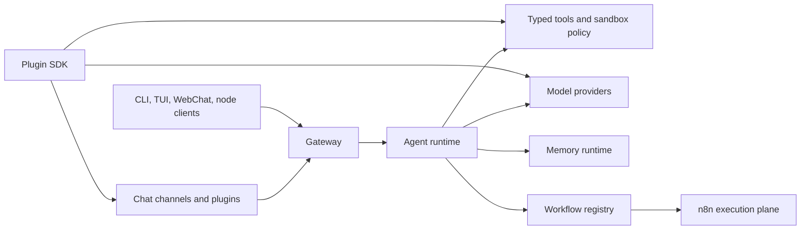

# 🦀 CrawClaw

<p align="center">
  
</p>

<p align="center">
  <a href="./README.md">English</a> · 简体中文
</p>

<p align="center">
  <a href="https://github.com/qianleigood/crawclaw/actions/workflows/ci.yml?branch=main"></a>
  <a href="https://github.com/qianleigood/crawclaw/releases"></a>
  <a href="https://www.npmjs.com/package/crawclaw"></a>
  <a href="LICENSE"></a>
</p>

**CrawClaw** 是一个本地优先的 AI agent Gateway。它把消息渠道、Gateway
客户端、记忆、工作流、宿主工具、模型 provider 和插件统一接到一个你自己控制的运行时。

当你希望拥有一个随时可用的个人助手，并且能从聊天应用、终端 UI、WebChat、节点集成或可复用工作流中访问它，同时把配置和运行时状态留在自己的机器上，CrawClaw 就适合这个场景。

## 快速开始

要求：

- 推荐 Node **24**
- 支持 Node **22.14+**
- 一个模型 provider 账号或 API key

通过 npm 安装：

```bash
npm install -g crawclaw@latest
```

运行 onboarding 并安装本地 Gateway 服务：

```bash
crawclaw onboard --install-daemon
```

检查 Gateway 并打开终端 UI：

```bash
crawclaw gateway status
crawclaw tui
```

常用文档：

- [快速开始](https://docs.crawclaw.ai/start/getting-started)
- [安装总览](https://docs.crawclaw.ai/install)
- [Node.js 安装](https://docs.crawclaw.ai/install/node)
- [消息渠道](https://docs.crawclaw.ai/channels)
- [模型 Provider](https://docs.crawclaw.ai/providers)

## Docker 快速开始

Docker 是可选路径。需要隔离的 Gateway 容器或服务器式部署时再使用。

在仓库根目录执行：

```bash
./scripts/docker/setup.sh
```

该脚本会构建或拉取镜像、运行 onboarding、写入 Gateway token 状态，并启动
Docker Compose。

如果要使用已发布镜像：

```bash
export CRAWCLAW_IMAGE="ghcr.io/crawclaw/crawclaw:latest"
./scripts/docker/setup.sh
```

然后通过 CLI 容器打开终端 UI：

```bash
docker compose run --rm crawclaw-cli tui
```

Docker 文档：

- [Docker 安装](https://docs.crawclaw.ai/install/docker)
- [Docker VM Runtime](https://docs.crawclaw.ai/install/docker-vm-runtime)
- [沙箱机制](https://docs.crawclaw.ai/gateway/sandboxing)

## CrawClaw 提供什么

- **自托管 Gateway**：一个长驻进程负责 sessions、auth、routing、客户端连接、渠道事件和 Gateway APIs。
- **多渠道消息**：内置渠道和插件渠道可以连接 WhatsApp、Telegram、Discord、iMessage、Slack、Matrix 等聊天应用。
- **Agent runtime**：模型调用、流式输出、工具调用、subagents、special agents、sandboxing 和执行可见性都在 Gateway 后面运行。
- **Memory runtime**：durable memory、session summaries、compaction、recall planning 和 prompt assembly 是一级运行时服务。
- **Workflow system**：CrawClaw 负责 workflow spec 的创建、版本化、diff 和控制；n8n 作为 durable execution plane。
- **强类型工具底座**：文件操作、shell 执行、浏览器、媒体、web、消息、Gateway 操作和插件工具都注册为受策略控制的 typed tools。
- **插件生态**：插件可以通过文档化 SDK contract 扩展渠道、providers、tools、skills、浏览器后端、媒体能力和 setup flows。

## 架构



最核心的边界是 **Gateway**。客户端和渠道连接 Gateway；agent runtime
位于 Gateway 后面；memory、workflows、plugins 和 tools 通过显式 runtime seam 接入。

### Gateway

Gateway 是控制面，负责 WebSocket 和 HTTP surfaces、auth、pairing、health、sessions、routing、channel events、Gateway clients 和 tool invocation APIs。

入口：

- [src/gateway](src/gateway)
- [Gateway Architecture](https://docs.crawclaw.ai/concepts/architecture)
- [Gateway Runbook](https://docs.crawclaw.ai/gateway)
- [Gateway Protocol](https://docs.crawclaw.ai/gateway/protocol)

### Agent Runtime

Agent runtime 负责 model/provider execution、tool registration、subagent orchestration、special agents、sandboxed execution、streaming glue 和 execution-event emission。

入口：

- [src/agents](src/agents)
- [src/agents/crawclaw-tools.runtime.ts](src/agents/crawclaw-tools.runtime.ts)
- [src/agents/tools](src/agents/tools)
- [Agent Loop](https://docs.crawclaw.ai/concepts/agent-loop)
- [Tools](https://docs.crawclaw.ai/tools)

### Memory Runtime

Memory 是运行时服务，不只是向量检索适配器。它负责 context assembly、compaction、durable extraction and recall、session summaries、experience recall planning 和维护流程。

入口：

- [src/memory](src/memory)
- [src/memory/engine/memory-runtime.ts](src/memory/engine/memory-runtime.ts)
- [src/memory/orchestration/context-assembler.ts](src/memory/orchestration/context-assembler.ts)
- [Memory Concept](https://docs.crawclaw.ai/concepts/memory)
- [Memory Config](https://docs.crawclaw.ai/reference/memory-config)

### Workflow System

Workflow 的边界是有意拆开的：CrawClaw 负责 authoring、versioning、registry operations、visibility 和 agent-facing control；n8n 负责 durable trigger 和 execution behavior。

入口：

- [src/workflows](src/workflows)
- [src/workflows/api.ts](src/workflows/api.ts)
- [src/workflows/n8n-client.ts](src/workflows/n8n-client.ts)
- [src/agents/tools/workflow-tool.ts](src/agents/tools/workflow-tool.ts)
- [n8n Workflow Architecture](https://docs.crawclaw.ai/reference/n8n-workflow-architecture)
- [Learning Loop](https://docs.crawclaw.ai/concepts/learning-loop)

### Plugin And Tool Boundary

插件扩展 CrawClaw 时不应该导入 core internals。公共边界是 plugin SDK、manifest metadata、setup/runtime helpers 和文档化 contracts。即使工具来自插件，tools 仍然是强类型、受策略控制的执行面。

入口：

- [src/plugins](src/plugins)
- [src/plugin-sdk](src/plugin-sdk)
- [extensions](extensions)
- [Plugin Architecture](https://docs.crawclaw.ai/plugins/architecture)
- [Building Plugins](https://docs.crawclaw.ai/plugins/building-plugins)
- [Plugin SDK Overview](https://docs.crawclaw.ai/plugins/sdk-overview)

## 仓库地图

| 路径                               | 作用                                                                                        |
| ---------------------------------- | ------------------------------------------------------------------------------------------- |
| [src/gateway](src/gateway)         | Gateway 控制面、protocol、auth、health、pairing 和 runtime services                         |
| [src/agents](src/agents)           | Agent runtime、tools、subagents、sandboxing、provider integration 和 execution events       |
| [src/memory](src/memory)           | Durable memory、session summaries、recall、context assembly 和维护流程                      |
| [src/workflows](src/workflows)     | Workflow registry、versioning、n8n bridge、execution records 和 action feed projection      |
| [src/channels](src/channels)       | channel/plugin 边界后面的核心渠道实现细节                                                   |
| [src/plugins](src/plugins)         | plugin discovery、manifest validation、loader、registry 和 contract enforcement             |
| [src/plugin-sdk](src/plugin-sdk)   | 面向插件的 public SDK surface                                                               |
| [extensions](extensions)           | bundled plugin packages，用于 channels、providers、browser backends 和 runtime capabilities |
| [packages](packages)               | workspace 内的支持型子包                                                                    |
| [skills](skills)                   | 随包发布的 runtime skills                                                                   |
| [skills-optional](skills-optional) | 可选 skill catalog 内容                                                                     |
| [docs](docs)                       | Mintlify 文档源文件                                                                         |
| [test](test)                       | 共享测试基础设施和 fixtures                                                                 |
| [scripts](scripts)                 | build、install、Docker、release 和维护脚本                                                  |

维护者结构说明：

- [Repository Structure](https://docs.crawclaw.ai/maintainers/repo-structure)
- [Skills Catalog](https://docs.crawclaw.ai/maintainers/skills-catalog)

## 开发

安装依赖：

```bash
pnpm install
```

从源码运行 CLI：

```bash
pnpm crawclaw --help
pnpm crawclaw gateway status
```

常用本地检查：

```bash
pnpm check
pnpm test
pnpm build
```

文档相关检查：

```bash
pnpm check:docs
pnpm docs:check-links
```

更多文档：

- [测试指南](https://docs.crawclaw.ai/help/testing)
- [CLI Reference](https://docs.crawclaw.ai/cli)
- [Configuration](https://docs.crawclaw.ai/gateway/configuration)
- [Security](https://docs.crawclaw.ai/gateway/security)

## License

CrawClaw 使用 MIT license。见 [LICENSE](LICENSE)。
