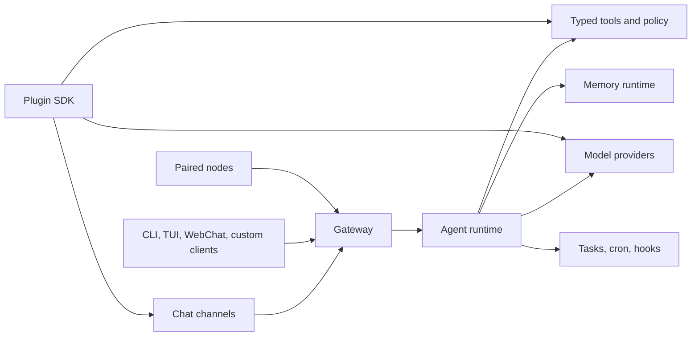

# CrawClaw

<p align="center">
  
</p>

<p align="center">
  <a href="./README.md">English</a> · 简体中文
</p>

<p align="center">
  <a href="https://github.com/qianleigood/crawclaw/actions/workflows/ci.yml?branch=main"></a>
  <a href="https://github.com/qianleigood/crawclaw/releases"></a>
  <a href="https://www.npmjs.com/package/crawclaw"></a>
  <a href="LICENSE"></a>
</p>

**CrawClaw** 是一个自托管的 AI agent Gateway。它用一个本地或服务器进程，把聊天渠道、Gateway 客户端、模型 provider、工具、记忆、自动化和插件连接到你自己控制的运行时里。

如果你希望助手可以从飞书、钉钉、QQ Bot、Weixin、WebChat、终端 UI 或自定义 Gateway 客户端访问，同时配置和运行状态仍留在自己的机器上，CrawClaw 就适合这个场景。

## 快速开始

要求：

- 推荐 Node **24**
- 支持 Node **22.14+**
- 一个模型 provider 账号或 API key

使用推荐安装脚本：

```bash
curl -fsSL https://crawclaw.ai/install.sh | bash
```

Windows PowerShell：

```powershell
iwr -useb https://crawclaw.ai/install.ps1 | iex
```

运行 onboarding 并安装本地 Gateway 服务：

```bash
crawclaw onboard --install-daemon
```

检查 Gateway 并开始聊天：

```bash
crawclaw gateway status
crawclaw tui
```

文档：

- [快速开始](https://docs.crawclaw.ai/start/getting-started)
- [安装](https://docs.crawclaw.ai/install)
- [Onboarding](https://docs.crawclaw.ai/start/wizard)
- [Gateway Runbook](https://docs.crawclaw.ai/gateway)
- [故障排查](https://docs.crawclaw.ai/gateway/troubleshooting)

## 安装方式

如果你已经自行管理 Node，也可以用 npm 或 pnpm：

```bash
npm install -g crawclaw@latest
crawclaw onboard --install-daemon
```

```bash
pnpm add -g crawclaw@latest
pnpm approve-builds -g
crawclaw onboard --install-daemon
```

贡献者从源码运行：

```bash
git clone https://github.com/qianleigood/crawclaw.git
cd crawclaw
pnpm install
pnpm build
pnpm crawclaw onboard
```

Docker 是可选路径，适合隔离或 headless 部署：

```bash
./scripts/docker/setup.sh
docker compose run --rm crawclaw-cli tui
```

更多安装路径：

- [Docker](https://docs.crawclaw.ai/install/docker)
- [Nix](https://docs.crawclaw.ai/install/nix)
- [Podman](https://docs.crawclaw.ai/install/podman)
- [云服务器和 VPS 部署](https://docs.crawclaw.ai/install)
- [更新](https://docs.crawclaw.ai/install/updating)
- [卸载](https://docs.crawclaw.ai/install/uninstall)

## 可以连接什么

CrawClaw 以消息渠道为优先入口。QuickStart 和主渠道选择器优先推荐中国常用渠道：

- [DingTalk](https://docs.crawclaw.ai/channels/ddingtalk)
- [Feishu](https://docs.crawclaw.ai/channels/feishu)
- [QQ Bot](https://docs.crawclaw.ai/channels/qqbot)
- [Weixin](https://docs.crawclaw.ai/channels/weixin)

可选和 legacy 渠道仍然可以手动启用，包括 BlueBubbles、Discord、Google Chat、iMessage、IRC、LINE、Matrix、Mattermost、Microsoft Teams、Nextcloud Talk、Nostr、Signal、Slack、Synology Chat、Telegram、Tlon、Twitch、Voice Call、WebChat、WhatsApp、Zalo 和 Zalo Personal。

入口：

- [消息渠道](https://docs.crawclaw.ai/channels)
- [配对和允许列表](https://docs.crawclaw.ai/channels/pairing)
- [渠道故障排查](https://docs.crawclaw.ai/channels/troubleshooting)
- [WebChat](https://docs.crawclaw.ai/web/webchat)

## CrawClaw 提供什么

- **Gateway runtime**：一个长驻进程负责 routing、auth、sessions、渠道事件、WebSocket/HTTP APIs、OpenAI-compatible endpoints 和客户端连接。
- **Agent runtime**：模型调用、流式输出、工具调用、subagents、sandboxing、执行事件和 provider orchestration 都在 Gateway 后面运行。
- **Tools and skills**：内置工具覆盖 shell 执行、文件编辑、浏览器自动化、web search/fetch、消息、媒体、cron、sessions 和 device nodes。Skills 负责告诉 agent 何时以及如何使用这些工具。
- **Memory runtime**：context assembly、compaction、durable extraction、recall、session summaries 和维护流程是运行时服务。
- **Automation**：scheduled tasks、background tasks、task flows、hooks、standing orders 和 main-session wakes 取代临时的 heartbeat 风格自动化。
- **插件生态**：插件通过 plugin SDK 添加渠道、providers、tools、skills、speech、image generation、浏览器后端、setup flows 和 runtime hooks。

常用参考：

- [Tools and Plugins](https://docs.crawclaw.ai/tools)
- [Model Providers](https://docs.crawclaw.ai/providers/models)
- [Automation and Tasks](https://docs.crawclaw.ai/automation)
- [Memory](https://docs.crawclaw.ai/concepts/memory)
- [Plugin Architecture](https://docs.crawclaw.ai/plugins/architecture)

## 架构



Gateway 是核心边界。客户端和渠道连接 Gateway；agent runtime 位于 Gateway 后面；tools、providers、memory、automation、plugins 和 nodes 通过显式 runtime contract 接入。

关键文档：

- [Gateway Architecture](https://docs.crawclaw.ai/concepts/architecture)
- [Gateway Protocol](https://docs.crawclaw.ai/gateway/protocol)
- [Agent Loop](https://docs.crawclaw.ai/concepts/agent-loop)
- [Configuration](https://docs.crawclaw.ai/gateway/configuration)
- [Security](https://docs.crawclaw.ai/gateway/security)

## 仓库地图

| 路径                             | 作用                                                                      |
| -------------------------------- | ------------------------------------------------------------------------- |
| [src/gateway](src/gateway)       | Gateway 控制面、protocol、auth、health、pairing 和 runtime services       |
| [src/agents](src/agents)         | Agent runtime、tools、subagents、sandboxing、provider execution 和 events |
| [src/memory](src/memory)         | Durable memory、recall、summaries、compaction 和 context assembly         |
| [src/workflows](src/workflows)   | Workflow registry、n8n bridge、execution records 和 workflow operations   |
| [src/channels](src/channels)     | channel/plugin 边界后的核心渠道实现                                       |
| [src/plugins](src/plugins)       | plugin discovery、manifests、loading、registry 和 contract enforcement    |
| [src/plugin-sdk](src/plugin-sdk) | 面向插件代码的 public SDK contracts                                       |
| [extensions](extensions)         | 渠道、providers、浏览器后端、speech、media 和 tools 的 bundled plugins    |
| [packages](packages)             | workspace 支持包                                                          |
| [skills](skills)                 | 随包发布的 runtime skills                                                 |
| [docs](docs)                     | Mintlify 文档源文件                                                       |
| [test](test)                     | 共享测试基础设施和 fixtures                                               |
| [scripts](scripts)               | install、build、Docker、release、generated baseline 和维护脚本            |

维护者文档：

- [Repository Structure](https://docs.crawclaw.ai/maintainers/repo-structure)
- [Skills Catalog](https://docs.crawclaw.ai/maintainers/skills-catalog)

## 开发

安装依赖：

```bash
pnpm install
```

从源码运行 CLI：

```bash
pnpm crawclaw --help
pnpm crawclaw gateway status
```

常用本地检查：

```bash
pnpm check
pnpm test
pnpm build
```

文档和生成基线：

```bash
pnpm check:docs
pnpm docs:check-links
pnpm config:docs:check
pnpm plugin-sdk:api:check
```

更多：

- [测试指南](https://docs.crawclaw.ai/help/testing)
- [CLI Reference](https://docs.crawclaw.ai/cli)
- [Configuration Reference](https://docs.crawclaw.ai/gateway/configuration-reference)
- [Building Plugins](https://docs.crawclaw.ai/plugins/building-plugins)

## License

CrawClaw 使用 MIT license。见 [LICENSE](LICENSE)。
