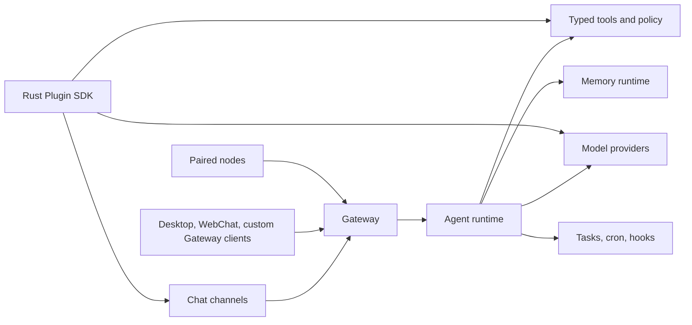

# CrawClaw

<p align="center">
  
</p>

<p align="center">
  <a href="./README.md">English</a> · 简体中文
</p>

<p align="center">
  <a href="https://github.com/qianleigood/crawclaw/actions/workflows/ci.yml?branch=main"></a>
  <a href="https://github.com/qianleigood/crawclaw/releases"></a>
  <a href="https://www.npmjs.com/package/crawclaw"></a>
  <a href="LICENSE"></a>
</p>

**CrawClaw** 是一个 desktop-first、local-first 的 AI Gateway。CrawClaw
Desktop 负责配置、模型、插件、会话、诊断、日志和本地 Gateway 生命周期；本地
Gateway API 仍然是自动化和集成的控制面。

公开的 `crawclaw` 命令不再是推荐用户入口。源码开发、发布校验和 npm 分发仍然保留
Node/npm，但它们现在只是 repo tooling adapter，不是产品 runtime boundary。

## 快速开始

要求：

- 一个模型 provider 账号或 API key

从
[GitHub Releases](https://github.com/qianleigood/crawclaw/releases) 安装
**CrawClaw Desktop**。桌面 app 会内置 Rust Gateway/runtime/native-plugin
二进制，初始化 `~/.crawclaw`，启动本机 Gateway，并打开连接本机 Gateway 的管理界面。

文档：

- [快速开始](https://docs.crawclaw.ai/start/getting-started)
- [桌面安装](https://docs.crawclaw.ai/install/desktop)
- [Gateway Protocol](https://docs.crawclaw.ai/gateway/protocol)
- [故障排查](https://docs.crawclaw.ai/gateway/troubleshooting)

## 源码开发

```bash
git clone https://github.com/qianleigood/crawclaw.git
cd crawclaw
pnpm install
pnpm desktop:tauri:stage-runtime
pnpm desktop:tauri:dev
```

常用本地检查：

```bash
pnpm check        # cargo run -q -p crawclaw-repo-tools -- check --profile local
pnpm test
pnpm build        # cargo run --quiet --release -p crawclaw-repo-tools -- build --profile package
```

文档和生成基线：

```bash
pnpm check:docs   # cargo run -q -p crawclaw-repo-tools -- check --profile docs-core
pnpm docs:check-links
pnpm config:docs:check
```

## 可以连接什么

CrawClaw 以消息渠道为优先入口。QuickStart 和主渠道选择器优先推荐中国常用渠道：

- [DingTalk](https://docs.crawclaw.ai/channels/ddingtalk)
- [Feishu](https://docs.crawclaw.ai/channels/feishu)
- [QQ Bot](https://docs.crawclaw.ai/channels/qqbot)
- [Weixin](https://docs.crawclaw.ai/channels/weixin)

可选和 legacy 渠道仍然可以手动启用，包括 BlueBubbles、Discord、Google Chat、iMessage、IRC、LINE、Matrix、Mattermost、Microsoft Teams、Nextcloud Talk、Nostr、Signal、Slack、Synology Chat、Telegram、Tlon、Twitch、Voice Call、WebChat、WhatsApp、Zalo 和 Zalo Personal。

入口：

- [消息渠道](https://docs.crawclaw.ai/channels)
- [配对和允许列表](https://docs.crawclaw.ai/channels/pairing)
- [渠道故障排查](https://docs.crawclaw.ai/channels/troubleshooting)
- [WebChat](https://docs.crawclaw.ai/web/webchat)

## CrawClaw 提供什么

- **Gateway runtime**：一个长驻进程负责 routing、auth、sessions、渠道事件、WebSocket/HTTP APIs、OpenAI-compatible endpoints 和客户端连接。
- **Tools and skills**：内置工具覆盖 shell 执行、文件编辑、浏览器自动化、web search/fetch、消息、媒体、cron、sessions 和 device nodes。Skills 负责告诉 agent 何时以及如何使用这些工具。
- **Memory runtime**：context assembly、compaction、durable extraction、recall、session summaries 和维护流程是运行时服务。
- **Automation**：scheduled tasks、background tasks、task flows、hooks、standing orders 和 main-session wakes 取代临时的 heartbeat 风格自动化。
- **插件生态**：插件通过 manifest metadata、native descriptors 和 Rust plugin SDK 添加渠道、providers、tools、skills、speech、image generation、浏览器后端和 setup flows。

常用参考：

- [Tools and Plugins](https://docs.crawclaw.ai/tools)
- [Model Providers](https://docs.crawclaw.ai/providers/models)
- [Automation and Tasks](https://docs.crawclaw.ai/automation)
- [Memory](https://docs.crawclaw.ai/concepts/memory)
- [Plugin Architecture](https://docs.crawclaw.ai/plugins/architecture)

## 架构


```mermaid
flowchart LR
  Channels["Chat channels"] --> Gateway["Gateway"]
  Clients["Desktop, WebChat, custom Gateway clients"] --> Gateway
  Nodes["Paired nodes"] --> Gateway
  Gateway --> Agent["Agent runtime"]
  Agent --> Tools["Typed tools and policy"]
  Agent --> Providers["Model providers"]
  Agent --> Memory["Memory runtime"]
  Agent --> Automation["Tasks, cron, hooks"]
  Plugins["Rust Plugin SDK"] --> Channels
  Plugins --> Tools
  Plugins --> Providers
```

Gateway 是核心边界。客户端和渠道连接 Gateway；agent runtime 位于 Gateway 后面；tools、providers、memory、automation、plugins 和 nodes 通过显式 runtime contract 接入。

关键文档：

- [Gateway Architecture](https://docs.crawclaw.ai/concepts/architecture)
- [Gateway Protocol](https://docs.crawclaw.ai/gateway/protocol)
- [Agent Loop](https://docs.crawclaw.ai/concepts/agent-loop)
- [Configuration](https://docs.crawclaw.ai/gateway/configuration)
- [Security](https://docs.crawclaw.ai/gateway/security)

## 仓库地图

| 路径                                           | 作用                                                                   |
| ---------------------------------------------- | ---------------------------------------------------------------------- |
| [apps/crawclaw-desktop](apps/crawclaw-desktop) | Tauri 桌面应用、desktop BFF 和 UI workbench                            |
| [crates](crates)                               | Rust Gateway、runtime、native-plugin、provider 和 SDK crates           |
| [src](src)                                     | 保留的非 runtime metadata、generated JSON 和本地边界说明               |
| [extensions](extensions)                       | 渠道、providers、浏览器后端、speech、media 和 tools 的 bundled plugins |
| [packages](packages)                           | 预留 workspace 支持包槽位，不是 runtime package tree                   |
| [skills](skills)                               | 随包发布的 runtime skills                                              |
| [docs](docs)                                   | Mintlify 文档源文件                                                    |
| [test](test)                                   | 共享测试基础设施和 fixtures                                            |
| [scripts](scripts)                             | Shell、Go 和 Python build/release/docs helpers                         |

维护者文档：

- [Repository Structure](https://docs.crawclaw.ai/maintainers/repo-structure)
- [Skills Catalog](https://docs.crawclaw.ai/maintainers/skills-catalog)

## 开发

Node/npm 是源码开发、桌面 renderer、文档 hosted tooling 和 npm 发布的 adapter；
Rust runtime 与 `crawclaw-repo-tools` 才是主控入口。

从源码运行桌面 app：

```bash
pnpm install
pnpm desktop:tauri:stage-runtime
pnpm desktop:tauri:dev
```

常用本地检查：

```bash
pnpm check
pnpm test
pnpm build
```

文档和生成基线：

```bash
pnpm check:docs
pnpm docs:check-links
pnpm config:docs:check
```

更多：

- [测试指南](https://docs.crawclaw.ai/help/testing)
- [Configuration Reference](https://docs.crawclaw.ai/gateway/configuration-reference)
- [Building Plugins](https://docs.crawclaw.ai/plugins/building-plugins)

## License

CrawClaw 使用 MIT license。见 [LICENSE](LICENSE)。
