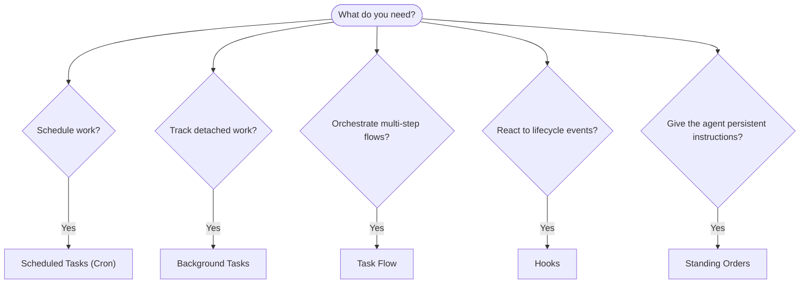

# Automation & Tasks

CrawClaw runs work in the background through tasks, scheduled jobs, event hooks, and standing instructions. This page helps you choose the right mechanism and understand how they fit together.

## Quick decision guide

| Use case                                | Recommended            | Why                                              |
| --------------------------------------- | ---------------------- | ------------------------------------------------ |
| Send daily report at 9 AM sharp         | Scheduled Tasks (Cron) | Exact timing, isolated execution                 |
| Remind me in 20 minutes                 | Scheduled Tasks (Cron) | One-shot with precise timing (`--at`)            |
| Run weekly deep analysis                | Scheduled Tasks (Cron) | Standalone task, can use different model         |
| Check inbox every 30 min                | Scheduled Tasks (Cron) | Use a main-session cron job for shared context   |
| Monitor calendar for upcoming events    | Scheduled Tasks (Cron) | Explicit schedule, visible run records           |
| Inspect status of a subagent or ACP run | Background Tasks       | Tasks ledger tracks all detached work            |
| Audit what ran and when                 | Background Tasks       | `crawclaw tasks list` and `crawclaw tasks audit` |
| Multi-step research then summarize      | Task Flow              | Durable orchestration with revision tracking     |
| Run a script on session reset           | Hooks                  | Event-driven, fires on lifecycle events          |
| Execute code on every tool call         | Hooks                  | Hooks can filter by event type                   |
| Always check compliance before replying | Standing Orders        | Injected into every session automatically        |

### Scheduled Tasks and main-session wakes

| Dimension       | Scheduled Tasks (Cron)                               | Main-session wake                                 |
| --------------- | ---------------------------------------------------- | ------------------------------------------------- |
| Timing          | Exact (cron expressions, one-shot)                   | Triggered by cron, hooks, tasks, or system events |
| Session context | Fresh isolated session or shared main session        | Full main-session context                         |
| Task records    | Created for cron executions                          | Not created for normal interactive wakes          |
| Delivery        | Channel, webhook, silent, or queued to main session  | Inline in main session when delivery is needed    |
| Best for        | Reports, reminders, periodic checks, background jobs | Event follow-ups and queued session updates       |

Use Scheduled Tasks (Cron) for new scheduled automation. When the work needs
the main conversation context, configure the cron job to wake the main session
instead of relying on legacy periodic heartbeat.

## Core concepts

### Scheduled tasks (cron)

Cron is the Gateway's built-in scheduler for precise timing. It persists jobs, wakes the agent at the right time, and can deliver output to a chat channel or webhook endpoint. Supports one-shot reminders, recurring expressions, and inbound webhook triggers.

See [Scheduled Tasks](/automation/cron-jobs).

### Tasks

The background task ledger tracks all detached work: ACP runs, subagent spawns, isolated cron executions, and CLI operations. Tasks are records, not schedulers. Use `crawclaw tasks list` and `crawclaw tasks audit` to inspect them.

See [Background Tasks](/automation/tasks).

### Task Flow

Task Flow is the flow orchestration substrate above background tasks. It manages durable multi-step flows with managed and mirrored sync modes, revision tracking, and `crawclaw tasks flow list|show|cancel` for inspection.

See [Task Flow](/automation/taskflow).

### Standing orders

Standing orders grant the agent permanent operating authority for defined programs. They live in workspace files (typically `AGENTS.md`) and are injected into every session. Combine with cron for time-based enforcement.

See [Standing Orders](/automation/standing-orders).

### Hooks

Hooks are event-driven scripts triggered by agent lifecycle events (`/new`, `/stop`), session compaction, gateway startup, message flow, and tool calls. Hooks are automatically discovered from directories and can be managed with `crawclaw hooks`.

See [Hooks](/automation/hooks).

### Main-session wakes

Main-session wakes are event-driven turns requested by cron, hooks, background
task completion, restart recovery, node notifications, or `crawclaw system
event`. They preserve main-session context without relying on the legacy
periodic heartbeat cadence.

See [Heartbeat](/gateway/heartbeat) for legacy compatibility notes.

## How they work together

- **Cron** handles precise schedules (daily reports, weekly reviews) and one-shot reminders. All cron executions create task records.
- **Main-session wakes** handle queued event follow-ups in the active session.
- **Hooks** react to specific events (tool calls, session resets, compaction) with custom scripts.
- **Standing orders** give the agent persistent context and authority boundaries.
- **Task Flow** coordinates multi-step flows above individual tasks.
- **Tasks** automatically track all detached work so you can inspect and audit it.

## Related

- [Scheduled Tasks](/automation/cron-jobs) — precise scheduling and one-shot reminders
- [Background Tasks](/automation/tasks) — task ledger for all detached work
- [Task Flow](/automation/taskflow) — durable multi-step flow orchestration
- [Hooks](/automation/hooks) — event-driven lifecycle scripts
- [Standing Orders](/automation/standing-orders) — persistent agent instructions
- [Heartbeat](/gateway/heartbeat) — heartbeat migration notes
- [Configuration Reference](/gateway/configuration-reference) — all config keys
