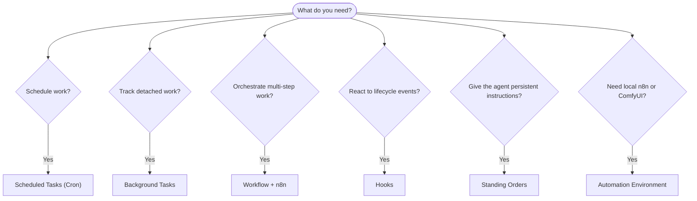

# Automation & Tasks

CrawClaw runs background work through task records, scheduled jobs, managed
automation runtimes, SDK lifecycle hooks, workflows, and standing instructions.
This page helps you choose the right mechanism and understand how they fit
together.

## Quick decision guide

```mermaid
flowchart TD
    START([What do you need?]) --> Q1{Schedule work?}
    START --> Q2{Track detached work?}
    START --> Q3{Orchestrate multi-step work?}
    START --> Q4{React to lifecycle events?}
    START --> Q5{Give the agent persistent instructions?}
    START --> Q6{Need local n8n or ComfyUI?}

    Q1 -->|Yes| CRON["Scheduled Tasks (Cron)"]

    Q2 -->|Yes| TASKS[Background Tasks]
    Q3 -->|Yes| FLOW[Workflow + n8n]
    Q4 -->|Yes| HOOKS[Hooks]
    Q5 -->|Yes| SO[Standing Orders]
    Q6 -->|Yes| ENV[Automation Environment]
```

| Use case                                | Recommended            | Why                                               |
| --------------------------------------- | ---------------------- | ------------------------------------------------- |
| Send daily report at 9 AM sharp         | Scheduled Tasks (Cron) | Exact timing, isolated execution                  |
| Remind me in 20 minutes                 | Scheduled Tasks (Cron) | One-shot with precise timing (`--at`)             |
| Run weekly deep analysis                | Scheduled Tasks (Cron) | Standalone task, can use different model          |
| Check inbox every 30 min                | Scheduled Tasks (Cron) | Use a main-session cron job for shared context    |
| Monitor calendar for upcoming events    | Scheduled Tasks (Cron) | Explicit schedule, visible run records            |
| Inspect status of a subagent or ACP run | Background Tasks       | Tasks ledger tracks all detached work             |
| Audit what ran and when                 | Background Tasks       | Desktop task ledger or Gateway API                |
| Install or bind local n8n / ComfyUI     | Automation Environment | Desktop-managed local services with health status |
| Multi-step research then summarize      | Workflow + n8n         | Workflow registry plus n8n execution              |
| Add context on session start            | Hooks                  | SDK lifecycle callback before the run             |
| Guard tool calls or permissions         | Hooks                  | SDK lifecycle callback around tool use            |
| Always check compliance before replying | Standing Orders        | Injected into every session automatically         |

### Scheduled Tasks and main-session wakes

| Dimension       | Scheduled Tasks (Cron)                               | Main-session wake                                 |
| --------------- | ---------------------------------------------------- | ------------------------------------------------- |
| Timing          | Exact (cron expressions, one-shot)                   | Triggered by cron, hooks, tasks, or system events |
| Session context | Fresh isolated session or shared main session        | Full main-session context                         |
| Task records    | Created for cron executions                          | Not created for normal interactive wakes          |
| Delivery        | Channel, webhook, silent, or queued to main session  | Inline in main session when delivery is needed    |
| Best for        | Reports, reminders, periodic checks, background jobs | Event follow-ups and queued session updates       |

Use Scheduled Tasks (Cron) for new scheduled automation. When the work needs
the main conversation context, configure the cron job to wake the main session
instead of relying on legacy periodic heartbeat.

## Core concepts

### Scheduled tasks (cron)

Cron is the Gateway's built-in scheduler for precise timing. It persists jobs, wakes the agent at the right time, and can deliver output to a chat channel or webhook endpoint. Supports one-shot reminders, recurring expressions, and inbound webhook triggers.

See [Scheduled Tasks](/automation/cron-jobs).

### Tasks

The background task ledger tracks all detached work: ACP runs, subagent spawns, isolated cron executions, and Gateway API operations. Tasks are records, not schedulers. Use CrawClaw Desktop or the Gateway API to inspect them.

See [Background Tasks](/automation/tasks).

### Automation Environment

Automation Environment is the Desktop settings area for heavier local automation
services. The first managed environments are n8n and ComfyUI. Desktop reads the
embedded runtime manifest, stages versioned GitHub release assets into the
packaged runtime tree, verifies installer checksums, runs installers with a
constrained environment, starts or stops local service processes, and reports
health status back to the Automation workspace.

n8n is managed as a pinned Node service and defaults to loopback
`http://127.0.0.1:5679`. ComfyUI is managed as a Python service and defaults to
loopback `http://127.0.0.1:8188`. ComfyUI installs are profile based because
PyTorch wheels differ by compute backend: Apple Metal, NVIDIA CUDA, AMD ROCm,
Intel XPU, CPU, or an external user-managed ComfyUI endpoint.

Automation Environment owns installation and local process lifecycle. Workflow
tools, plugins, and agents still own the actual automation calls after a runtime
is available. Cron is built into the Gateway scheduler, so it is shown in the
Automation workspace but is not installed from Automation Environment.

### Workflows and Task Flow

For new multi-step automation, use CrawClaw workflows. The Rust workflow tools manage the local workflow registry, workflow drafts, runs, revisions, and n8n binding. n8n is the execution engine for deployed workflow graphs; background tasks remain the audit ledger for detached work.

Task Flow is retained as a compatibility term for older ClawFlow and task-flow docs. It is not a separate general-purpose workflow engine in the current Gateway.

See [Task Flow](/automation/taskflow) and [n8n workflow architecture](/reference/n8n-workflow-architecture).

### Standing orders

Standing orders grant the agent permanent operating authority for defined programs. They live in workspace files (typically `AGENTS.md`) and are injected into every session. Combine with cron for time-based enforcement.

See [Standing Orders](/automation/standing-orders).

### Hooks

Hooks are SDK lifecycle callbacks and external webhooks. SDK clients register hook callback matchers during Gateway `initialize`; external services trigger CrawClaw through configured webhook mappings. The current Rust Gateway does not auto-discover local `HOOK.md` and `handler.ts` modules.

See [Hooks](/automation/hooks).

### Main-session wakes

Main-session wakes are event-driven turns requested by cron, hooks, background
task completion, restart recovery, node notifications, or CrawClaw Desktop or the local Gateway API. They preserve main-session context without relying on the legacy
periodic heartbeat cadence.

See [Heartbeat](/gateway/heartbeat) for legacy compatibility notes.

## How they work together

- **Cron** handles precise schedules (daily reports, weekly reviews) and one-shot reminders. All cron executions create task records.
- **Automation Environment** installs, starts, stops, and health-checks local n8n and ComfyUI services for Desktop.
- **Main-session wakes** handle queued event follow-ups in the active session.
- **Hooks** react to SDK lifecycle events or external webhook requests.
- **Standing orders** give the agent persistent context and authority boundaries.
- **Workflows** coordinate multi-step work through the Rust workflow registry and n8n execution.
- **Tasks** automatically track all detached work so you can inspect and audit it.

## Related

- [Scheduled Tasks](/automation/cron-jobs) — precise scheduling and one-shot reminders
- [Background Tasks](/automation/tasks) — task ledger for all detached work
- [ComfyUI Tool](/tools/comfyui) — local ComfyUI workflow creation and execution
- [Task Flow](/automation/taskflow) — compatibility boundary for older task-flow terminology
- [Hooks](/automation/hooks) — SDK lifecycle hooks and webhooks
- [Standing Orders](/automation/standing-orders) — persistent agent instructions
- [Heartbeat](/gateway/heartbeat) — heartbeat migration notes
- [Configuration Reference](/gateway/configuration-reference) — all config keys
