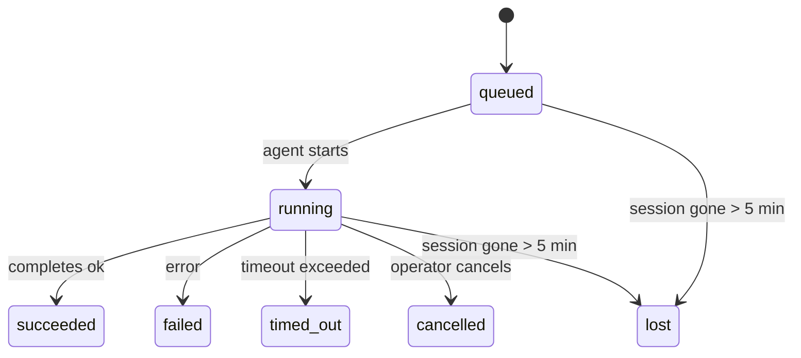

# Background Tasks

> **Looking for scheduling?** See [Automation & Tasks](/automation) for choosing the right mechanism. This page covers **tracking** background work, not scheduling it.

Background tasks track work that runs **outside your main conversation session**:
ACP runs, subagent spawns, isolated cron job executions, and CLI-initiated operations.

Tasks do **not** replace sessions, cron jobs, or event-driven main-session wakes

- they are the **activity ledger** that records what detached work happened,
  when, and whether it succeeded.

<Note>
Not every agent run creates a task. Normal interactive chat and event-driven
main-session wakes do not. All cron executions, ACP spawns, subagent spawns, and
CLI agent commands do.
</Note>

## TL;DR

- Tasks are **records**, not schedulers - cron, hooks, and system events decide _when_ work runs, tasks track _what happened_.
- ACP, subagents, all cron jobs, and Gateway API operations create tasks. Normal main-session wakes do not.
- Each task moves through `queued → running → terminal` (succeeded, failed, timed_out, cancelled, or lost).
- Completion notifications are delivered directly to a channel or queued for the next main-session wake.
- CrawClaw Desktop shows all tasks; the Gateway API exposes task listing, audit, and mutation operations.
- Terminal records are kept for 7 days, then automatically pruned.

## Quick start

Use CrawClaw Desktop for interactive inspection. For automation, call the local
Gateway RPC endpoint:

```bash
curl -sS http://127.0.0.1:18789/api/gateway/rpc \
  -H "content-type: application/json" \
  -H "authorization: Bearer $CRAWCLAW_GATEWAY_TOKEN" \
  -d '{
    "method": "agentRuntime.list",
    "params": { "status": "running", "limit": 20 }
  }'
```

## What creates a task

| Source                 | Runtime type | When a task record is created                       | Default notify policy |
| ---------------------- | ------------ | --------------------------------------------------- | --------------------- |
| ACP background runs    | `acp`        | Spawning a child ACP session                        | `done_only`           |
| Subagent orchestration | `subagent`   | Spawning a subagent via `sessions_spawn`            | `done_only`           |
| Cron jobs (all types)  | `cron`       | Every cron execution (main-session and isolated)    | `silent`              |
| Gateway API operations | `api`        | Desktop or API actions that run through the Gateway | `silent`              |

Main-session cron tasks use `silent` notify policy by default — they create records for tracking but do not generate notifications. Isolated cron tasks also default to `silent` but are more visible because they run in their own session.

**What does not create tasks:**

- Normal main-session wakes; see [Heartbeat](/gateway/heartbeat) for legacy compatibility notes
- Normal interactive chat turns
- Direct `/command` responses

## Task lifecycle



| Status      | What it means                                                              |
| ----------- | -------------------------------------------------------------------------- |
| `queued`    | Created, waiting for the agent to start                                    |
| `running`   | Agent turn is actively executing                                           |
| `succeeded` | Completed successfully                                                     |
| `failed`    | Completed with an error                                                    |
| `timed_out` | Exceeded the configured timeout                                            |
| `cancelled` | Stopped by the operator through Desktop or the Gateway API                 |
| `lost`      | Backing child session disappeared (detected after a 5-minute grace period) |

Transitions happen automatically — when the associated agent run ends, the task status updates to match.

## Delivery and notifications

When a task reaches a terminal state, CrawClaw notifies you. There are two delivery paths:

**Direct delivery** — if the task has a channel target (the `requesterOrigin`), the completion message goes straight to that channel (Feishu, community chat, Feishu, etc.).

**Session-queued delivery** — if direct delivery fails or no origin is set, the update is queued as a system event in the requester's session and surfaces on the next main-session wake.

<Tip>
Task completion triggers an immediate main-session wake so you see the result
quickly. It does not wait for a legacy periodic heartbeat tick.
</Tip>

### Notification policies

Control how much you hear about each task:

| Policy                | What is delivered                                                       |
| --------------------- | ----------------------------------------------------------------------- |
| `done_only` (default) | Only terminal state (succeeded, failed, etc.) — **this is the default** |
| `state_changes`       | Every state transition and progress update                              |
| `silent`              | Nothing at all                                                          |

Change the policy while a task is running:

There is no task-level RPC for changing notification policy after launch. Task
notification routing is owned by the run that created the task; set the notify
policy on the creating surface. `sessions.patch` only changes operator metadata
or session status.

## Gateway API reference

The Gateway exposes task-ledger data through `POST /api/gateway/rpc`. Send a
JSON body with a `method` and `params` object. The current supported methods are
the Rust Gateway RPC methods below; there is no separate `tasks.*` RPC namespace.

| Method                 | Purpose                                       | Common params                                            |
| ---------------------- | --------------------------------------------- | -------------------------------------------------------- |
| `agentRuntime.summary` | Counts running, waiting, failed, and complete | `category`, `status`, `agent`, `sessionKey`              |
| `agentRuntime.list`    | Lists task/run rows with a summary            | `limit`, plus the same filters as `summary`              |
| `agentRuntime.get`     | Fetches one task/run detail                   | `taskId`, `runId`, `sessionKey`, or `key`                |
| `agentRuntime.cancel`  | Cancels a waiting or running task             | `taskId`, `runId`, `sessionKey`, or `key`                |
| `agent.inspect`        | Returns run details plus transcript refs      | `runId`, `taskId`, `traceId`, `sessionKey`, `key`        |
| `agent.wait`           | Returns a status/timing snapshot for a run    | `runId`, `taskId`, `sessionKey`, or `key`                |
| `sessions.patch`       | Updates session metadata/status               | `key`/`sessionKey`, `label`, `model`, `pinned`, `status` |
| `sessions.abort`       | Acknowledges a low-level chat abort request   | `key`/`sessionKey`, optional `runId`                     |

### List active runs

```bash
curl -sS http://127.0.0.1:18789/api/gateway/rpc \
  -H "content-type: application/json" \
  -H "authorization: Bearer $CRAWCLAW_GATEWAY_TOKEN" \
  -d '{
    "method": "agentRuntime.list",
    "params": { "status": "running", "limit": 20 }
  }'
```

`agentRuntime.list` returns `summary`, `count`, and `runs`. Each run includes
`taskId`, `category`, `runtime`, `status`, `title`, `sessionKey`,
`childSessionKey`, timestamps, and error/summary fields when present.

### Show one run

```bash
curl -sS http://127.0.0.1:18789/api/gateway/rpc \
  -H "content-type: application/json" \
  -H "authorization: Bearer $CRAWCLAW_GATEWAY_TOKEN" \
  -d '{
    "method": "agentRuntime.get",
    "params": { "taskId": "task-or-session-key" }
  }'
```

The lookup token accepts a task ID, run ID, session key, or normalized key. The
response includes the `run`, `metadata`, and `availableActions` such as
`openSession` and `cancel`.

### Cancel one run

```bash
curl -sS http://127.0.0.1:18789/api/gateway/rpc \
  -H "content-type: application/json" \
  -H "authorization: Bearer $CRAWCLAW_GATEWAY_TOKEN" \
  -d '{
    "method": "agentRuntime.cancel",
    "params": { "taskId": "task-or-session-key" }
  }'
```

For active ACP and subagent tasks this aborts the backing child work when an
abort handle is registered, patches the session status to `cancelled`, and emits
a session change event. If the target is missing or already terminal, the
response still returns `ok: true` with `cancelled: false` and a `reason`.

### Inspect or wait

Use `agent.inspect` when you need transcript references and the resolved run
record. Use `agent.wait` when a caller only needs a status snapshot with
`startedAt`, `endedAt`, and `error`.

Operational issues are derived from the runtime summary/list data and Desktop
status views. There is no standalone `tasks.audit` RPC method.

| Finding                   | Severity | Trigger                                               |
| ------------------------- | -------- | ----------------------------------------------------- |
| `stale_queued`            | warn     | Queued for more than 10 minutes                       |
| `stale_running`           | error    | Running for more than 30 minutes                      |
| `lost`                    | error    | Backing session is gone                               |
| `delivery_failed`         | warn     | Delivery failed and notify policy is not `silent`     |
| `missing_cleanup`         | warn     | Terminal task with no cleanup timestamp               |
| `inconsistent_timestamps` | warn     | Timeline violation (for example ended before started) |

## Chat task board (`/tasks`)

Use `/tasks` in any chat session to see background tasks linked to that session. The board shows
active and recently completed tasks with runtime, status, timing, and progress or error detail.

When the current session has no visible linked tasks, `/tasks` falls back to agent-local task counts
so you still get an overview without leaking other-session details.

For the full operator ledger, use CrawClaw Desktop or the Gateway API.

## Status integration (task pressure)

CrawClaw Desktop or the local Gateway API includes an at-a-glance task summary:

```
Tasks: 3 queued · 2 running · 1 issues
```

The summary reports:

- **active** — count of `queued` + `running`
- **failures** — count of `failed` + `timed_out` + `lost`
- **byRuntime** — breakdown by `acp`, `subagent`, `cron`, `cli`

Both `/status` and the `session_status` tool use a cleanup-aware task snapshot: active tasks are
preferred, stale completed rows are hidden, and recent failures only surface when no active work
remains. This keeps the status card focused on what matters right now.

## Storage and maintenance

### Where tasks live

Task records persist in SQLite at:

```
$CRAWCLAW_STATE_DIR/tasks/runs.sqlite
```

The registry loads into memory at gateway start and syncs writes to SQLite for durability across restarts.

### Automatic maintenance

A sweeper runs every **60 seconds** and handles three things:

1. **Reconciliation** — checks if active tasks' backing sessions still exist. If a child session has been gone for more than 5 minutes, the task is marked `lost`.
2. **Cleanup stamping** — sets a `cleanupAfter` timestamp on terminal tasks (endedAt + 7 days).
3. **Pruning** — deletes records past their `cleanupAfter` date.

**Retention**: terminal task records are kept for **7 days**, then automatically pruned. No configuration needed.

## How tasks relate to other systems

### Tasks and workflows

CrawClaw workflows manage multi-step automation assets and n8n execution bindings. Tasks remain the detached-work ledger for runs, status, notifications, and cleanup. Use Desktop or the Gateway API to inspect task records when a workflow, cron job, subagent, or API operation runs outside the main conversation.

See [Task Flow](/automation/taskflow) for the compatibility boundary between older task-flow language and current workflows.

### Tasks and cron

A cron job **definition** lives in `~/.crawclaw/cron/jobs.json`. **Every** cron execution creates a task record — both main-session and isolated. Main-session cron tasks default to `silent` notify policy so they track without generating notifications.

See [Cron Jobs](/automation/cron-jobs).

### Tasks and main-session wakes

Main-session wakes do not create task records. When a task completes, it can
trigger a wake so you see the result promptly.

See [Heartbeat](/gateway/heartbeat) for legacy compatibility notes.

### Tasks and sessions

A task may reference a `childSessionKey` (where work runs) and a `requesterSessionKey` (who started it). Sessions are conversation context; tasks are activity tracking on top of that.

### Tasks and agent runs

A task's `runId` links to the agent run doing the work. Agent lifecycle events (start, end, error) automatically update the task status — you do not need to manage the lifecycle manually.

## Related

- [Automation & Tasks](/automation) — all automation mechanisms at a glance
- [Task Flow](/automation/taskflow) — compatibility boundary for older task-flow terminology
- [Scheduled Tasks](/automation/cron-jobs) — scheduling background work
- [Heartbeat](/gateway/heartbeat) — heartbeat migration notes
- [Background tasks](/automation/tasks#gateway-api-reference) — API reference
