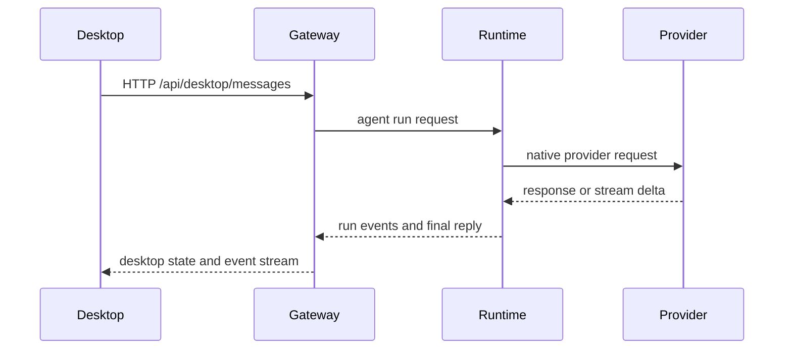

# Gateway architecture

## Overview

CrawClaw is desktop-first and local-first. CrawClaw Desktop owns setup, status,
logs, diagnostics, plugin visibility, and the local Gateway lifecycle. The
Gateway is the local control plane for HTTP, WebSocket, OpenAI-compatible APIs,
channel routing, sessions, auth, and runtime state.

The product runtime is Rust-owned:

- `crates/crawclaw-gateway` owns Gateway protocol, auth, HTTP/WS services, and
  client-facing API boundaries.
- `crates/crawclaw-runtime` owns the agent loop, memory, cron, runtime tools,
  native plugin registry wiring, runtime layout, and runtime status.
- `crates/crawclaw-providers` owns provider metadata, model normalization, and
  native provider request/stream parsing.
- `crates/crawclaw-channels` owns native channel descriptors, delivery
  capabilities, and desktop channel configuration metadata.
- `crates/crawclaw-plugin-sdk` is the public Rust plugin authoring contract.

TypeScript remains in the desktop renderer, docs hosted tooling, and npm
packaging surface where it is intentionally part of the UI/build workflow. Node
and npm are now routed through the repo-tools adapter layer; they are not the
production plugin runtime contract.

## Components and flows

### CrawClaw Desktop

- Starts and supervises the local Gateway/runtime binaries.
- Reads desktop API state from `/api/desktop/*`.
- Presents provider, plugin, channel, session, memory, and diagnostic surfaces.
- Uses generated desktop API types from the Rust/Tauri contract.

### Gateway

- Exposes HTTP, WebSocket, and OpenAI-compatible endpoints.
- Applies local auth, pairing, allowlists, and routing policy.
- Normalizes channel messages into typed runtime requests.
- Emits desktop and protocol events for status, messages, sessions, and runtime
  updates.

### Runtime

- Executes agent turns, memory operations, cron jobs, runtime tools, and native
  plugin operations.
- Reads provider and channel contracts from Rust crates.
- Keeps repo/build/release tooling out of the product runtime crate.

### Maintainer tooling

Build, release, docs checks, generated baseline emitters, GitHub helpers, and
Node/npm tool wrappers live in `crates/crawclaw-repo-tools`. The preferred
maintainer entrypoints are aggregate profiles such as
`crawclaw-repo-tools check --profile local`,
`crawclaw-repo-tools build --profile package`, and
`crawclaw-repo-tools release-check`. That crate may call product crates to read
catalogs or stage artifacts, but product runtime code does not own maintainer
command implementations.

## Local client flow

## Wire protocol summary

- WebSocket clients connect with the Gateway protocol handshake.
- HTTP desktop clients use `/api/desktop/*`.
- OpenAI-compatible clients use local Gateway compatibility endpoints.
- Protocol changes are owned by the Rust Gateway contract and generated schema.

Details: [Gateway protocol](/gateway/protocol), [Channels](/channels),
[Security](/gateway/security).

## Invariants

- CrawClaw Desktop is the primary user entrypoint.
- The local Gateway is the product control-plane boundary.
- Public plugin authoring goes through manifest metadata and the Rust plugin SDK.
- Native provider and channel behavior stays in Rust-owned contracts.
- Repository automation belongs in `crawclaw-repo-tools`, not `crawclaw-runtime`.

## Related

- [Agent Loop](/concepts/agent-loop)
- [Gateway Protocol](/gateway/protocol)
- [Channels](/channels)
- [Queue](/concepts/queue)
- [Security](/gateway/security)
