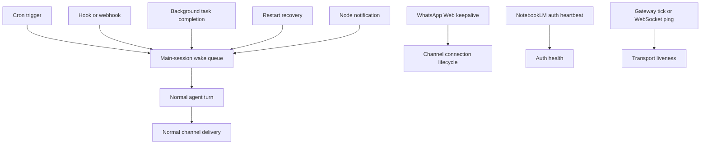

# Legacy heartbeat removal plan

This page defines the implementation boundary for removing CrawClaw's legacy
agent heartbeat.

The target is narrow:

- remove periodic agent model polls
- remove `HEARTBEAT.md` bootstrap behavior
- remove `HEARTBEAT_OK` acknowledgement semantics
- keep event-driven main-session wakes
- keep connection, auth, and protocol keepalive mechanisms

Do not delete files or config by grepping for `heartbeat`. The same word is
currently used for several unrelated runtime concepts.

## Terminology

| Concept                | Meaning                                                                                                        | Target state                        |
| ---------------------- | -------------------------------------------------------------------------------------------------------------- | ----------------------------------- |
| Legacy agent heartbeat | Periodic model run that asks the agent to inspect `HEARTBEAT.md` and reply `HEARTBEAT_OK` when idle            | Remove                              |
| Main-session wake      | Event-driven run requested by cron, hooks, background task completion, restart recovery, or node notifications | Keep and rename away from heartbeat |
| Connection keepalive   | Timer that keeps a channel connection observable or alive                                                      | Keep                                |
| Auth heartbeat         | Timer that probes or refreshes an auth state                                                                   | Keep                                |
| Protocol ping or tick  | WebSocket or gateway protocol liveness signal                                                                  | Keep                                |

## Current legacy agent heartbeat surface

Remove or replace these surfaces as part of the migration:

- `src/infra/heartbeat-runner.ts`: periodic scheduler and runtime enable flag.
- `src/infra/heartbeat-wake.ts`: currently mixes event-driven wake requests with
  heartbeat naming.
- `src/infra/heartbeat-events.ts`, `src/infra/heartbeat-summary.ts`,
  `src/infra/heartbeat-visibility.ts`, and related filters: status, summaries,
  visibility, and acknowledgement behavior for periodic heartbeat runs.
- `src/auto-reply/heartbeat.ts`, `src/auto-reply/tokens.ts`, and
  `src/auto-reply/heartbeat-reply-payload.ts`: prompt defaults, `HEARTBEAT_OK`,
  and stripping logic.
- `src/agents/workspace.ts`, `src/agents/bootstrap-files.ts`, and
  `src/agents/system-prompt.ts`: `HEARTBEAT.md` generation, lightweight
  heartbeat bootstrap files, and system-prompt instructions.
- `src/gateway/server.impl.ts`, `src/gateway/server-close.ts`,
  `src/gateway/server-reload-handlers.ts`, `src/gateway/server-methods/system.ts`,
  `src/gateway/server-chat.ts`, and `src/gateway/config-reload-plan.ts`:
  gateway lifecycle, RPC, reload, and chat surfaces that assume a heartbeat
  runner exists.
- `extensions/whatsapp/src/auto-reply/heartbeat-runner.ts`: WhatsApp-specific
  auto-reply heartbeat runner that depends on the agent heartbeat prompt and
  `HEARTBEAT_OK` token.
- `src/agents/acp-spawn.ts`: relay-route logic currently depends on heartbeat
  target configuration and must be rebuilt around explicit main-session wake or
  delivery configuration.
- `src/channels/plugins/types.core.ts`: `ChannelOutboundTargetMode` currently
  includes `heartbeat`; replace it with a wake or system-run mode through the
  public SDK migration path.

## Protected keepalive surfaces

These are not legacy agent heartbeat and must continue to work.

### WhatsApp Web keepalive

Keep `web.heartbeatSeconds` and the Web monitor interval.

Relevant code:

- `extensions/whatsapp/src/auto-reply/monitor.ts` starts the Web gateway
  connection interval, logs gateway liveness, clears the interval on close, and
  runs the stale-message watchdog.
- `extensions/whatsapp/src/reconnect.ts` resolves `web.heartbeatSeconds` with
  `DEFAULT_HEARTBEAT_SECONDS`.
- `docs/channels/whatsapp.md` documents the operations config surface.

The implementation may rename local variables and log modules from
`web-heartbeat` to `web-keepalive`, but behavior and config compatibility must
stay intact.

### NotebookLM auth heartbeat

Keep NotebookLM auth probing.

Relevant code:

- `src/memory/notebooklm/heartbeat.ts` owns the auth probe timer.
- `src/memory/config/notebooklm.ts` owns the default heartbeat config.
- `src/memory/config/resolve.ts` owns env overrides for
  `memory.notebooklm.auth.heartbeat.*`.
- `src/memory/engine/context-memory-runtime.ts` starts the NotebookLM auth
  heartbeat during memory runtime bootstrap.

This heartbeat is an auth-health loop, not a main-session model poll.

### Gateway and WebSocket liveness

Keep gateway tick and WebSocket liveness behavior.

Relevant code:

- `src/gateway/server-maintenance.ts` broadcasts the gateway `tick` event.
- `src/gateway/client.ts` watches for missing ticks and closes stale
  connections with `tick timeout`.
- `src/gateway/protocol/schema/frames.ts` carries `tickIntervalMs` in the
  connection policy.
- `extensions/qqbot/src/gateway.ts` sends QQ Bot gateway heartbeat frames using
  the provider's `heartbeat_interval`.
- `extensions/voice-call/src/providers/twilio.ts` sends silence keepalive audio
  while telephony TTS is being synthesized.

These paths are network or provider protocol liveness, not agent heartbeat.

## Target architecture

The target runtime split is:



Main-session wake should be a normal agent turn with explicit event context. It
should not use `HEARTBEAT.md`, `HEARTBEAT_OK`, heartbeat-only bootstrap files,
heartbeat visibility, or heartbeat delivery modes.

## Rollout plan

### PR1: introduce wake naming

- Add a `main-session-wake` runtime module that owns event-driven wake requests.
- Replace `requestHeartbeatNow` call sites with `requestMainSessionWakeNow`.
- Keep the existing event queue in `src/infra/system-events.ts`.
- Classify `background-task` as event-driven wake context instead of generic
  heartbeat context.
- Keep a short internal compatibility alias only where needed to make the PR
  mechanical; the alias must not expose user-facing heartbeat behavior.

Acceptance criteria:

- Cron, hooks, background task completion, restart recovery, and node
  notifications still enqueue system events and wake the main session.
- No periodic model polling is introduced by the new wake module.
- Tests cover the wake reason classification and session-key scoping.

### PR2: remove the periodic runner

- Delete `src/infra/heartbeat-runner.ts`.
- Remove gateway startup, close, reload, and config-reload actions that manage
  the heartbeat runner.
- Remove `set-heartbeats`, `last-heartbeat`, and `system.heartbeat.last` RPC
  methods or replace them with wake-specific status methods only if still
  needed.
- Remove `agents.defaults.heartbeat` and `agents.list[].heartbeat` schema
  handling.
- Remove heartbeat model override handling from model pricing and cron run
  configuration.

Acceptance criteria:

- Gateway startup has no default periodic agent runner.
- Config reload no longer restarts a heartbeat scheduler.
- Config validation rejects new legacy agent heartbeat config with a migration
  message.

### PR3: remove prompt, ack, and workspace bootstrap behavior

- Stop generating `HEARTBEAT.md` in new agent workspaces.
- Remove `docs/reference/templates/HEARTBEAT.md`.
- Remove heartbeat-only bootstrap mode from `src/agents/bootstrap-files.ts`.
- Remove `HEARTBEAT_OK` stripping, suppression, and alert split logic.
- Remove the heartbeat section from agent system prompts.
- Update docs that currently tell users to configure periodic heartbeat.

Acceptance criteria:

- New workspaces no longer create `HEARTBEAT.md`.
- A literal `HEARTBEAT_OK` is treated like normal user or assistant text
  outside any legacy migration test.
- User docs point to cron and hooks for scheduled or event-driven work.

### PR4: clean channel and plugin delivery semantics

- Replace `ChannelOutboundTargetMode = "heartbeat"` with a wake or system-run
  mode through `src/channels/plugins/types.core.ts`.
- Update bundled plugin logic and tests that currently branch on
  `mode === "heartbeat"`, including WhatsApp and Twitch outbound target
  resolution.
- Decide whether the public SDK needs a one-release compatibility decoder for
  plugin authors. If kept, it must be documented as a target-mode alias, not as
  legacy agent heartbeat.

Acceptance criteria:

- Bundled plugins no longer depend on heartbeat delivery mode.
- Public plugin SDK API drift is generated and checked if the SDK type changes.
- No channel routing behavior regresses for cron, hooks, or explicit sends.

### PR5: split WhatsApp legacy heartbeat from Web keepalive

- Delete or convert `extensions/whatsapp/src/auto-reply/heartbeat-runner.ts`.
- Preserve `extensions/whatsapp/src/auto-reply/monitor.ts` Web keepalive and
  stale-message watchdog behavior.
- Optionally rename internal fields and log names from `heartbeat` to
  `keepalive` while keeping `web.heartbeatSeconds` config compatibility.

Acceptance criteria:

- WhatsApp Web still logs liveness and watchdog stale connections.
- `web.heartbeatSeconds` still works.
- WhatsApp no longer sends or suppresses `HEARTBEAT_OK`.

### PR6: docs and migration cleanup

- Remove or redirect `/gateway/heartbeat`.
- Update configuration, CLI, troubleshooting, token-use, prompt-caching, start,
  FAQ, and template docs that mention periodic heartbeat.
- Replace `next-heartbeat` wording in hooks and cron docs with wake-specific
  wording.
- Keep docs for protected keepalive surfaces where relevant.

Acceptance criteria:

- Docs no longer recommend periodic agent heartbeat.
- Cron and hooks are the documented way to schedule or trigger future work.
- WhatsApp Web and NotebookLM auth heartbeat docs remain accurate.

## Verification gates

Run targeted checks close to the touched surface:

```bash
pnpm test -- src/memory/notebooklm/heartbeat.test.ts
pnpm test -- src/gateway/client.watchdog.test.ts
pnpm test -- extensions/whatsapp/src/auto-reply/web-auto-reply-monitor.test.ts
pnpm test -- extensions/whatsapp/src/reconnect.test.ts
```

Add missing tests before relying on those gates if any listed file has no
current test coverage in the target branch.

Run broader gates when config, docs, SDK, or build output changes:

```bash
pnpm config:docs:check
pnpm plugin-sdk:api:check
pnpm docs:check-i18n-glossary
pnpm check
pnpm test
pnpm build
```

Use `pnpm build` for any PR that touches config schema, dynamic imports,
package exports, plugin SDK surfaces, or gateway startup wiring.

## Search guardrails

Before landing the final cleanup, these searches should have clear intentional
matches only:

```bash
rg -n "HEARTBEAT_OK|HEARTBEAT.md|agents\\.defaults\\.heartbeat|agents\\.list\\[\\]\\.heartbeat" src docs extensions
rg -n "requestHeartbeatNow|startHeartbeatRunner|setHeartbeatsEnabled" src extensions
rg -n "mode === \"heartbeat\"|ChannelOutboundTargetMode.*heartbeat" src extensions
```

Remaining `heartbeat` matches must be reviewed and classified as one of:

- connection keepalive
- auth heartbeat
- protocol ping or tick
- historical migration test

Anything else should be renamed or removed.

## Non-goals

This migration does not remove:

- cron
- hooks
- background task notifications
- WebSocket or gateway tick liveness
- channel provider keepalive timers
- NotebookLM auth probing
- WhatsApp Web connection watchdog behavior

Those systems should continue to work without periodic legacy agent heartbeat.
