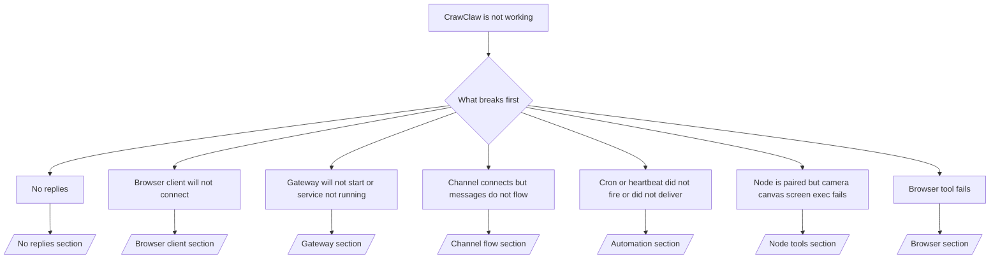

# Troubleshooting

If you only have 2 minutes, use this page as a triage front door.

## First 60 seconds

Run this exact ladder in order:

```bash
crawclaw status
crawclaw status --all
crawclaw gateway probe
crawclaw gateway status
crawclaw doctor
crawclaw channels status --probe
crawclaw logs --follow
```

Good output in one line:

- `crawclaw status` → shows configured channels and no obvious auth errors.
- `crawclaw status --all` → full report is present and shareable.
- `crawclaw gateway probe` → expected gateway target is reachable (`Reachable: yes`). `RPC: limited - missing scope: operator.read` is degraded diagnostics, not a connect failure.
- `crawclaw gateway status` → `Runtime: running` and `RPC probe: ok`.
- `crawclaw doctor` → no blocking config/service errors.
- `crawclaw channels status --probe` → channels report `connected` or `ready`.
- `crawclaw logs --follow` → steady activity, no repeating fatal errors.

## Anthropic long context 429

If you see:
`HTTP 429: rate_limit_error: Extra usage is required for long context requests`,
go to [/gateway/troubleshooting#anthropic-429-extra-usage-required-for-long-context](/gateway/troubleshooting#anthropic-429-extra-usage-required-for-long-context).

## Plugin install fails with missing crawclaw extensions

If install fails with `package.json missing crawclaw.extensions`, the plugin package
is using an old shape that CrawClaw no longer accepts.

Fix in the plugin package:

1. Add `crawclaw.extensions` to `package.json`.
2. Point entries at built runtime files (usually `./dist/index.js`).
3. Republish the plugin and run `crawclaw plugins install <package>` again.

Example:

```json
{
  "name": "@crawclaw/my-plugin",
  "version": "1.2.3",
  "crawclaw": {
    "extensions": ["./dist/index.js"]
  }
}
```

Reference: [Plugin architecture](/plugins/architecture)

## Decision tree



<AccordionGroup>
  <Accordion title="No replies">
    ```bash
    crawclaw status
    crawclaw gateway status
    crawclaw channels status --probe
    crawclaw pairing list --channel <channel> [--account <id>]
    crawclaw logs --follow
    ```

    Good output looks like:

    - `Runtime: running`
    - `RPC probe: ok`
    - Your channel shows connected/ready in `channels status --probe`
    - Sender appears approved (or DM policy is open/allowlist)

    Common log signatures:

    - `drop guild message (mention required` → mention gating blocked the message in Discord.
    - `pairing request` → sender is unapproved and waiting for DM pairing approval.
    - `blocked` / `allowlist` in channel logs → sender, room, or group is filtered.

    Deep pages:

    - [/gateway/troubleshooting#no-replies](/gateway/troubleshooting#no-replies)
    - [/channels/troubleshooting](/channels/troubleshooting)
    - [/channels/pairing](/channels/pairing)

  </Accordion>

  <Accordion title="Browser client will not connect">
    ```bash
    crawclaw status
    crawclaw gateway status
    crawclaw logs --follow
    crawclaw doctor
    crawclaw channels status --probe
    ```

    Good output looks like:

    - A reachable client target is shown in your chosen access path
    - `RPC probe: ok`
    - No auth loop in logs

    Common log signatures:

    - `device identity required` → HTTP/non-secure context cannot complete device auth.
    - `AUTH_TOKEN_MISMATCH` with retry hints (`canRetryWithDeviceToken=true`) → one trusted device-token retry may occur automatically.
    - repeated `unauthorized` after that retry → wrong token/password, auth mode mismatch, or stale paired device token.
    - `gateway connect failed:` → client is targeting the wrong URL/port or an unreachable gateway.

    Deep pages:

    - [/gateway/troubleshooting#browser-client-connectivity](/gateway/troubleshooting#browser-client-connectivity)
    - [/gateway/authentication](/gateway/authentication)

  </Accordion>

  <Accordion title="Gateway will not start or service installed but not running">
    ```bash
    crawclaw status
    crawclaw gateway status
    crawclaw logs --follow
    crawclaw doctor
    crawclaw channels status --probe
    ```

    Good output looks like:

    - `Service: ... (loaded)`
    - `Runtime: running`
    - `RPC probe: ok`

    Common log signatures:

    - `Gateway start blocked: set gateway.mode=local` → gateway mode is unset/remote.
    - `refusing to bind gateway ... without auth` → non-loopback bind without token/password.
    - `another gateway instance is already listening` or `EADDRINUSE` → port already taken.

    Deep pages:

    - [/gateway/troubleshooting#gateway-service-not-running](/gateway/troubleshooting#gateway-service-not-running)
    - [/gateway/background-process](/gateway/background-process)
    - [/gateway/configuration](/gateway/configuration)

  </Accordion>

  <Accordion title="Channel connects but messages do not flow">
    ```bash
    crawclaw status
    crawclaw gateway status
    crawclaw logs --follow
    crawclaw doctor
    crawclaw channels status --probe
    ```

    Good output looks like:

    - Channel transport is connected.
    - Pairing/allowlist checks pass.
    - Mentions are detected where required.

    Common log signatures:

    - `mention required` → group mention gating blocked processing.
    - `pairing` / `pending` → DM sender is not approved yet.
    - `not_in_channel`, `missing_scope`, `Forbidden`, `401/403` → channel permission token issue.

    Deep pages:

    - [/gateway/troubleshooting#channel-connected-messages-not-flowing](/gateway/troubleshooting#channel-connected-messages-not-flowing)
    - [/channels/troubleshooting](/channels/troubleshooting)

  </Accordion>

  <Accordion title="Cron or heartbeat did not fire or did not deliver">
    ```bash
    crawclaw status
    crawclaw gateway status
    crawclaw cron status
    crawclaw cron list
    crawclaw cron runs --id <jobId> --limit 20
    crawclaw logs --follow
    ```

    Good output looks like:

    - `cron.status` shows enabled with a next wake.
    - `cron runs` shows recent `ok` entries.
    - Heartbeat is enabled and not outside active hours.

    Common log signatures:

    - `cron: scheduler disabled; jobs will not run automatically` → cron is disabled.
    - `heartbeat skipped` with `reason=quiet-hours` → outside configured active hours.
    - `requests-in-flight` → main lane busy; heartbeat wake was deferred.
    - `unknown accountId` → heartbeat delivery target account does not exist.

    Deep pages:

    - [/gateway/troubleshooting#cron-and-heartbeat-delivery](/gateway/troubleshooting#cron-and-heartbeat-delivery)
    - [/automation/cron-jobs#troubleshooting](/automation/cron-jobs#troubleshooting)
    - [/gateway/heartbeat](/gateway/heartbeat)

  </Accordion>

  <Accordion title="Node is paired but tool fails camera canvas screen exec">
    ```bash
    crawclaw status
    crawclaw gateway status
    crawclaw nodes status
    crawclaw nodes describe --node <idOrNameOrIp>
    crawclaw logs --follow
    ```

    Good output looks like:

    - Node is listed as connected and paired for role `node`.
    - Capability exists for the command you are invoking.
    - Permission state is granted for the tool.

    Common log signatures:

    - `NODE_BACKGROUND_UNAVAILABLE` → bring node app to foreground.
    - `*_PERMISSION_REQUIRED` → OS permission was denied/missing.
    - `SYSTEM_RUN_DENIED: approval required` → exec approval is pending.
    - `SYSTEM_RUN_DENIED: allowlist miss` → command not on exec allowlist.

    Deep pages:

    - [/gateway/troubleshooting#node-paired-tool-fails](/gateway/troubleshooting#node-paired-tool-fails)
    - [/nodes/troubleshooting](/nodes/troubleshooting)
    - [/tools/exec-approvals](/tools/exec-approvals)

  </Accordion>

  <Accordion title="Exec suddenly asks for approval">
    ```bash
    crawclaw config get tools.exec.host
    crawclaw config get tools.exec.security
    crawclaw config get tools.exec.ask
    crawclaw gateway restart
    ```

    What changed:

    - If `tools.exec.host` is unset, the default is `auto`.
    - `host=auto` resolves to `sandbox` when a sandbox runtime is active, `gateway` otherwise.
    - `host=auto` is routing only; the no-prompt "YOLO" behavior comes from `security=full` plus `ask=off` on gateway/node.
    - On `gateway` and `node`, unset `tools.exec.security` defaults to `full`.
    - Unset `tools.exec.ask` defaults to `off`.
    - Result: if you are seeing approvals, some host-local or per-session policy tightened exec away from the current defaults.

    Restore current default no-approval behavior:

    ```bash
    crawclaw config set tools.exec.host gateway
    crawclaw config set tools.exec.security full
    crawclaw config set tools.exec.ask off
    crawclaw gateway restart
    ```

    Safer alternatives:

    - Set only `tools.exec.host=gateway` if you just want stable host routing.
    - Use `security=allowlist` with `ask=on-miss` if you want host exec but still want review on allowlist misses.
    - Enable sandbox mode if you want `host=auto` to resolve back to `sandbox`.

    Common log signatures:

    - `Approval required.` → command is waiting on `/approve ...`.
    - `SYSTEM_RUN_DENIED: approval required` → node-host exec approval is pending.
    - `exec host=sandbox requires a sandbox runtime for this session` → implicit/explicit sandbox selection but sandbox mode is off.

    Deep pages:

    - [/tools/exec](/tools/exec)
    - [/tools/exec-approvals](/tools/exec-approvals)
    - [/gateway/security#runtime-expectation-drift](/gateway/security#runtime-expectation-drift)

  </Accordion>

  <Accordion title="Browser tool fails">
    ```bash
    crawclaw status
    crawclaw gateway status
    crawclaw browser status
    crawclaw logs --follow
    crawclaw doctor
    ```

    Good output looks like:

    - Browser status shows `running: true` and a chosen browser/profile.
    - `crawclaw` starts, or a remote CDP profile is reachable.

    Common log signatures:

    - `unknown command "browser"` or `unknown command 'browser'` → `plugins.allow` is set and does not include `browser`.
    - `Failed to start Chrome CDP on port` → local browser launch failed.
    - `browser.executablePath not found` → configured binary path is wrong.
    - `Remote CDP for profile "<name>" is not reachable` → configured remote CDP endpoint is unreachable.

    Deep pages:

    - [/gateway/troubleshooting#browser-tool-fails](/gateway/troubleshooting#browser-tool-fails)
    - [/tools/browser#missing-browser-command-or-tool](/tools/browser#missing-browser-command-or-tool)
    - [/tools/browser-linux-troubleshooting](/tools/browser-linux-troubleshooting)
    - [/tools/browser-wsl2-windows-remote-cdp-troubleshooting](/tools/browser-wsl2-windows-remote-cdp-troubleshooting)

  </Accordion>
</AccordionGroup>

## Related

- [FAQ](/help/faq) — frequently asked questions
- [Gateway Troubleshooting](/gateway/troubleshooting) — gateway-specific issues
- [Doctor](/gateway/doctor) — automated health checks and repairs
- [Channel Troubleshooting](/channels/troubleshooting) — channel connectivity issues
- [Automation Troubleshooting](/automation/cron-jobs#troubleshooting) — cron and heartbeat issues
