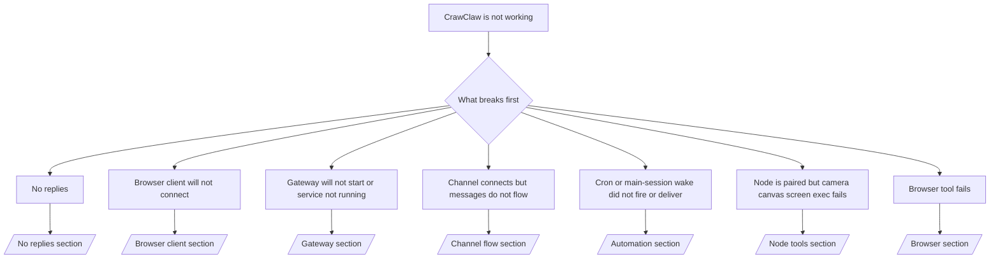

# Troubleshooting

If you only have 2 minutes, use this page as a triage front door.

## First 60 seconds

Run this exact ladder in order:

```bash
# Use CrawClaw Desktop or the local Gateway API for this operation.
# Use CrawClaw Desktop or the local Gateway API for this operation.
# Use CrawClaw Desktop or the local Gateway API for this operation.
# Use CrawClaw Desktop or the local Gateway API for this operation.
# Use CrawClaw Desktop or the local Gateway API for this operation.
# Use CrawClaw Desktop or the local Gateway API for this operation.
# Use CrawClaw Desktop or the local Gateway API for this operation.
```

Good output in one line:

- CrawClaw Desktop or the local Gateway API → shows configured channels and no obvious auth errors.
- CrawClaw Desktop or the local Gateway API → full report is present and shareable.
- CrawClaw Desktop or the local Gateway API → expected gateway target is reachable (`Reachable: yes`). `RPC: limited - missing scope: operator.read` is degraded diagnostics, not a connect failure.
- CrawClaw Desktop or the local Gateway API → `Runtime: running` and `RPC probe: ok`.
- CrawClaw Desktop or the local Gateway API → no blocking config/service errors.
- CrawClaw Desktop or the local Gateway API → channels report `connected` or `ready`.
- CrawClaw Desktop or the local Gateway API → steady activity, no repeating fatal errors.

## Anthropic long context 429

If you see:
`HTTP 429: rate_limit_error: Extra usage is required for long context requests`,
go to [/gateway/troubleshooting#anthropic-429-extra-usage-required-for-long-context](/gateway/troubleshooting#anthropic-429-extra-usage-required-for-long-context).

## Plugin install fails with missing crawclaw extensions

If install fails with `package.json missing crawclaw.extensions`, the plugin package
is using an old shape that CrawClaw no longer accepts.

Fix in the plugin package:

1. Remove the legacy JavaScript extension entry.
2. Rebuild the plugin as a Rust native plugin descriptor.
3. Republish the plugin and run CrawClaw Desktop or the local Gateway API again.

Example:

```json crawclaw.plugin.json
{
  "id": "my-plugin",
  "name": "My Plugin",
  "description": "Adds a native capability to CrawClaw",
  "native": {
    "protocol": "crawclaw-native-plugin-jsonrpc",
    "schemaVersion": 1,
    "bin": "./target/release/my-plugin"
  }
}
```

Reference: [Plugin architecture](/plugins/architecture)

## Decision tree


```mermaid
flowchart TD
  A[CrawClaw is not working] --> B{What breaks first}
  B --> C[No replies]
  B --> D[Browser client will not connect]
  B --> E[Gateway will not start or service not running]
  B --> F[Channel connects but messages do not flow]
  B --> G[Cron or main-session wake did not fire or deliver]
  B --> H[Node is paired but camera canvas screen exec fails]
  B --> I[Browser tool fails]

  C --> C1[/No replies section/]
  D --> D1[/Browser client section/]
  E --> E1[/Gateway section/]
  F --> F1[/Channel flow section/]
  G --> G1[/Automation section/]
  H --> H1[/Node tools section/]
  I --> I1[/Browser section/]
```

<AccordionGroup>
  <Accordion title="No replies">
    ```bash
    # Use CrawClaw Desktop or the local Gateway API for this operation.
    # Use CrawClaw Desktop or the local Gateway API for this operation.
    # Use CrawClaw Desktop or the local Gateway API for this operation.
    # Use CrawClaw Desktop or the local Gateway API for this operation.
    # Use CrawClaw Desktop or the local Gateway API for this operation.
    ```

    Good output looks like:

    - `Runtime: running`
    - `RPC probe: ok`
    - Your channel shows connected/ready in `channels status --probe`
    - Sender appears approved (or DM policy is open/allowlist)

    Common log signatures:

    - `drop guild message (mention required` → mention gating blocked the message in community chat.
    - `pairing request` → sender is unapproved and waiting for DM pairing approval.
    - `blocked` / `allowlist` in channel logs → sender, room, or group is filtered.

    Deep pages:

    - [/gateway/troubleshooting#no-replies](/gateway/troubleshooting#no-replies)
    - [/channels/troubleshooting](/channels/troubleshooting)
    - [/channels/pairing](/channels/pairing)

  </Accordion>

  <Accordion title="Browser client will not connect">
    ```bash
    # Use CrawClaw Desktop or the local Gateway API for this operation.
    # Use CrawClaw Desktop or the local Gateway API for this operation.
    # Use CrawClaw Desktop or the local Gateway API for this operation.
    # Use CrawClaw Desktop or the local Gateway API for this operation.
    # Use CrawClaw Desktop or the local Gateway API for this operation.
    ```

    Good output looks like:

    - A reachable client target is shown in your chosen access path
    - `RPC probe: ok`
    - No auth loop in logs

    Common log signatures:

    - `AUTH_TOKEN_MISMATCH` → wrong token/password or auth mode mismatch.
    - `gateway connect failed:` → client is targeting the wrong URL/port or an unreachable gateway.

    Deep pages:

    - [/gateway/troubleshooting#browser-client-connectivity](/gateway/troubleshooting#browser-client-connectivity)
    - [/gateway/authentication](/gateway/authentication)

  </Accordion>

  <Accordion title="Gateway will not start or service installed but not running">
    ```bash
    # Use CrawClaw Desktop or the local Gateway API for this operation.
    # Use CrawClaw Desktop or the local Gateway API for this operation.
    # Use CrawClaw Desktop or the local Gateway API for this operation.
    # Use CrawClaw Desktop or the local Gateway API for this operation.
    # Use CrawClaw Desktop or the local Gateway API for this operation.
    ```

    Good output looks like:

    - `Service: ... (loaded)`
    - `Runtime: running`
    - `RPC probe: ok`

    Common log signatures:

    - `Gateway start blocked: set gateway.mode=local` → gateway mode is unset/remote.
    - `refusing to bind gateway ... without auth` → non-loopback bind without token/password.
    - `another gateway instance is already listening` or `EADDRINUSE` → port already taken.

    Deep pages:

    - [/gateway/troubleshooting#gateway-service-not-running](/gateway/troubleshooting#gateway-service-not-running)
    - [/gateway/background-process](/gateway/background-process)
    - [/gateway/configuration](/gateway/configuration)

  </Accordion>

  <Accordion title="Channel connects but messages do not flow">
    ```bash
    # Use CrawClaw Desktop or the local Gateway API for this operation.
    # Use CrawClaw Desktop or the local Gateway API for this operation.
    # Use CrawClaw Desktop or the local Gateway API for this operation.
    # Use CrawClaw Desktop or the local Gateway API for this operation.
    # Use CrawClaw Desktop or the local Gateway API for this operation.
    ```

    Good output looks like:

    - Channel transport is connected.
    - Pairing/allowlist checks pass.
    - Mentions are detected where required.

    Common log signatures:

    - `mention required` → group mention gating blocked processing.
    - `pairing` / `pending` → DM sender is not approved yet.
    - `not_in_channel`, `missing_scope`, `Forbidden`, `401/403` → channel permission token issue.

    Deep pages:

    - [/gateway/troubleshooting#channel-connected-messages-not-flowing](/gateway/troubleshooting#channel-connected-messages-not-flowing)
    - [/channels/troubleshooting](/channels/troubleshooting)

  </Accordion>

  <Accordion title="Cron or main-session wake did not fire or deliver">
    ```bash
    # Use CrawClaw Desktop or the local Gateway API for this operation.
    # Use CrawClaw Desktop or the local Gateway API for this operation.
    # Use CrawClaw Desktop or the local Gateway API for this operation.
    # Use CrawClaw Desktop or the local Gateway API for this operation.
    # Use CrawClaw Desktop or the local Gateway API for this operation.
    # Use CrawClaw Desktop or the local Gateway API for this operation.
    ```

    Good output looks like:

    - `cron.status` shows enabled with a next wake.
    - `cron runs` shows recent `ok` entries.
    - Queued main-session wake events are visible through CrawClaw Desktop or the local Gateway API.

    Common log signatures:

    - `cron: scheduler disabled; jobs will not run automatically` → cron is disabled.
    - `requests-in-flight` → main lane busy; wake was deferred.
    - `unknown accountId` → legacy heartbeat delivery target account does not exist.

    Deep pages:

    - [/gateway/troubleshooting#cron-and-main-session-wake-delivery](/gateway/troubleshooting#cron-and-main-session-wake-delivery)
    - [/automation/cron-jobs#troubleshooting](/automation/cron-jobs#troubleshooting)
    - [/gateway/heartbeat](/gateway/heartbeat)

  </Accordion>

  <Accordion title="Exec suddenly asks for approval">
    ```bash
    # Use CrawClaw Desktop or the local Gateway API for this operation.
    # Use CrawClaw Desktop or the local Gateway API for this operation.
    # Use CrawClaw Desktop or the local Gateway API for this operation.
    # Use CrawClaw Desktop or the local Gateway API for this operation.
    ```

    What changed:

    - If `tools.exec.host` is unset, the default is `auto`.
    - `host=auto` is routing only; the no-prompt "YOLO" behavior comes from `security=full` plus `ask=off` on the Gateway host.
    - On `gateway`, unset `tools.exec.security` defaults to `full`.
    - Unset `tools.exec.ask` defaults to `off`.
    - Result: if you are seeing approvals, some host-local or per-session policy tightened exec away from the current defaults.

    Restore current default no-approval behavior:

    ```bash
    # Use CrawClaw Desktop or the local Gateway API for this operation.
    # Use CrawClaw Desktop or the local Gateway API for this operation.
    # Use CrawClaw Desktop or the local Gateway API for this operation.
    # Use CrawClaw Desktop or the local Gateway API for this operation.
    ```

    Safer alternatives:

    - Set only `tools.exec.host=gateway` if you just want stable host routing.
    - Use `security=allowlist` with `ask=on-miss` if you want host exec but still want review on allowlist misses.

    Common log signatures:

    - `Approval required.` → command is waiting on `/approve ...`.
    - `SYSTEM_RUN_DENIED: approval required` → gateway exec approval is pending.

    Deep pages:

    - [/tools/exec](/tools/exec)
    - [/tools/exec-approvals](/tools/exec-approvals)
    - [Security](/gateway/security)

  </Accordion>

  <Accordion title="Browser tool fails">
    ```bash
    # Use CrawClaw Desktop or the local Gateway API for this operation.
    # Use CrawClaw Desktop or the local Gateway API for this operation.
    # Use CrawClaw Desktop or the local Gateway API for this operation.
    # Use CrawClaw Desktop or the local Gateway API for this operation.
    ```

    From the current agent or Gateway `/tools/invoke` path, run the `browser` tool
    with `{ "action": "status", "profile": "crawclaw" }`.

    Good output looks like:

    - Browser tool status shows `running: true` and a chosen browser/profile.
    - `crawclaw` starts, or a remote CDP profile is reachable.

    Common log signatures:

    - Browser tool missing / unavailable while `browser.enabled=true` → `plugins.allow` is set and does not include `browser`.
    - `Failed to start Chrome CDP on port` → local browser launch failed.
    - `browser.executablePath not found` → configured binary path is wrong.
    - `Remote CDP for profile "<name>" is not reachable` → configured remote CDP endpoint is unreachable.

    Deep pages:

    - [/gateway/troubleshooting#browser-tool-fails](/gateway/troubleshooting#browser-tool-fails)
    - [/tools/browser#missing-browser-tool](/tools/browser#missing-browser-tool)
    - [/tools/browser-linux-troubleshooting](/tools/browser-linux-troubleshooting)

  </Accordion>
</AccordionGroup>

## Related

- [FAQ](/help/faq) — frequently asked questions
- [Gateway Troubleshooting](/gateway/troubleshooting) — gateway-specific issues
- [Doctor](/gateway/doctor) — automated health checks and repairs
- [Channel Troubleshooting](/channels/troubleshooting) — channel connectivity issues
- [Automation Troubleshooting](/automation/cron-jobs#troubleshooting) — cron and wake issues
