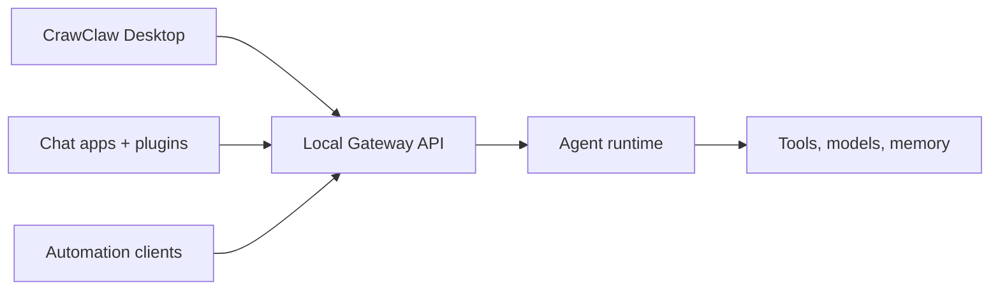

# CrawClaw 🦀

    
    

  <strong>Desktop-first local Gateway for AI agents across chat channels, tools, plugins, and automation.</strong> 
  Configure and operate CrawClaw from the desktop app; automate through the local Gateway API.

<Columns>
  <Card title="Get Started" href="/start/getting-started" icon="rocket">
    Install CrawClaw Desktop and bring up the local Gateway.
  </Card>
  <Card title="Desktop" href="/install/desktop" icon="monitor">
    Learn what the desktop app bundles, starts, and stores.
  </Card>
</Columns>

## What is CrawClaw?

CrawClaw is a **local-first desktop Gateway** that connects chat channels, tools,
model providers, sessions, memory, and plugins to AI agents. On Apple platforms,
CrawClaw is a desktop application, not a user CLI. The Gateway API remains the
local control-plane boundary for automation and integrations.

**Who is it for?** Developers and power users who want a personal AI assistant
running on their own machine without giving up control of data or runtime state.

**What makes it different?**

- **Desktop-first**: one app owns setup, status, logs, plugins, models, and Agent chat
- **Local Gateway API**: automation clients integrate through explicit JSON methods
- **Multi-channel**: one Gateway can serve supported channels and paired devices
- **Agent-native**: built for tool use, sessions, memory, and multi-agent routing
- **Open source**: MIT licensed, community-driven

## How it works

The Gateway is the single source of truth for sessions, routing, local runtime
state, and authenticated control-plane operations.

## Key capabilities

<Columns>
  <Card title="Desktop workbench" icon="monitor">
    Configure models, plugins, status, logs, diagnostics, and Agent sessions.
  </Card>
  <Card title="Gateway API" icon="waypoints">
    Use local JSON methods for automation and integrations.
  </Card>
  <Card title="Multi-agent routing" icon="route">
    Isolated sessions per agent, workspace, or sender.
  </Card>
  <Card title="Plugin ecosystem" icon="plug">
    Extend CrawClaw with native plugins, tools, channels, and providers.
  </Card>
</Columns>

Need the full install and dev setup? See [Getting Started](/start/getting-started).

  

## Start here

<Columns>
  <Card title="Docs hubs" href="/start/hubs" icon="book-open">
    All docs and guides, organized by use case.
  </Card>
  <Card title="Concepts index" href="/concepts" icon="blocks">
    System model, runtime, memory, models, and messaging concepts.
  </Card>
  <Card title="Gateway protocol" href="/gateway/protocol" icon="waypoints">
    Local API contract for desktop and automation clients.
  </Card>
  <Card title="Reference docs" href="/reference" icon="file-text">
    Stable reference material for testing, release, RPC, and migration.
  </Card>
  <Card title="Configuration" href="/gateway/configuration" icon="settings">
    Core Gateway settings, tokens, and provider config.
  </Card>
  <Card title="Remote access" href="/gateway/remote" icon="globe">
    SSH and tailnet access patterns.
  </Card>
  <Card title="Channels" href="/channels" icon="message-square">
    Channel-specific setup for supported chat surfaces.
  </Card>
  <Card title="Help" href="/help" icon="life-buoy">
    Common fixes and troubleshooting entry point.
  </Card>
</Columns>
