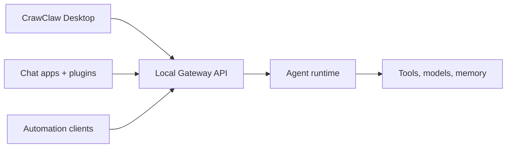

---
read_when:
  - 新規ユーザーに CrawClaw を紹介するとき
summary: CrawClaw は AI エージェント向けのデスクトップ優先ローカル Gateway です。
title: CrawClaw
x-i18n:
  generated_at: "2026-06-10T10:02:25Z"
  model: codex
  provider: openai
  source_hash: 58c6b8f2e6dbfa0c4388c7cb016977df0d1c27872d3f3bfb7402894649129136
  source_path: index.md
  workflow: 15
---

# CrawClaw 🦀

    
    

  <strong>チャットチャネル、ツール、プラグイン、自動化にまたがる AI エージェント向けのデスクトップ優先ローカル Gateway。</strong> 
  デスクトップアプリから CrawClaw を設定、運用します。自動化はローカル Gateway API 経由で実行します。

<Columns>
  <Card title="はじめに" href="/start/getting-started" icon="rocket">
    CrawClaw Desktop をインストールし、ローカル Gateway を起動します。
  </Card>
  <Card title="Desktop" href="/install/desktop" icon="monitor">
    デスクトップアプリがバンドル、起動、保存する内容を確認します。
  </Card>
</Columns>

## CrawClaw とは

CrawClaw は、チャットチャネル、ツール、モデルプロバイダー、セッション、メモリ、プラグインを AI エージェントへ接続する **ローカル優先のデスクトップ Gateway** です。Apple プラットフォームでは、CrawClaw はユーザー CLI ではなくデスクトップアプリです。Gateway API は、自動化と連携のためのローカル control-plane 境界として残ります。

**誰向けですか？** 自分のマシン上で動く個人 AI アシスタントを必要とし、データや runtime state の制御を手放したくない開発者と power user 向けです。

**何が違いますか？**

- **デスクトップ優先**: setup、status、logs、plugins、models、Agent chat を 1 つのアプリが管理します
- **ローカル Gateway API**: 自動化クライアントは明示的な JSON methods で連携します
- **マルチチャネル**: 1 つの Gateway が対応チャネルと paired devices を扱えます
- **Agent-native**: tool use、sessions、memory、multi-agent routing のために設計されています
- **オープンソース**: MIT licensed、community-driven

## 仕組み

```mermaid
flowchart LR
  A["CrawClaw Desktop"] --> B["Local Gateway API"]
  C["Chat apps + plugins"] --> B
  D["Automation clients"] --> B
  B --> E["Agent runtime"]
  E --> F["Tools, models, memory"]
```

Gateway は、sessions、routing、local runtime state、認証済み control-plane operations の single source of truth です。

## 主な機能

<Columns>
  <Card title="Desktop workbench" icon="monitor">
    models、plugins、status、logs、diagnostics、Agent sessions を設定します。
  </Card>
  <Card title="Gateway API" icon="waypoints">
    自動化と連携にはローカル JSON methods を使います。
  </Card>
  <Card title="Multi-agent routing" icon="route">
    agent、workspace、sender ごとに session を分離します。
  </Card>
  <Card title="Plugin ecosystem" icon="plug">
    native plugins、tools、channels、providers で CrawClaw を拡張します。
  </Card>
</Columns>

完全なインストールと開発セットアップが必要ですか？[はじめに](/start/getting-started) を参照してください。

  

## ここから始める

<Columns>
  <Card title="Docs hubs" href="/start/hubs" icon="book-open">
    ユースケース別に整理されたすべてのドキュメントとガイド。
  </Card>
  <Card title="Concepts index" href="/concepts" icon="blocks">
    system model、runtime、memory、models、messaging concepts。
  </Card>
  <Card title="Gateway protocol" href="/gateway/protocol" icon="waypoints">
    desktop と automation clients 向けのローカル API contract。
  </Card>
  <Card title="Reference docs" href="/reference" icon="file-text">
    testing、release、RPC、migration の安定した reference material。
  </Card>
  <Card title="Configuration" href="/gateway/configuration" icon="settings">
    Core Gateway settings、tokens、provider config。
  </Card>
  <Card title="Remote access" href="/gateway/remote" icon="globe">
    SSH と tailnet access patterns。
  </Card>
  <Card title="Channels" href="/channels" icon="message-square">
    対応 chat surfaces 向けの channel-specific setup。
  </Card>
  <Card title="Help" href="/help" icon="life-buoy">
    よくある修正と troubleshooting entry point。
  </Card>
</Columns>
