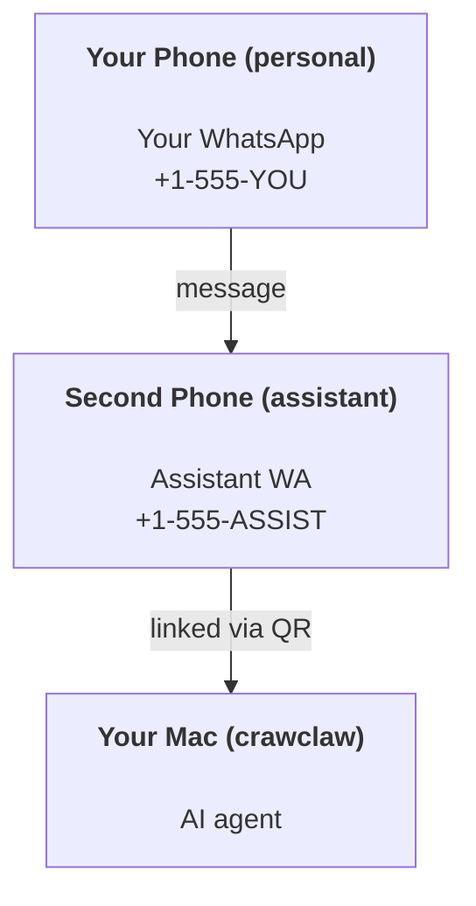

# Building a personal assistant with CrawClaw

CrawClaw is a self-hosted gateway that connects WhatsApp, Telegram, Discord, iMessage, and more to AI agents. This guide covers the "personal assistant" setup: a dedicated WhatsApp number that behaves like your always-on AI assistant.

## ⚠️ Safety first

You’re putting an agent in a position to:

- run commands on your machine (depending on your tool policy)
- read/write files in your workspace
- send messages back out via WhatsApp/Telegram/Discord/Mattermost (plugin)

Start conservative:

- Always set `channels.whatsapp.allowFrom` (never run open-to-the-world on your personal Mac).
- Use a dedicated WhatsApp number for the assistant.
- Add proactive checks with cron only after you trust the setup and delivery target.

## Prerequisites

- CrawClaw installed and onboarded — see [Getting Started](/start/getting-started) if you haven't done this yet
- A second phone number (SIM/eSIM/prepaid) for the assistant

## The two-phone setup (recommended)

You want this:



If you link your personal WhatsApp to CrawClaw, every message to you becomes “agent input”. That’s rarely what you want.

## 5-minute quick start

1. Pair WhatsApp Web (shows QR; scan with the assistant phone):

```bash
crawclaw channels login
```

2. Start the Gateway (leave it running):

```bash
crawclaw gateway --port 18789
```

3. Put a minimal config in `~/.crawclaw/crawclaw.json`:

```json5
{
  channels: { whatsapp: { allowFrom: ["+15555550123"] } },
}
```

Now message the assistant number from your allowlisted phone.

When onboarding finishes, use a channel or launch the terminal interface with `crawclaw tui`.

## Give the agent a workspace (AGENTS)

CrawClaw reads operating instructions and “memory” from its workspace directory.

By default, CrawClaw uses `~/.crawclaw/workspace` as the agent workspace, and
will create starter `AGENTS.md`, `SOUL.md`, `TOOLS.md`, `IDENTITY.md`,
`USER.md`, and compatibility `HEARTBEAT.md` automatically on setup/first agent run.
`BOOTSTRAP.md` is only created when the workspace is brand new (it should not
come back after you delete it). `MEMORY.md` is optional and not auto-created.

Default runtime bootstrap injection is intentionally narrow:

- normal runs inject `AGENTS.md`
- legacy heartbeat compatibility runs can inject `HEARTBEAT.md`
- `MEMORY.md` and `memory/*.md` stay on-demand through memory tools/workflows
  rather than auto-injected bootstrap context

Tip: treat this folder like CrawClaw’s “memory” and make it a git repo (ideally private) so your `AGENTS.md` + memory files are backed up. If git is installed, brand-new workspaces are auto-initialized.

```bash
crawclaw setup
```

Full workspace layout + backup guide: [Agent workspace](/concepts/agent-workspace)
Memory workflow: [Memory](/concepts/memory)

Optional: choose a different workspace with `agents.defaults.workspace` (supports `~`).

```json5
{
  agents: { defaults: { workspace: "~/.crawclaw/workspace" } },
}
```

If you already ship your own workspace files from a repo, you can disable bootstrap file creation entirely:

```json5
{
  agents: { defaults: { skipBootstrap: true } },
}
```

## The config that turns it into "an assistant"

CrawClaw defaults to a good assistant setup, but you’ll usually want to tune:

- persona/instructions in `SOUL.md`
- thinking defaults (if desired)
- cron jobs or hooks for proactive checks (once you trust delivery)

Example:

```json5
{
  logging: { level: "info" },
  agents: {
    defaults: {
      model: { primary: "anthropic/claude-opus-4-6" },
      workspace: "~/.crawclaw/workspace",
      thinkingDefault: "high",
      timeoutSeconds: 1800,
    },
  },
  channels: {
    whatsapp: {
      allowFrom: ["+15555550123"],
      groups: {
        "*": { requireMention: true },
      },
    },
  },
  routing: {
    groupChat: {
      mentionPatterns: ["@crawclaw", "crawclaw"],
    },
  },
  session: {
    scope: "per-sender",
    resetTriggers: ["/new"],
    reset: {
      mode: "daily",
      atHour: 4,
      idleMinutes: 10080,
    },
  },
}
```

## Sessions and memory

- Session files: `~/.crawclaw/agents/<agentId>/sessions/{{SessionId}}.jsonl`
- Session metadata (token usage, last route, etc): `~/.crawclaw/agents/<agentId>/sessions/sessions.json` (legacy: `~/.crawclaw/sessions/sessions.json`)
- `/new` starts a fresh session for that chat (configurable via `resetTriggers`). If sent alone, the agent replies with a short hello to confirm the reset.
- `/compact [instructions]` compacts the session context and reports the remaining context budget.

## Proactive checks

Legacy periodic agent heartbeat is no longer configured by default. For
proactive checks such as inbox review, calendar scans, or daily reports, create
a cron job instead. Use a main-session cron job when the work needs conversation
context, or an isolated cron job when you want a standalone run with its own task
record.

See [Scheduled Tasks](/automation/cron-jobs) and [Heartbeat](/gateway/heartbeat)
for migration notes.

## Media in and out

Inbound attachments (images/audio/docs) can be surfaced to your command via templates:

- `{{MediaPath}}` (local temp file path)
- `{{MediaUrl}}` (pseudo-URL)
- `{{Transcript}}` (if audio transcription is enabled)

Outbound attachments from the agent: include `MEDIA:<path-or-url>` on its own line (no spaces). Example:

```
Here’s the screenshot.
MEDIA:https://example.com/screenshot.png
```

CrawClaw extracts these and sends them as media alongside the text.

Local-path behavior follows the same file-read trust model as the agent:

- If `tools.fs.workspaceOnly` is `true`, outbound `MEDIA:` local paths stay restricted to the CrawClaw temp root, the media cache, agent workspace paths, and sandbox-generated files.
- If `tools.fs.workspaceOnly` is `false`, outbound `MEDIA:` can use host-local files the agent is already allowed to read.
- Host-local sends still only allow media and safe document types (images, audio, video, PDF, and Office documents). Plain text and secret-like files are not treated as sendable media.

That means generated images/files outside the workspace can now send when your fs policy already allows those reads, without reopening arbitrary host-text attachment exfiltration.

## Operations checklist

```bash
crawclaw status          # local status (creds, sessions, queued events)
crawclaw status --all    # full diagnosis (read-only, pasteable)
crawclaw status --deep   # adds gateway health probes (Telegram + Discord)
crawclaw health --json   # gateway health snapshot (WS)
```

Logs live under `/tmp/crawclaw/` (default: `crawclaw-YYYY-MM-DD.log`).

## Next steps

- WebChat: [WebChat](/web/webchat)
- Gateway ops: [Gateway runbook](/gateway)
- Cron + wakeups: [Cron jobs](/automation/cron-jobs)
- Historical mobile note: iOS and Android source trees were removed from this repository.
- Windows status: [Windows (WSL2)](/platforms/windows)
- Linux status: [Linux](/platforms/linux)
- Security: [Security](/gateway/security)
