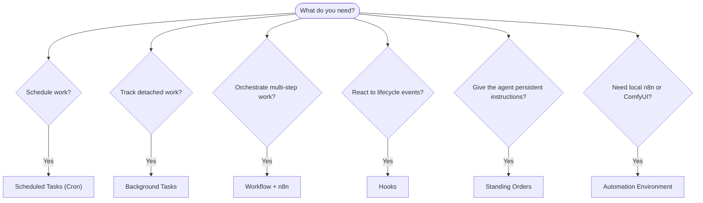

---
read_when:
  - 决定如何使用 CrawClaw 自动化工作
  - 在 cron、钩子、工作流、常设指令和系统事件之间选择
  - 寻找合适的自动化入口点
summary: 自动化机制概览：任务、cron、钩子、工作流和常设指令
title: 自动化与任务
x-i18n:
  generated_at: "2026-06-10T08:19:30Z"
  model: MiniMax-M2.7-highspeed
  provider: minimax
  source_hash: dfe2b3f8bc828a3a80c53e26123e84d232250dca99d87044862bebe1a23387be
  source_path: automation/index.md
  workflow: 15
---

# 自动化与任务

CrawClaw 通过任务记录、计划任务、受管理的自动化运行时、SDK 生命周期钩子、工作流和常设指令来运行后台工作。本页面帮助你选择合适的机制，并理解它们如何协同工作。

## 快速决策指南

| Use case                                | Recommended            | Why                                               |
| --------------------------------------- | ---------------------- | ------------------------------------------------- |
| Send daily report at 9 AM sharp         | Scheduled Tasks (Cron) | Exact timing, isolated execution                  |
| Remind me in 20 minutes                 | Scheduled Tasks (Cron) | One-shot with precise timing (`--at`)             |
| Run weekly deep analysis                | Scheduled Tasks (Cron) | Standalone task, can use different model          |
| Check inbox every 30 min                | Scheduled Tasks (Cron) | Use a main-session cron job for shared context    |
| Monitor calendar for upcoming events    | Scheduled Tasks (Cron) | Explicit schedule, visible run records            |
| Inspect status of a subagent or ACP run | Background Tasks       | Tasks ledger tracks all detached work             |
| Audit what ran and when                 | Background Tasks       | Desktop task ledger or Gateway API                |
| Install or bind local n8n / ComfyUI     | Automation Environment | Desktop-managed local services with health status |
| Multi-step research then summarize      | Workflow + n8n         | Workflow registry plus n8n execution              |
| Add context on session start            | Hooks                  | SDK lifecycle callback before the run             |
| Guard tool calls or permissions         | Hooks                  | SDK lifecycle callback around tool use            |
| Always check compliance before replying | Standing Orders        | Injected into every session automatically         |

### 定时任务与主会话唤醒

| Dimension       | Scheduled Tasks (Cron)                               | Main-session wake                                 |
| --------------- | ---------------------------------------------------- | ------------------------------------------------- |
| Timing          | Exact (cron expressions, one-shot)                   | Triggered by cron, hooks, tasks, or system events |
| Session context | Fresh isolated session or shared main session        | Full main-session context                         |
| Task records    | Created for cron executions                          | Not created for normal interactive wakes          |
| Delivery        | Channel, webhook, silent, or queued to main session  | Inline in main session when delivery is needed    |
| Best for        | Reports, reminders, periodic checks, background jobs | Event follow-ups and queued session updates       |

新的计划自动化请使用定时任务（Cron）。当工作需要主会话上下文时，请将 cron 任务配置为唤醒主会话，而不是依赖旧的周期性心跳。

## 核心概念

### 定时任务（cron）

Cron 是 Gateway 网关的内置调度器，用于精确计时。它会持久化任务、在正确的时间唤醒智能体，并可将输出传递到聊天渠道或 webhook 端点。支持一次性提醒、循环表达式和入站 webhook 触发。

参见 [定时任务](/automation/cron-jobs)。

### 任务

后台任务账本追踪所有分离的工作：ACP 运行、子智能体生成、隔离的 cron 执行以及 Gateway API 操作。任务是记录，不是调度器。使用 CrawClaw Desktop 或 Gateway API 检查它们。

参见 [后台任务](/automation/tasks)。

### 自动化环境

自动化环境是 Desktop 设置中用于较重本地自动化服务的区域。首批托管环境是 n8n 和 ComfyUI。Desktop 读取嵌入式运行时清单，将版本化的 GitHub release 资源暂存到打包的运行时树，验证安装程序校验和，在受限环境中运行安装程序，启动或停止本地服务进程，并向自动化工作区报告健康状态。

n8n 作为固定的 Node 服务进行管理，默认使用 local loopback
`http://127.0.0.1:5679`。ComfyUI 作为 Python 服务进行管理，默认使用 local loopback `http://127.0.0.1:8188`。ComfyUI 安装按 profile 区分，因为 PyTorch wheels 会随计算后端变化：Apple Metal、NVIDIA CUDA、AMD ROCm、Intel XPU、CPU 或外部用户管理的 ComfyUI 端点。

自动化环境拥有安装和本地进程生命周期。工作流工具、插件和智能体在运行时可用后仍然拥有实际的自动化调用。Cron 内置于 Gateway 调度器中，因此它显示在自动化工作区中，但不是从自动化环境安装的。

### 工作流与任务流

对于新的多步骤自动化，请使用 CrawClaw 工作流。Rust workflow 工具管理本地工作流注册表、工作流草稿、运行、修订版本和 n8n 绑定。n8n 是已部署工作流图的执行引擎；后台任务仍然是分离工作的审计账本。

Task Flow 作为兼容术语保留，用于早期 ClawFlow 和 task-flow 文档。它不是当前 Gateway 中的独立通用工作流引擎。

参见 [Task Flow](/automation/taskflow) 和 [n8n 工作流架构](/reference/n8n-workflow-architecture)。

### 常设指令

常设指令授予智能体对特定程序的永久操作权限。它们位于工作区文件中（通常为 `AGENTS.md`），并注入到每个会话中。可与 cron 结合使用以进行基于时间的执行。

参见 [常设指令](/automation/standing-orders)。

### 钩子

钩子是 SDK 生命周期回调和外部 webhook。SDK 客户端在 Gateway `initialize` 期间注册钩子回调匹配器；外部服务通过配置的 webhook 映射触发 CrawClaw。当前 Rust Gateway 不会自动发现本地 `HOOK.md` 和 `handler.ts` 模块。

参见 [钩子](/automation/hooks)。

### 主会话唤醒

主会话唤醒是由 cron、钩子、后台任务完成、重启恢复、节点通知或 CrawClaw Desktop 或本地 Gateway API 请求的事件驱动轮次。它们在不依赖旧的周期性心跳节律的情况下保留主会话上下文。

参见 [心跳](/gateway/heartbeat) 了解旧版兼容性说明。

## 它们如何协同工作

- **Cron** 处理精确的计划（每日报告、周报）和一次性提醒。所有 cron 执行都会创建任务记录。
- **自动化环境** 为 Desktop 安装、启动、停止和健康检查本地 n8n 和 ComfyUI 服务。
- **主会话唤醒** 处理活动会话中排队的后续事件。
- **钩子** 响应 SDK 生命周期事件或外部 webhook 请求。
- **常设指令** 为智能体提供持久上下文和权限边界。
- **工作流** 通过 Rust 工作流注册表和 n8n 执行协调多步骤工作。
- **任务** 自动追踪所有独立工作，以便你可以检查和审计。

## 相关

- [定时任务](/automation/cron-jobs) — 精确调度和一次性提醒
- [后台任务](/automation/tasks) — 所有分离工作的任务账本
- [ComfyUI 工具](/tools/comfyui) — 本地 ComfyUI 工作流创建和执行
- [Task Flow](/automation/taskflow) — 早期 Task Flow 术语的兼容性边界
- [钩子](/automation/hooks) — SDK 生命周期钩子和 webhook
- [常设指令](/automation/standing-orders) — 持久化智能体指令
- [心跳](/gateway/heartbeat) — 心跳迁移说明
- [配置参考](/gateway/configuration-reference) — 所有配置键名
