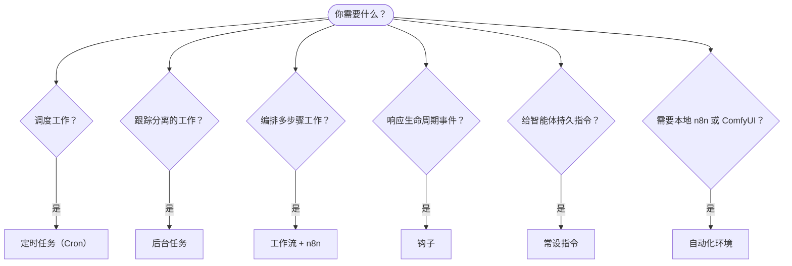

---
read_when:
  - 确定如何使用 CrawClaw 实现工作自动化
  - 在 cron、钩子、工作流、常设指令和系统事件之间做出选择
  - 寻找合适的自动化入口点
summary: 自动化机制概览：任务、cron、钩子、工作流和常设指令
title: 自动化与任务
x-i18n:
  generated_at: "2026-06-10T19:16:37Z"
  model: MiniMax-M2.7-highspeed
  provider: minimax
  source_hash: 581b40efee81213c6c1a2805f728b8123c6667c8125954cb7db171e144797c09
  source_path: automation/index.md
  workflow: 15
---

# 自动化与任务

CrawClaw 通过任务记录、定时任务、托管的自动化运行时、SDK 生命周期钩子、工作流和常设指令运行后台工作。本页面帮助你选择合适的机制并理解它们如何协同工作。

## 快速决策指南

| 用例                          | 推荐             | 原因                               |
| ----------------------------- | ---------------- | ---------------------------------- |
| 上午 9 点整发送每日报告       | 定时任务（Cron） | 精确计时，隔离执行                 |
| 20 分钟后提醒我               | 定时任务（Cron） | 一次性精确计时（`--at`）           |
| 运行每周深度分析              | 定时任务（Cron） | 独立任务，可使用不同的模型         |
| 每 30 分钟检查一次收件箱      | 定时任务（Cron） | 使用主会话 cron 作业以共享上下文   |
| 监控日历中的即将到来的事件    | 定时任务（Cron） | 显式计划，可见运行记录             |
| 检查子智能体或 ACP 运行的状态 | 后台任务         | 任务账本跟踪所有分离的工作         |
| 审计运行内容和时间            | 后台任务         | Desktop 任务账本或 Gateway API     |
| 安装或绑定本地 n8n / ComfyUI  | 自动化环境       | Desktop 管理的本地服务，带健康状态 |
| 多步骤研究然后总结            | 工作流 + n8n     | 工作流注册表加上 n8n 执行          |
| 在会话开始时添加上下文        | 钩子             | 运行前的 SDK 生命周期回调          |
| 守卫工具调用或权限            | 钩子             | 工具使用周围的 SDK 生命周期回调    |
| 在回复前始终检查合规性        | 常设指令         | 自动注入每个会话                   |

### 定时任务和主会话唤醒

| 维度       | 定时任务（Cron）                  | 主会话唤醒                        |
| ---------- | --------------------------------- | --------------------------------- |
| 计时       | 精确（cron 表达式、一次性）       | 由 cron、钩子、任务或系统事件触发 |
| 会话上下文 | 新隔离会话或共享主会话            | 完整的主会话上下文                |
| 任务记录   | 为 cron 执行创建                  | 正常交互唤醒不创建                |
| 投递       | 渠道、webhook、静默或排队到主会话 | 需要投递时内联到主会话            |
| 适用场景   | 报告、提醒、定期检查、后台作业    | 事件后续和排队的会话更新          |

新增定时自动化请使用定时任务（Cron）。当工作需要主对话上下文时，请将 cron 作业配置为唤醒主会话，而不是依赖遗留的定期 heartbeat。

## 核心概念

### 定时任务（cron）

Cron 是 Gateway 内置的精确计时调度器。它持久化作业、在正确的时间唤醒智能体，并可以将输出投递到聊天渠道或 webhook 端点。支持一次性提醒、循环表达式和入站 webhook 触发。

参见[定时任务](/automation/cron-jobs)。

### 任务

后台任务账本跟踪所有分离的工作：ACP 运行、子智能体生成、隔离的 cron 执行和 Gateway API 操作。任务是记录，不是调度器。使用 CrawClaw Desktop 或 Gateway API 检查它们。

参见[后台任务](/automation/tasks)。

### 自动化环境

自动化环境是 Desktop 中用于较重的本地自动化服务的设置区域。首个托管环境是 n8n 和 ComfyUI。Desktop 读取嵌入式运行时清单、将版本化的 GitHub 发布资产暂存到打包的运行时树中、验证安装程序校验和、使用受限环境运行安装程序、启动或停止本地服务进程、并向自动化工作区报告健康状态。

n8n 作为固定 Node 服务管理，默认为 local loopback `http://127.0.0.1:5679`。ComfyUI 作为 Python 服务管理，默认为 local loopback `http://127.0.0.1:8188`。ComfyUI 安装是基于配置文件的，因为 PyTorch wheel 因计算后端而异：Apple Metal、NVIDIA CUDA、AMD ROCm、Intel XPU、CPU 或外部用户管理的 ComfyUI 端点。

自动化环境拥有安装和本地进程生命周期。运行时可用后，工作流工具、插件和智能体仍然拥有实际的自动化调用。Cron 内置于 Gateway 调度器中，因此显示在自动化工作区中，但并非从自动化环境安装。

### 工作流和任务流

对于新的多步骤自动化，请使用 CrawClaw 工作流。Rust 工作流工具管理本地工作流注册表、工作流草稿、运行、修订和 n8n 绑定。n8n 是已部署工作流图的执行引擎；后台任务仍然是分离工作的审计账本。

任务流保留为旧版 ClawFlow 和 task-flow 文档的兼容术语。它不是当前 Gateway 中的独立通用工作流引擎。

参见[任务流](/automation/taskflow)和 [n8n 工作流架构](/reference/n8n-workflow-architecture)。

### 常设指令

常设指令授予智能体定义程序的永久操作权限。它们存在于工作区文件中（通常为 `AGENTS.md`），并自动注入每个会话。可与 cron 结合使用以实现基于时间的强制执行。

参见[常设指令](/automation/standing-orders)。

### 钩子

钩子是 SDK 生命周期回调和外部 webhook。SDK 客户端在 Gateway `initialize` 期间注册钩子回调匹配器；外部服务通过配置的 webhook 映射触发 CrawClaw。当前 Rust Gateway 不会自动发现本地 `HOOK.md` 和 `handler.ts` 模块。

参见[钩子](/automation/hooks)。

### 主会话唤醒

主会话唤醒是由 cron、钩子、后台任务完成、重启恢复、节点通知、desktop 操作或本地 Gateway API 调用请求的事件驱动轮次。它们在不依赖遗留定期 heartbeat 节奏的情况下保留主会话上下文。

有关遗留兼容性说明，请参见 [Heartbeat](/gateway/heartbeat)。

## 它们如何协同工作

- **Cron** 处理精确计划（每日报告、每周回顾）和一次性提醒。所有 cron 执行都会创建任务记录。
- **自动化环境** 为 Desktop 安装、启动、停止和健康检查本地 n8n 和 ComfyUI 服务。
- **主会话唤醒** 处理活动会话中排队的后续事件。
- **钩子** 对 SDK 生命周期事件或外部 webhook 请求作出反应。
- **常设指令** 赋予智能体持久上下文和权限边界。
- **工作流** 通过 Rust 工作流注册表和 n8n 执行协调多步骤工作。
- **任务** 自动跟踪所有分离的工作，以便你检查和审计。

## 相关

- [定时任务](/automation/cron-jobs) — 精确调度和一次性提醒
- [后台任务](/automation/tasks) — 所有分离工作的任务账本
- [ComfyUI 工具](/tools/comfyui) — 本地 ComfyUI 工作流创建和执行
- [任务流](/automation/taskflow) — 旧版 task-flow 术语的兼容边界
- [钩子](/automation/hooks) — SDK 生命周期钩子和 webhook
- [常设指令](/automation/standing-orders) — 持久智能体指令
- [Heartbeat](/gateway/heartbeat) — heartbeat 迁移说明
- [配置参考](/gateway/configuration-reference) — 所有配置键
