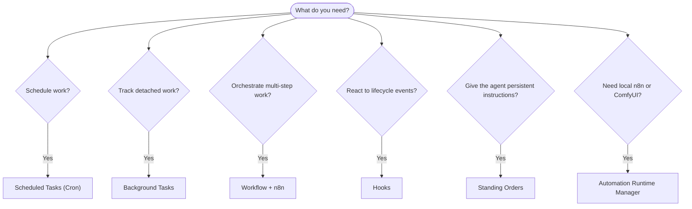

---
read_when:
  - 决定如何使用 CrawClaw 自动化工作
  - 在 cron、钩子、工作流、常设指令和系统事件之间做出选择
  - 寻找合适的自动化入口点
summary: 自动化机制概览：任务、cron、钩子、工作流和常设指令
title: 自动化 & 任务
x-i18n:
  generated_at: "2026-06-05T13:56:03Z"
  model: MiniMax-M2.7-highspeed
  provider: minimax
  source_hash: 06adf4929443364e08286a891ddddbd24b21b9a712549d06b52c6b72d428c8cb
  source_path: automation/index.md
  workflow: 15
---

# 自动化 & 任务

CrawClaw 通过任务记录、定时任务、托管自动化运行时、SDK 生命周期钩子、工作流和常设指令来运行后台工作。本页面帮助你选择合适的机制，并了解它们如何协同工作。

## 快速决策指南

| Use case                                | Recommended                | Why                                               |
| --------------------------------------- | -------------------------- | ------------------------------------------------- |
| Send daily report at 9 AM sharp         | Scheduled Tasks (Cron)     | Exact timing, isolated execution                  |
| Remind me in 20 minutes                 | Scheduled Tasks (Cron)     | One-shot with precise timing (`--at`)             |
| Run weekly deep analysis                | Scheduled Tasks (Cron)     | Standalone task, can use different model          |
| Check inbox every 30 min                | Scheduled Tasks (Cron)     | Use a main-session cron job for shared context    |
| Monitor calendar for upcoming events    | Scheduled Tasks (Cron)     | Explicit schedule, visible run records            |
| Inspect status of a subagent or ACP run | Background Tasks           | Tasks ledger tracks all detached work             |
| Audit what ran and when                 | Background Tasks           | Desktop task ledger or Gateway API                |
| Install or bind local n8n / ComfyUI     | Automation Runtime Manager | Desktop-managed local services with health status |
| Multi-step research then summarize      | Workflow + n8n             | Workflow registry plus n8n execution              |
| Add context on session start            | Hooks                      | SDK lifecycle callback before the run             |
| Guard tool calls or permissions         | Hooks                      | SDK lifecycle callback around tool use            |
| Always check compliance before replying | Standing Orders            | Injected into every session automatically         |

### 定时任务和主会话唤醒

| Dimension       | Scheduled Tasks (Cron)                               | Main-session wake                                 |
| --------------- | ---------------------------------------------------- | ------------------------------------------------- |
| Timing          | Exact (cron expressions, one-shot)                   | Triggered by cron, hooks, tasks, or system events |
| Session context | Fresh isolated session or shared main session        | Full main-session context                         |
| Task records    | Created for cron executions                          | Not created for normal interactive wakes          |
| Delivery        | Channel, webhook, silent, or queued to main session  | Inline in main session when delivery is needed    |
| Best for        | Reports, reminders, periodic checks, background jobs | Event follow-ups and queued session updates       |

使用定时任务（Cron）进行新的定时自动化。当工作需要主会话上下文时，请将 cron 任务配置为唤醒主会话，而不是依赖旧版定期心跳。

## 核心概念

### 定时任务（Cron）

Cron 是 Gateway 网关内置的调度器，用于精确计时。它持久化任务、在正确的时间唤醒智能体，并可将输出传递到聊天渠道或 webhook 端点。支持一次性提醒、循环表达式和入站 webhook 触发。

请参阅 [定时任务](/automation/cron-jobs)。

### 任务

后台任务账本追踪所有独立工作：ACP 运行、子智能体生成、独立 cron 执行和 Gateway API 操作。任务是记录，而非调度器。使用 CrawClaw Desktop 或 Gateway API 查看它们。

请参阅 [后台任务](/automation/tasks)。

### 自动化运行时管理器

Automation Runtime Manager 是 Desktop 拥有的重型本地自动化服务的生命周期层。首批托管运行时是 n8n 和 ComfyUI。Desktop 读取嵌入的运行时清单，将版本化的 GitHub release 资源分阶段放入打包的运行时树，验证安装程序校验和，在受限环境中运行安装程序，启动或停止本地服务进程，并向自动化工作区报告健康状态。

n8n 作为固定版本的 Node 服务管理，默认监听本地回环地址
`http://127.0.0.1:5679`。ComfyUI 作为 Python 服务管理，默认监听本地回环地址 `http://127.0.0.1:8188`。ComfyUI 安装按计算后端分 profile，因为 PyTorch 轮包会随后端变化：Apple Metal、NVIDIA CUDA、AMD ROCm、Intel XPU、CPU，或外部用户管理的 ComfyUI 端点。

运行时管理器负责安装和本地进程生命周期。运行时可用后，工作流工具、插件和智能体仍然负责实际的自动化调用。

### 工作流与任务流

对于新的多步骤自动化，请使用 CrawClaw 工作流。Rust 工作流工具管理本地工作流注册表、工作流草稿、运行、修订和 n8n 绑定。n8n 是已部署工作流图的执行引擎；后台任务仍然是独立工作的审计账本。

Task Flow 作为兼容性术语保留，用于旧的 ClawFlow 和 task-flow 文档。它不是当前 Gateway 网关中的独立通用工作流引擎。

请参阅 [Task Flow](/automation/taskflow) 和 [n8n 工作流架构](/reference/n8n-workflow-architecture)。

### 常设指令

常设指令授予智能体对特定程序的永久操作权限。它们保存在工作区文件中（通常为 `AGENTS.md`）并注入到每个会话中。结合 cron 可实现基于时间的执行。

请参阅 [常设指令](/automation/standing-orders)。

### 钩子

钩子是 SDK 生命周期回调和外部 webhook。SDK 客户端在 Gateway `initialize` 期间注册钩子回调匹配器；外部服务通过配置的 webhook 映射触发 CrawClaw。当前 Rust Gateway 不会自动发现本地 `HOOK.md` 和 `handler.ts` 模块。

请参阅 [钩子](/automation/hooks)。

### 主会话唤醒

主会话唤醒是由 cron、钩子、后台任务完成、重启恢复、节点通知或 CrawClaw Desktop 或本地 Gateway API 请求的事件驱动轮次。它们保持主会话上下文，而不依赖旧版定期心跳节奏。

请参阅 [心跳](/gateway/heartbeat) 了解旧版兼容性注意事项。

## 它们如何协同工作

- **Cron** 处理精确的时间安排（每日报告、每周回顾）和一次性提醒。所有 cron 执行都会创建任务记录。
- **自动化运行时管理器** 为 Desktop 安装、启动、停止和健康检查本地 n8n 和 ComfyUI 服务。
- **主会话唤醒** 处理活动会话中排队的后续事件。
- **钩子** 响应 SDK 生命周期事件或外部 webhook 请求。
- **常设指令** 为智能体提供持久上下文和权限边界。
- **工作流** 通过 Rust 工作流注册表和 n8n 执行协调多步骤工作。
- **任务** 自动追踪所有独立工作，以便你检查和审计。

## 相关资源

- [定时任务](/automation/cron-jobs) — 精确调度和一次性提醒
- [后台任务](/automation/tasks) — 独立工作的任务账本
- [ComfyUI 工具](/tools/comfyui) — 本地 ComfyUI 工作流创建和执行
- [Task Flow](/automation/taskflow) — 旧 task-flow 术语的兼容性边界
- [钩子](/automation/hooks) — SDK 生命周期钩子和 webhook
- [常设指令](/automation/standing-orders) — 持久化的智能体指令
- [心跳](/gateway/heartbeat) — Heartbeat 迁移注意事项
- [配置参考](/gateway/configuration-reference) — 所有配置键
