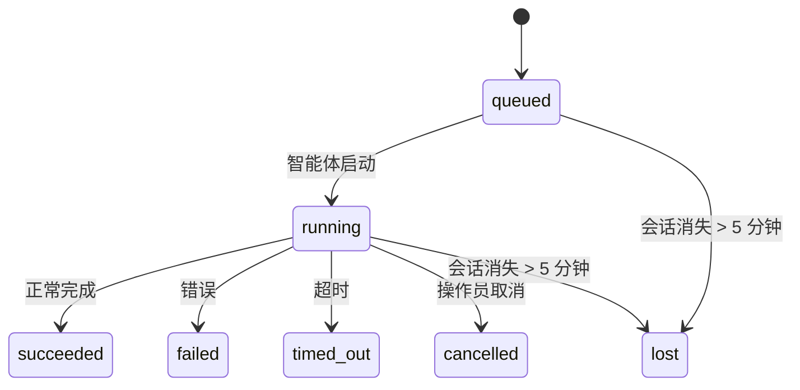

---
read_when:
  - 查看进行中或最近完成的后台工作
  - 调试分离式智能体运行的投递失败
  - 理解后台运行与会话、cron 和主会话唤醒的关系
summary: ACP 运行、子智能体、隔离 cron 作业和 Gateway API 操作的背景任务追踪
title: 后台任务
x-i18n:
  generated_at: "2026-06-05T14:02:44Z"
  model: MiniMax-M2.7-highspeed
  provider: minimax
  source_hash: 62231f0cc6818fcd8693feb94838b05d57fed899ee70d38fcc87d695ba562b24
  source_path: automation/tasks.md
  workflow: 15
---

# 后台任务

> **想了解调度？** 参见[自动化与任务](/automation)以选择合适的机制。本页面涵盖后台工作的**追踪**，而非调度。

后台任务追踪在**主会话之外**运行的工作：
ACP 运行、子智能体生成、隔离 cron 作业执行和 CLI 启动的操作。

任务**不会**替代会话、cron 作业或事件驱动的主会话唤醒

—— 它们是**活动账本**，记录分离工作的内容、时间和成功与否。

<Note>
并非每个智能体运行都会创建任务。正常的交互式聊天和事件驱动的主会话唤醒不会创建任务。所有 cron 执行、ACP 生成、子智能体生成和 CLI 智能体命令都会创建任务。
</Note>

## TL;DR

- 任务是**记录**，而非调度器 - cron、钩子和系统事件决定工作何时运行，任务追踪发生了什么。
- ACP、子智能体、所有 cron 作业和 Gateway API 操作都会创建任务。正常的主会话唤醒不会。
- 每个任务经历 `queued → running → terminal`（succeeded、failed、timed_out、cancelled 或 lost）。
- 完成通知直接投递到渠道，或排队等待下次主会话唤醒。
- CrawClaw Desktop 显示所有任务；Gateway API 提供任务列表、审计和变更操作。
- 终端记录保留 7 天，然后自动清理。

## 快速开始

使用 CrawClaw Desktop 进行交互式设置，或调用本地 Gateway API 进行自动化。

## 什么会创建任务

| 来源                  | 运行时类型 | 任务记录创建时机                        | 默认通知策略 |
| --------------------- | ---------- | --------------------------------------- | ------------ |
| ACP 后台运行          | `acp`      | 生成子 ACP 会话时                       | `done_only`  |
| 子智能体编排          | `subagent` | 通过 `sessions_spawn` 生成子智能体时    | `done_only`  |
| Cron 作业（所有类型） | `cron`     | 每次 cron 执行（主会话和隔离）          | `silent`     |
| Gateway API 操作      | `api`      | 通过 Gateway 运行的 Desktop 或 API 操作 | `silent`     |

主会话 cron 任务默认使用 `silent` 通知策略 —— 它们创建记录用于追踪，但不生成通知。隔离 cron 任务同样默认为 `silent`，但更可见，因为它们在自己的会话中运行。

**不会创建任务的情况：**

- 正常的主会话唤醒；参见 [Heartbeat](/gateway/heartbeat) 了解遗留兼容性说明
- 正常交互式聊天回合
- 直接 `/command` 响应

## 任务生命周期



| 状态        | 含义                                     |
| ----------- | ---------------------------------------- |
| `queued`    | 已创建，等待智能体启动                   |
| `running`   | 智能体回合正在执行                       |
| `succeeded` | 成功完成                                 |
| `failed`    | 因错误完成                               |
| `timed_out` | 超过配置的超时时间                       |
| `cancelled` | 通过 Desktop 或 Gateway API 被操作员停止 |
| `lost`      | 后备子会话消失（5 分钟宽限期后检测到）   |

转换自动发生 —— 当关联的智能体运行结束时，任务状态自动更新为匹配状态。

## 投递和通知

当任务达到终态时，CrawClaw 会通知你。有两条投递路径：

**直接投递** —— 如果任务有渠道目标（`requesterOrigin`），完成消息直接发送到该渠道（飞书、community chat、飞书等）。

**会话队列投递** —— 如果直接投递失败或未设置来源，更新作为系统事件排队到请求者的会话中，并在下次主会话唤醒时浮现。

<Tip>
任务完成会触发即时主会话唤醒，让你快速看到结果。
它不会等待遗留的定期心跳 tick。
</Tip>

### 通知策略

控制每个任务的通知频率：

| 策略                | 投递内容                                        |
| ------------------- | ----------------------------------------------- |
| `done_only`（默认） | 仅终态（succeeded、failed 等）—— **这是默认值** |
| `state_changes`     | 每次状态转换和进度更新                          |
| `silent`            | 完全不通知                                      |

在任务运行期间更改策略：

使用 CrawClaw Desktop 进行交互式设置，或调用本地 Gateway API 进行自动化。

## Gateway API 参考

### `tasks list`

使用 CrawClaw Desktop 进行交互式设置，或调用本地 Gateway API 进行自动化。

输出列：任务 ID、类型、状态、投递、运行 ID、子会话、摘要。

### `tasks show`

使用 CrawClaw Desktop 进行交互式设置，或调用本地 Gateway API 进行自动化。

查找令牌接受任务 ID、运行 ID 或会话密钥。显示完整记录，包括时间、投递状态、错误和终态摘要。

### `tasks cancel`

使用 CrawClaw Desktop 进行交互式设置，或调用本地 Gateway API 进行自动化。

对于 ACP 和子智能体任务，这会终止子会话。状态转换为 `cancelled` 并发送投递通知。

### `tasks notify`

使用 CrawClaw Desktop 进行交互式设置，或调用本地 Gateway API 进行自动化。

### `tasks audit`

使用 CrawClaw Desktop 进行交互式设置，或调用本地 Gateway API 进行自动化。

显示操作问题。发现问题也会在检测到时出现在 CrawClaw Desktop 或本地 Gateway API 中。

| 发现                      | 严重级别 | 触发条件                               |
| ------------------------- | -------- | -------------------------------------- |
| `stale_queued`            | warn     | 排队超过 10 分钟                       |
| `stale_running`           | error    | 运行超过 30 分钟                       |
| `lost`                    | error    | 后备会话已消失                         |
| `delivery_failed`         | warn     | 投递失败且通知策略不是 `silent`        |
| `missing_cleanup`         | warn     | 终态任务没有清理时间戳                 |
| `inconsistent_timestamps` | warn     | 时间线违规（例如结束时间早于开始时间） |

## 聊天任务看板（`/tasks`）

在任何聊天会话中使用 `/tasks` 查看链接到该会话的后台任务。看板显示活跃和最近完成的任务，包括运行时、状态、时间和进度或错误详情。

当当前会话没有可见的链接任务时，`/tasks` 回退到智能体本地任务计数，这样你仍可获得概览而不会泄露其他会话的详情。

要获取完整操作员账本，请使用 CrawClaw Desktop 或 Gateway API。

## 状态集成（任务压力）

CrawClaw Desktop 或本地 Gateway API 包含一目了然的任务摘要：

```
Tasks: 3 queued · 2 running · 1 issues
```

摘要报告：

- **active** — `queued` + `running` 的计数
- **failures** — `failed` + `timed_out` + `lost` 的计数
- **byRuntime** — 按 `acp`、`subagent`、`cron`、`cli` 分类

`/status` 和 `session_status` 工具都使用清理感知任务快照：优先显示活跃任务，隐藏陈旧的已完成行，只有当没有活跃工作时才浮现近期失败。这让状态卡片聚焦于当前重要的事项。

## 存储与维护

### 任务存储位置

任务记录持久化在 SQLite 中：

```
$CRAWCLAW_STATE_DIR/tasks/runs.sqlite
```

注册表在 gateway 启动时加载到内存中，并将写入同步到 SQLite 以实现跨重启的持久化。

### 自动维护

每 **60 秒** 运行一个清理器，处理三件事：

1. **协调** — 检查活跃任务的后备会话是否仍存在。如果子会话消失超过 5 分钟，任务标记为 `lost`。
2. **清理盖章** — 在终态任务上设置 `cleanupAfter` 时间戳（endedAt + 7 天）。
3. **修剪** — 删除超过 `cleanupAfter` 日期的记录。

**保留期**：终态任务记录保留 **7 天**，然后自动修剪。无需配置。

## 任务与其他系统的关系

### 任务和工作流

CrawClaw 工作流管理多步骤自动化资产和 n8n 执行绑定。任务仍然是运行、状态、通知和清理的分离工作账本。使用 Desktop 或 Gateway API 检查工作流、cron 作业、子智能体或 API 操作在主会话外运行时的任务记录。

参见 [Task Flow](/automation/taskflow) 了解旧任务流语言与当前工作流的兼容性边界。

### 任务和 cron

Cron 作业**定义**位于 `~/.crawclaw/cron/jobs.json`。**每次** cron 执行都会创建任务记录 —— 包括主会话和隔离。主会话 cron 任务默认使用 `silent` 通知策略，以便追踪而不生成通知。

参见 [Cron 作业](/automation/cron-jobs)。

### 任务和主会话唤醒

主会话唤醒不会创建任务记录。任务完成时，它可以触发唤醒，让你及时看到结果。

参见 [Heartbeat](/gateway/heartbeat) 了解遗留兼容性说明。

### 任务和会话

任务可能引用 `childSessionKey`（工作运行位置）和 `requesterSessionKey`（启动者）。会话是会话上下文；任务是在此之上的活动追踪。

### 任务和智能体运行

任务的 `runId` 链接到执行工作的智能体运行。智能体生命周期事件（启动、结束、错误）自动更新任务状态 —— 你无需手动管理生命周期。

## 相关

- [自动化与任务](/automation) — 所有自动化机制一览
- [Task Flow](/automation/taskflow) — 旧任务流术语的兼容性边界
- [定时任务](/automation/cron-jobs) — 调度后台工作
- [Heartbeat](/gateway/heartbeat) — heartbeat 迁移说明
- [后台任务](/automation/tasks#gateway-api-reference) — API 参考
