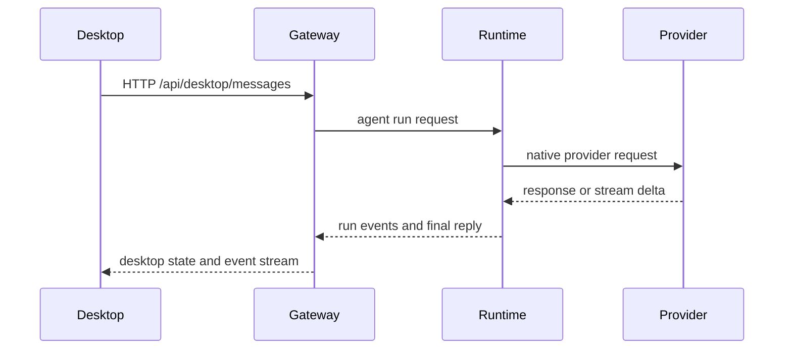

---
read_when:
  - Working on Gateway protocol, desktop runtime, clients, or transports
summary: Desktop-first local Gateway architecture, Rust runtime boundaries, and client flows
title: Gateway 架构
x-i18n:
  generated_at: "2026-05-22T04:20:44Z"
  model: MiniMax-M2.7-highspeed
  provider: minimax
  source_hash: c3ca4c044ad5f9153d5ed367019fc8308e02ec50b1146ed9dde5c188c245773b
  source_path: concepts/architecture.md
  workflow: 15
---

# Gateway 架构

## 概述

CrawClaw 以 Desktop 为核心，采用本地优先架构。CrawClaw Desktop 负责设置、状态、日志、诊断、插件可见性和本地 Gateway 网关生命周期。Gateway 网关是本地控制平面，提供 HTTP、WebSocket、OpenAI 兼容 API、渠道路由、会话、凭证和运行时状态。

产品运行时归 Rust 所有：

- `crates/crawclaw-gateway` 负责 Gateway 协议、凭证、HTTP/WS 服务和面向客户端的 API 边界。
- `crates/crawclaw-runtime` 负责智能体循环、记忆、cron、运行时工具、本机插件注册接线、运行时布局和运行时状态。
- `crates/crawclaw-providers` 负责提供商元数据、模型规范化和本机提供商请求/流解析。
- `crates/crawclaw-channels` 负责本机渠道描述符、投递能力和 Desktop 渠道配置元数据。
- `crates/crawclaw-plugin-sdk` 是公开的 Rust 插件编写契约。

TypeScript 保留在 Desktop 渲染器、文档托管工具和 npm 打包层中，因为它是有意成为 UI/构建工作流的一部分。Node 和 npm 现已通过 repo-tools 适配器层路由；它们不是生产插件运行时契约。

## 组件和流程

### CrawClaw Desktop

- 启动并监督本地 Gateway 网关/运行时二进制文件。
- 从 `/api/desktop/*` 读取 Desktop API 状态。
- 展示提供商、插件、渠道、会话、记忆和诊断界面。
- 使用 Rust/Tauri 契约生成的 Desktop API 类型。

### Gateway 网关

- 暴露 HTTP、WebSocket 和 OpenAI 兼容端点。
- 应用本地凭证、配对、允许列表和路由策略。
- 将渠道消息规范化为类型化运行时请求。
- 发出状态、消息、会话和运行时更新的 Desktop 和协议事件。

### 运行时

- 执行智能体轮次、记忆操作、cron 作业、运行时工具和本机插件操作。
- 从 Rust crate 读取提供商和渠道契约。
- 将 repo/构建/发布工具保留在产品运行时 crate 之外。

### 维护者工具

构建、发布、文档检查、生成的基线发射器、GitHub 辅助工具和 Node/npm 工具包装器位于 `crates/crawclaw-repo-tools` 中。首选维护者入口点是聚合 profile，如 `crawclaw-repo-tools check --profile local`、`crawclaw-repo-tools build --profile package` 和 `crawclaw-repo-tools release-check`。该 crate 可以调用产品 crate 来读取目录或暂存工件，但产品运行时代码不拥有维护者命令实现。

## 本地客户端流程

## 线协议摘要

- WebSocket 客户端通过 Gateway 协议握手连接。
- HTTP Desktop 客户端使用 `/api/desktop/*`。
- OpenAI 兼容客户端使用本地 Gateway 兼容端点。
- 协议变更归 Rust Gateway 契约和生成的 schema 所有。

详情：[Gateway 协议](/gateway/protocol)、[渠道](/channels)、[安全](/gateway/security)。

## 不变式

- CrawClaw Desktop 是主要用户入口。
- 本地 Gateway 网关是产品控制平面边界。
- 公共插件编写通过清单元数据和 Rust 插件 SDK 完成。
- 本机提供商和渠道行为保留在 Rust 拥有的契约中。
- 仓库自动化属于 `crawclaw-repo-tools`，不属于 `crawclaw-runtime`。

## 相关

- [智能体循环](/concepts/agent-loop)
- [Gateway 协议](/gateway/protocol)
- [渠道](/channels)
- [队列](/concepts/queue)
- [安全](/gateway/security)
