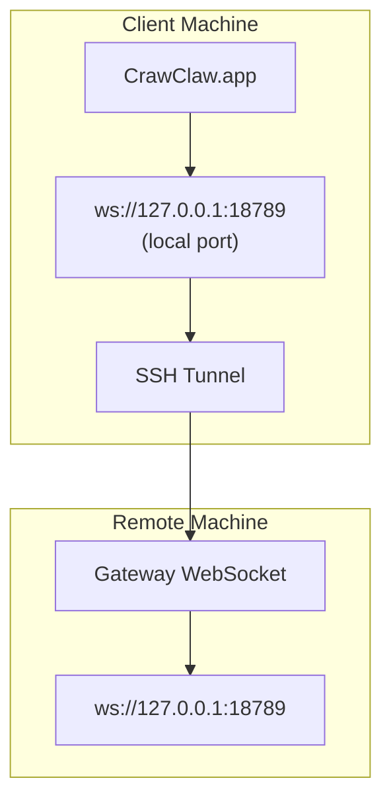

> 此内容已合并到 [远程访问](/gateway/remote#macos-persistent-ssh-tunnel-via-launchagent)。请参阅该页面获取当前指南。

# 使用远程 Gateway 网关运行 CrawClaw.app

CrawClaw.app 使用 SSH 隧道连接到远程 Gateway 网关。本指南将向你展示如何进行设置。

## 概览



## 快速设置

### 步骤 1：添加 SSH 配置

编辑 `~/.ssh/config` 并添加：

```ssh
Host remote-gateway
    HostName <REMOTE_IP>          # e.g., 172.27.187.184
    User <REMOTE_USER>            # e.g., jefferson
    LocalForward 18789 127.0.0.1:18789
    IdentityFile ~/.ssh/id_rsa
```

替换 `<REMOTE_IP>` 和 `<REMOTE_USER>` 使用你的实际值。

### 步骤 2：复制 SSH 密钥

将你的公钥复制到远程机器（输入一次密码）：

```bash
ssh-copy-id -i ~/.ssh/id_rsa <REMOTE_USER>@<REMOTE_IP>
```

### 步骤 3：设置 Gateway 令牌

```bash
launchctl setenv CRAWCLAW_GATEWAY_TOKEN "<your-token>"
```

### 步骤 4：启动 SSH 隧道

```bash
ssh -N remote-gateway &
```

### 步骤 5：重启 CrawClaw.app

```bash
# Quit CrawClaw.app (⌘Q), then reopen:
open /path/to/CrawClaw.app
```

CrawClaw.app 现在将通过 SSH 隧道连接到远程 Gateway 网关。

---

## 登录时自动启动隧道

要让 SSH 隧道在登录时自动启动，请创建一个 Launch Agent。

### 创建 PLIST 文件

保存为 `~/Library/LaunchAgents/ai.crawclaw.ssh-tunnel.plist`：

```xml
<?xml version="1.0" encoding="UTF-8"?>
<!DOCTYPE plist PUBLIC "-//Apple//DTD PLIST 1.0//EN" "http://www.apple.com/DTDs/PropertyList-1.0.dtd">
<plist version="1.0">
<dict>
    <key>Label</key>
    <string>ai.crawclaw.ssh-tunnel</string>
    <key>ProgramArguments</key>
    <array>
        <string>/usr/bin/ssh</string>
        <string>-N</string>
        <string>remote-gateway</string>
    </array>
    <key>KeepAlive</key>
    <true/>
    <key>RunAtLoad</key>
    <true/>
</dict>
</plist>
```

### 加载 Launch Agent

```bash
launchctl bootstrap gui/$UID ~/Library/LaunchAgents/ai.crawclaw.ssh-tunnel.plist
```

隧道现在将：

- 在登录时自动启动
- 崩溃时自动重启
- 保持后台运行

遗留说明：移除任何残留 `com.crawclaw.ssh-tunnel` LaunchAgent（如果存在）。

---

## 故障排除

**检查隧道是否正在运行：**

```bash
ps aux | grep "ssh -N remote-gateway" | grep -v grep
lsof -i :18789
```

**重启隧道：**

```bash
launchctl kickstart -k gui/$UID/ai.crawclaw.ssh-tunnel
```

**停止隧道：**

```bash
launchctl bootout gui/$UID/ai.crawclaw.ssh-tunnel
```

---

## 工作原理

| Component                            | What It Does                                                 |
| ------------------------------------ | ------------------------------------------------------------ |
| `LocalForward 18789 127.0.0.1:18789` | Forwards local port 18789 to remote port 18789               |
| `ssh -N`                             | SSH without executing remote commands (just port forwarding) |
| `KeepAlive`                          | Automatically restarts tunnel if it crashes                  |
| `RunAtLoad`                          | Starts tunnel when the agent loads                           |

CrawClaw.app 连接到 `ws://127.0.0.1:18789` CrawClaw.app 在你的客户端机器上连接到 <local loopback>。SSH 隧道将该连接转发到运行 Gateway 网关的远程机器的 18789 端口。
