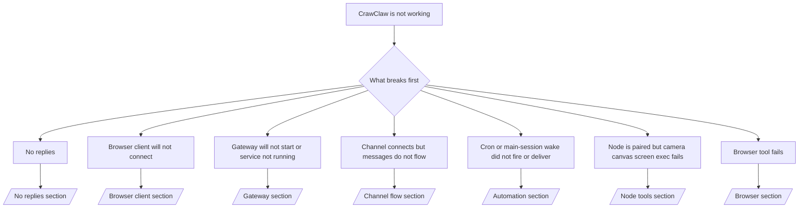

---
read_when:
  - CrawClaw 无法工作，需要最快的修复路径
  - 想要在深入查看详细手册前进行分类排查
summary: CrawClaw 症状优先故障排除中心
title: 常见故障排除
x-i18n:
  generated_at: "2026-05-22T03:00:56Z"
  model: MiniMax-M2.7-highspeed
  provider: minimax
  source_hash: b5f920dcb764a45e63ccbf2c40bbc37fb107df49f019404804a3c85913b62b55
  source_path: help/troubleshooting.md
  workflow: 15
---

# 故障排除

如果你只有 2 分钟，把本页作为分诊入口。

## 最初的六十秒

按顺序执行以下确切的排查步骤：

使用 CrawClaw Desktop 进行交互式设置，或通过本地 Gateway API 自动化。

正常输出的判断标准：

- CrawClaw Desktop 或 local loopback Gateway API → 显示已配置的渠道，无明显认证错误。
- CrawClaw Desktop 或 local loopback Gateway API → 完整报告存在且可分享。
- CrawClaw Desktop 或 local loopback Gateway API → 预期 gateway 目标可访问（`Reachable: yes`）。`RPC: limited - missing scope: operator.read` 是降级的诊断状态，不是连接失败。
- CrawClaw Desktop 或 local loopback Gateway API → `Runtime: running` 且 `RPC probe: ok`。
- CrawClaw Desktop 或 local loopback Gateway API → 无阻止性的配置/服务错误。
- CrawClaw Desktop 或 local loopback Gateway API → 渠道报告 `connected` 或 `ready`。
- CrawClaw Desktop 或 local loopback Gateway API → 活动稳定，无重复的致命错误。

## Anthropic long context 429

如果你看到：
`HTTP 429: rate_limit_error: Extra usage is required for long context requests`,
请访问 [/gateway/troubleshooting#anthropic-429-extra-usage-required-for-long-context](/gateway/troubleshooting#anthropic-429-extra-usage-required-for-long-context)。

## 插件安装失败，旧的 executable 条目

如果安装失败是因为某个包依赖 `crawclaw.extensions`，说明该插件包使用了 CrawClaw 不再接受的旧 TypeScript 运行时结构。

在插件包中修复：

1. 删除旧的 JavaScript 扩展条目。
2. 将插件重新构建为 Rust 原生插件描述符。
3. 重新发布插件，然后再次运行 CrawClaw Desktop 或 local loopback Gateway API。

示例：

```json crawclaw.plugin.json
{
  "id": "my-plugin",
  "name": "My Plugin",
  "description": "Adds a native capability to CrawClaw",
  "native": {
    "protocol": "crawclaw-native-plugin-jsonrpc",
    "schemaVersion": 1,
    "bin": "./target/release/my-plugin"
  }
}
```

参考：[插件架构](/plugins/architecture)

## 决策树



<AccordionGroup>
  <Accordion title="无回复">
    使用 CrawClaw Desktop 进行交互式设置，或通过本地 Gateway API 自动化。

    正常输出的判断标准：

    - `Runtime: running`
    - `RPC probe: ok`
    - 你的渠道在 `channels status --probe` 中显示 connected/ready
    - 发送者显示已批准（或私信策略为 open/allowlist）

    常见日志特征：

    - `drop guild message (mention required` → 提及门控在 community chat 中阻止了消息。
    - `pairing request` → 发送者未批准，等待私信配对批准。
    - `blocked` / `allowlist` 在渠道日志中 → 发送者、房间或群组被过滤。

    深入页面：

    - [/gateway/troubleshooting#no-replies](/gateway/troubleshooting#no-replies)
    - [/channels/troubleshooting](/channels/troubleshooting)
    - [/channels/pairing](/channels/pairing)

  </Accordion>

  <Accordion title="浏览器客户端无法连接">
    使用 CrawClaw Desktop 进行交互式设置，或通过本地 Gateway API 自动化。

    正常输出的判断标准：

    - 在你选择的访问路径中显示一个可访问的客户端目标
    - `RPC probe: ok`
    - 日志中无认证循环

    常见日志特征：

    - `AUTH_TOKEN_MISMATCH` → token/password 错误或认证模式不匹配。
    - `gateway connect failed:` → 客户端指向了错误的 URL/端口或 gateway 不可达。

    深入页面：

    - [/gateway/troubleshooting#browser-client-connectivity](/gateway/troubleshooting#browser-client-connectivity)
    - [/gateway/authentication](/gateway/authentication)

  </Accordion>

  <Accordion title="Gateway 无法启动或服务已安装但未运行">
    使用 CrawClaw Desktop 进行交互式设置，或通过本地 Gateway API 自动化。

    正常输出的判断标准：

    - `Service: ... (loaded)`
    - `Runtime: running`
    - `RPC probe: ok`

    常见日志特征：

    - `Gateway start blocked: set gateway.mode=local` → gateway 模式未设置或为 remote。
    - `refusing to bind gateway ... without auth` → 在非 loopback 绑定时没有 token/password。
    - `another gateway instance is already listening` 或 `EADDRINUSE` → 端口已被占用。

    深入页面：

    - [/gateway/troubleshooting#gateway-runtime-not-reachable](/gateway/troubleshooting#gateway-runtime-not-reachable)
    - [/gateway/background-process](/gateway/background-process)
    - [/gateway/configuration](/gateway/configuration)

  </Accordion>

  <Accordion title="渠道连接但消息不流转">
    使用 CrawClaw Desktop 进行交互式设置，或通过本地 Gateway API 自动化。

    正常输出的判断标准：

    - 渠道传输已连接。
    - 配对/允许列表检查通过。
    - 在需要的地方检测到提及。

    常见日志特征：

    - `mention required` → 群组提及门控阻止了处理。
    - `pairing` / `pending` → 私信发送者尚未批准。
    - `not_in_channel`、`missing_scope`、`Forbidden`、`401/403` → 渠道权限 token 问题。

    深入页面：

    - [/gateway/troubleshooting#channel-connected-messages-not-flowing](/gateway/troubleshooting#channel-connected-messages-not-flowing)
    - [/channels/troubleshooting](/channels/troubleshooting)

  </Accordion>

  <Accordion title="Cron 或 main-session wake 未触发或未投递">
    使用 CrawClaw Desktop 进行交互式设置，或通过本地 Gateway API 自动化。

    正常输出的判断标准：

    - `cron.status` 显示已启用且有下一次唤醒时间。
    - `cron runs` 显示最近的 `ok` 条目。
    - 通过 CrawClaw Desktop 或 local loopback Gateway API 可以看到排队的 main-session wake 事件。

    常见日志特征：

    - `cron: scheduler disabled; jobs will not run automatically` → cron 被禁用。
    - `requests-in-flight` → 主通道忙；wake 被推迟。
    - `unknown accountId` → 遗留 heartbeat 投递目标账户不存在。

    深入页面：

    - [/gateway/troubleshooting#cron-and-main-session-wake-delivery](/gateway/troubleshooting#cron-and-main-session-wake-delivery)
    - [/automation/cron-jobs#troubleshooting](/automation/cron-jobs#troubleshooting)
    - [/gateway/heartbeat](/gateway/heartbeat)

  </Accordion>

  <Accordion title="Exec 突然要求批准">
    使用 CrawClaw Desktop 进行交互式设置，或通过本地 Gateway API 自动化。

    发生了什么变化：

    - 如果 `tools.exec.host` 未设置，默认为 `auto`。
    - `host=auto` 仅做路由；无提示的"YOLO"行为来自 Gateway 主机上的 `security=full` 加 `ask=off`。
    - 在 `gateway` 上，未设置的 `tools.exec.security` 默认为 `full`。
    - 未设置的 `tools.exec.ask` 默认为 `off`。
    - 结果：如果你看到批准提示，说明某些主机本地或每会话策略收紧了 exec，远离了当前默认值。

    恢复当前默认的无批准行为：

    使用 CrawClaw Desktop 进行交互式设置，或通过本地 Gateway API 自动化。

    更安全的替代方案：

    - 如果你只想稳定的主机路由，只设置 `tools.exec.host=gateway`。
    - 如果你想要主机 exec 但仍想对允许列表缺失进行审查，使用 `security=allowlist` 加 `ask=on-miss`。

    常见日志特征：

    - `Approval required.` → 命令在等待 `/approve ...`。
    - `SYSTEM_RUN_DENIED: approval required` → gateway exec 批准待处理。

    深入页面：

    - [/tools/exec](/tools/exec)
    - [/tools/exec-approvals](/tools/exec-approvals)
    - [安全](/gateway/security)

  </Accordion>

  <Accordion title="浏览器工具失败">
    使用 CrawClaw Desktop 进行交互式设置，或通过本地 Gateway API 自动化。

    从当前智能体或 Gateway `/tools/invoke` 路径，使用 `browser` 工具运行
    `{ "action": "status", "profile": "crawclaw" }`。

    正常输出的判断标准：

    - 浏览器工具状态显示 `running: true` 和选定的浏览器/配置文件。
    - `crawclaw` 启动，或远程 CDP 配置文件可访问。

    常见日志特征：

    - 浏览器工具缺失/不可用，而 `browser.enabled=true` → `plugins.allow` 已设置且不包含 `browser`。
    - `Failed to start Chrome CDP on port` → 本地浏览器启动失败。
    - `browser.executablePath not found` → 配置的二进制路径错误。
    - `Remote CDP for profile "<name>" is not reachable` → 配置的远程 CDP 端点不可达。

    深入页面：

    - [/gateway/troubleshooting#browser-tool-fails](/gateway/troubleshooting#browser-tool-fails)
    - [/tools/browser#missing-browser-tool](/tools/browser#missing-browser-tool)
    - [/tools/browser-linux-troubleshooting](/tools/browser-linux-troubleshooting)

  </Accordion>
</AccordionGroup>

## 相关

- [常见问题](/help/faq) — 常见问题
- [Gateway 故障排除](/gateway/troubleshooting) — gateway 特定问题
- [Doctor](/gateway/doctor) — 自动化健康检查和修复
- [渠道故障排除](/channels/troubleshooting) — 渠道连接问题
- [自动化故障排除](/automation/cron-jobs#troubleshooting) — cron 和 wake 问题
