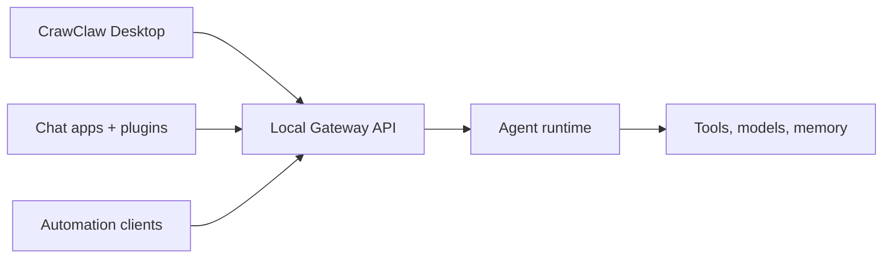

---
read_when:
  - 向新用户介绍 CrawClaw
summary: CrawClaw 是一个多渠道 AI 智能体 Gateway 网关，可在任何操作系统上运行。
title: CrawClaw
x-i18n:
  generated_at: "2026-02-04T17:53:40Z"
  model: claude-opus-4-5
  provider: pi
  source_hash: fc8babf7885ef91d526795051376d928599c4cf8aff75400138a0d7d9fa3b75f
  source_path: index.md
  workflow: 15
---

# CrawClaw 🦀

<p align="center">
    
    
</p>

> _"去壳！去壳！"_ — 大概是一只太空龙虾说的

<p align="center">
  <strong>适用于任何操作系统的 AI 智能体 Gateway 网关，支持 Weixin、Feishu、QQBot、Weixin 等。</strong><br />
  发送消息，随时随地获取智能体响应。通过插件可添加 Feishu 等更多渠道。
</p>

<Columns>
  <Card title="入门指南" href="/start/getting-started" icon="rocket">
    安装 CrawClaw Desktop 并启动本地 Gateway。
  </Card>
  <Card title="Desktop 设置" href="/install/desktop" icon="sparkles">
    通过 desktop UI 配置模型、plugins、日志和诊断。
  </Card>
  <Card title="Gateway API" href="/gateway/protocol" icon="terminal">
    自动化客户端通过本地 Gateway API 连接。
  </Card>
</Columns>

CrawClaw 通过单个 Gateway 网关进程将聊天应用、插件和自动化客户端连接到 Rust agent runtime。它为 CrawClaw 助手提供支持，并支持本地或远程部署。

## 工作原理



Gateway 网关是会话、路由和渠道连接的唯一事实来源。

## 核心功能

<Columns>
  <Card title="多渠道 Gateway 网关" icon="network">
    通过单个 Gateway 网关进程连接 Weixin、Feishu、QQBot 和 Weixin。
  </Card>
  <Card title="插件渠道" icon="plug">
    通过扩展包添加 Feishu 等更多渠道。
  </Card>
  <Card title="多智能体路由" icon="route">
    按智能体、工作区或发送者隔离会话。
  </Card>
  <Card title="媒体支持" icon="image">
    发送和接收图片、音频和文档。
  </Card>
  <Card title="终端界面" icon="terminal">
    在 CrawClaw Desktop 中进行本地聊天、会话和审批。
  </Card>
  <Card title="节点模式" icon="smartphone">
    配对节点与无头主机，支持 Canvas 与远程命令。
  </Card>
</Columns>

## 快速开始

<Steps>
  <Step title="安装 CrawClaw">
    从 [GitHub Releases](https://github.com/qianleigood/crawclaw/releases) 安装 CrawClaw Desktop。
  </Step>
  <Step title="打开 CrawClaw Desktop">
    Desktop 会准备 `~/.crawclaw`、stage embedded Rust runtime，并启动本地 Gateway。
  </Step>
  <Step title="配置模型并开始聊天">
    使用 Desktop Settings 配置模型 providers 和 plugins，然后在 Agent 页面发送消息。
  </Step>
</Steps>

需要完整的安装和开发环境设置？请参阅[入门指南](/start/getting-started)。

## 本地与远程访问

Gateway 网关启动后，可通过 CrawClaw Desktop、本地 Gateway API 或远程访问方式使用它。

- 本地：CrawClaw Desktop 和本地 Gateway API
- 远程访问：[远程访问](/gateway/remote) 和 [Tailscale](/gateway/tailscale)

## 配置（可选）

配置文件位于 `~/.crawclaw/crawclaw.json`。

- 如果你**不做任何修改**，CrawClaw 使用 Rust AgentRuntime 和 NativeProvider 路径，并按发送者创建独立会话。
- 如果你想要限制访问，可以从 `channels.weixin.allowFrom` 和（针对群组的）提及规则开始配置。

示例：

```json5
{
  channels: {
    weixin: {
      allowFrom: ["+15555550123"],
      groups: { "*": { requireMention: true } },
    },
  },
  messages: { groupChat: { mentionPatterns: ["@crawclaw"] } },
}
```

## 从这里开始

<Columns>
  <Card title="文档中心" href="/start/hubs" icon="book-open">
    所有文档和指南，按用例分类。
  </Card>
  <Card title="概念总览" href="/concepts" icon="blocks">
    系统模型、运行时、记忆、模型和消息相关的核心概念。
  </Card>
  <Card title="Gateway 运行手册" href="/gateway" icon="waypoints">
    运行、健康检查、远程访问与网关行为。
  </Card>
  <Card title="参考文档" href="/reference" icon="file-text">
    测试、发布、RPC、迁移等稳定参考资料入口。
  </Card>
  <Card title="配置" href="/gateway/configuration" icon="settings">
    核心 Gateway 网关设置、令牌和提供商配置。
  </Card>
  <Card title="远程访问" href="/gateway/remote" icon="globe">
    SSH 和 tailnet 访问模式。
  </Card>
  <Card title="渠道" href="/channels/index" icon="message-square">
    Weixin、Feishu、QQBot 等渠道的具体设置。
  </Card>
  <Card title="节点" href="/nodes" icon="smartphone">
    macOS 节点模式与无头节点的配对、Canvas 和远程命令。
  </Card>
  <Card title="帮助" href="/help" icon="life-buoy">
    常见修复方法和故障排除入口。
  </Card>
</Columns>

## 了解更多

<Columns>
  <Card title="完整功能列表" href="/concepts/features" icon="list">
    全部渠道、路由和媒体功能。
  </Card>
  <Card title="多智能体路由" href="/concepts/multi-agent" icon="route">
    工作区隔离和按智能体的会话管理。
  </Card>
  <Card title="安全" href="/gateway/security" icon="shield">
    令牌、白名单和安全控制。
  </Card>
  <Card title="故障排除" href="/gateway/troubleshooting" icon="wrench">
    Gateway 网关诊断和常见错误。
  </Card>
  <Card title="调试与维护者文档" href="/debug" icon="search-code">
    深层实现笔记、调查记录和维护者入口。
  </Card>
  <Card title="关于与致谢" href="/reference/credits" icon="info">
    项目起源、贡献者和许可证。
  </Card>
</Columns>
