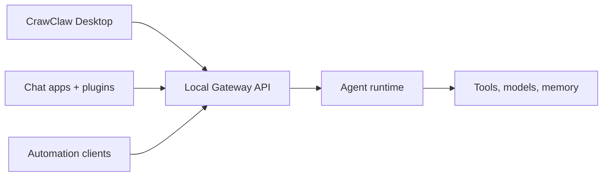

---
read_when:
  - 向新用户介绍 CrawClaw
summary: CrawClaw 是一款以桌面应用为核心的本地 AI 智能体网关。
title: CrawClaw
x-i18n:
  generated_at: "2026-06-05T14:38:42Z"
  model: MiniMax-M2.7-highspeed
  provider: minimax
  source_hash: 58c6b8f2e6dbfa0c4388c7cb016977df0d1c27872d3f3bfb7402894649129136
  source_path: index.md
  workflow: 15
---

# CrawClaw 🦀

    
    

  <strong>面向 AI 智能体的桌面优先本地 Gateway，连接聊天渠道、工具、插件和自动化。</strong> 
  通过桌面应用配置和操作 CrawClaw；通过本地 Gateway API 实现自动化。

<Columns>
  <Card title="入门指南" href="/start/getting-started" icon="rocket">
    安装 CrawClaw Desktop 并启动本地 Gateway。
  </Card>
  <Card title="Desktop" href="/install/desktop" icon="monitor">
    了解桌面应用包含、启动和管理的内容。
  </Card>
</Columns>

## 什么是 CrawClaw？

CrawClaw 是一款**本地优先的桌面 Gateway**，它将聊天渠道、工具、模型提供商、会话、记忆和插件连接到 AI 智能体。在 Apple 平台上，CrawClaw 是一个桌面应用程序，而非用户 CLI。Gateway API 始终是自动化和集成的本地控制平面边界。

**谁适合使用？** 希望在个人设备上运行个人 AI 助手，同时不放弃对数据或运行时状态控制权的开发者和高级用户。

**它有何不同？**

- **桌面优先**：一个应用统一管理设置、状态、日志、插件、模型和智能体聊天
- **本地 Gateway API**：自动化客户端通过显式 JSON 方法集成
- **多渠道**：一个 Gateway 可同时服务多个支持的渠道和配对设备
- **智能体原生**：专为工具使用、会话、记忆和多智能体路由构建
- **开源**：MIT 许可，社区驱动

## 工作原理

Gateway 是会话、路由、本地运行时状态和认证控制平面操作的唯一真实来源。

## 核心能力

<Columns>
  <Card title="桌面工作台" icon="monitor">
    配置模型、插件、状态、日志、诊断和智能体会话。
  </Card>
  <Card title="Gateway API" icon="waypoints">
    使用本地 JSON 方法进行自动化和集成。
  </Card>
  <Card title="多智能体路由" icon="route">
    按智能体、工作区或发送者隔离会话。
  </Card>
  <Card title="插件生态系统" icon="plug">
    通过原生插件、工具、渠道和提供商扩展 CrawClaw。
  </Card>
</Columns>

需要完整的安装和开发环境配置？请参阅[入门指南](/start/getting-started)。

  

## 从这里开始

<Columns>
  <Card title="文档中心" href="/start/hubs" icon="book-open">
    所有文档和指南，按使用场景组织。
  </Card>
  <Card title="概念索引" href="/concepts" icon="blocks">
    系统模型、运行时、记忆、模型和消息概念。
  </Card>
  <Card title="Gateway 协议" href="/gateway/protocol" icon="waypoints">
    面向桌面和自动化客户端的本地 API 契约。
  </Card>
  <Card title="参考文档" href="/reference" icon="file-text">
    测试、发布、RPC 和迁移的稳定参考资料。
  </Card>
  <Card title="配置" href="/gateway/configuration" icon="settings">
    核心 Gateway 设置、令牌和提供商配置。
  </Card>
  <Card title="远程访问" href="/gateway/remote" icon="globe">
    SSH 和 tailnet 访问模式。
  </Card>
  <Card title="渠道" href="/channels" icon="message-square">
    支持的聊天平台的渠道特定设置。
  </Card>
  <Card title="帮助" href="/help" icon="life-buoy">
    常见修复和故障排除入口。
  </Card>
</Columns>
