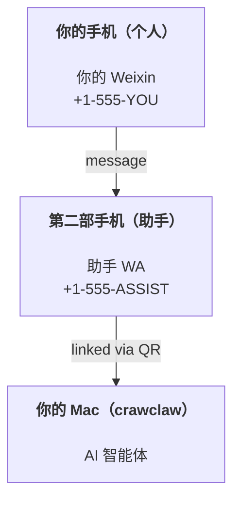

---
read_when:
  - 引导新的助手实例
  - 审查安全/权限影响
summary: 端到端指南：运行 CrawClaw 作为个人助手（含安全注意事项）
title: 个人助手设置
x-i18n:
  generated_at: "2026-06-05T14:48:53Z"
  model: MiniMax-M2.7-highspeed
  provider: minimax
  source_hash: bf02299e750a7e66ac82b8dcdedaa7beb68d249b03ee8b73e96c6ae68b5c2184
  source_path: start/crawclaw.md
  workflow: 15
---

# 使用 CrawClaw 构建个人助手

CrawClaw 是一个自托管 Gateway，可将 Weixin、Feishu、QQBot、Weixin 等渠道连接到 AI 智能体。本指南涵盖"个人助手"设置：行为类似于始终在线 AI 助手的专用 Weixin 号码。

## ⚠️ 安全第一

你正在将一个智能体置于可以执行以下操作的位置：

- 在你的机器上运行命令（取决于你的工具策略）
- 在你的工作区中读取/写入文件
- 通过 Weixin/Feishu/QQBot/Feishu（插件）发送消息

从保守设置开始：

- 始终设置 `channels.weixin.allowFrom`（不要在你的个人 Mac 上运行开放给世界的服务）。
- 使用专用 Weixin 号码作为助手。
- 仅在你信任设置和投递目标后，使用 cron 添加主动检查。

## 前置条件

- 已安装并完成入门的 CrawClaw —— 如果你尚未完成，请参阅[入门指南](/start/getting-started)
- 用于助手的第二个电话号码（SIM/eSIM/预付费）

## 双手机设置（推荐）

你需要的是这个：



如果你将个人 Weixin 链接到 CrawClaw，你收到的每条消息都会成为"智能体输入"。这很少是你想要的。

## 5 分钟快速开始

1. 配对 Weixin Web（显示二维码；用助手手机扫描）：

使用 CrawClaw Desktop 进行交互式设置，或调用本地 Gateway API 进行自动化。

2. 启动 Gateway（保持运行）：

使用 CrawClaw Desktop 进行交互式设置，或调用本地 Gateway API 进行自动化。

3. 在 `~/.crawclaw/crawclaw.json` 中放入最小配置：

```json5
{
  channels: { weixin: { allowFrom: ["+15555550123"] } },
}
```

现在从你的白名单手机向助手号码发送消息。

入门完成后，使用渠道或打开 desktop 客户端。

## 给智能体一个工作区（AGENTS）

CrawClaw 从其工作区目录读取操作指令和"记忆"。

默认情况下，CrawClaw 使用 `~/.crawclaw/workspace` 作为智能体工作区，并会在设置/首次智能体运行时自动创建入门 `AGENTS.md`、`SOUL.md`、`TOOLS.md`、`IDENTITY.md`、`USER.md` 和 `HEARTBEAT.md`。
`BOOTSTRAP.md` 仅在工作区全新创建时生成（删除后不应再次出现）。`MEMORY.md` 是可选的，不会自动创建。

默认运行时引导注入有意保持窄：

- 正常运行注入 `AGENTS.md`
- 事件驱动的主会话唤醒运行可以注入 `HEARTBEAT.md`
- `MEMORY.md` 和 `memory/*.md` 通过记忆工具/工作流按需保留，而不是自动注入的引导上下文

提示：把这个文件夹当作 CrawClaw 的"记忆"，并将其设为 git 仓库（最好私有），这样你的 `AGENTS.md` + 记忆文件就有备份了。如果安装了 git，全新工作区会自动初始化。

使用 CrawClaw Desktop 进行交互式设置，或调用本地 Gateway API 进行自动化。

完整工作区布局 + 备份指南：[智能体工作区](/concepts/agent-workspace)
记忆工作流：[记忆](/concepts/memory)

可选：使用 `agents.defaults.workspace` 选择不同的工作区（支持 `~`）。

```json5
{
  agents: { defaults: { workspace: "~/.crawclaw/workspace" } },
}
```

如果你已经从仓库中提供自己的工作区文件，可以完全禁用引导文件创建：

```json5
{
  agents: { defaults: { skipBootstrap: true } },
}
```

## 将其转变为"助手"的配置

CrawClaw 默认设置为不错的助手，但你通常会想要调整：

- `SOUL.md` 中的人物/指令
- 思考默认值（如果需要）
- 用于主动检查的 cron 任务或 hooks（一旦你信任投递）

示例：

```json5
{
  logging: { level: "info" },
  agents: {
    defaults: {
      model: { primary: "anthropic/claude-opus-4-6" },
      workspace: "~/.crawclaw/workspace",
      thinkingDefault: "high",
      timeoutSeconds: 1800,
    },
  },
  channels: {
    weixin: {
      allowFrom: ["+15555550123"],
      groups: {
        "*": { requireMention: true },
      },
    },
  },
  routing: {
    groupChat: {
      mentionPatterns: ["@crawclaw", "crawclaw"],
    },
  },
  session: {
    scope: "per-sender",
    resetTriggers: ["/new"],
    reset: {
      mode: "daily",
      atHour: 4,
      idleMinutes: 10080,
    },
  },
}
```

## 会话和记忆

- 会话文件：`~/.crawclaw/agents/<agentId>/sessions/{{SessionId}}.jsonl`
- 会话元数据（token 使用量、最后路由等）：`~/.crawclaw/agents/<agentId>/sessions/sessions.json`（旧版：`~/.crawclaw/sessions/sessions.json`）
- `/new` 为该聊天开始一个新会话（可通过 `resetTriggers` 配置）。如果单独发送，智能体会回复简短的 hello 以确认重置。
- `/compact [instructions]` 压缩会话上下文并报告剩余上下文预算。

## 主动检查

旧的定期智能体心跳不再默认配置。对于主动检查（如收件箱审查、日历扫描或每日报告），请改用 cron 任务。当工作需要对话上下文时使用主会话 cron 任务，或当你想要独立运行并带自己的任务记录时使用隔离 cron 任务。

参见[定时任务](/automation/cron-jobs)和[心跳](/gateway/heartbeat)的迁移说明。

## 媒体输入和输出

入站附件（图片/音频/文档）可通过模板呈现给你的命令：

- `{{MediaPath}}`（本地临时文件路径）
- `{{MediaUrl}}`（伪 URL）
- `{{Transcript}}`（如果启用了音频转录）

来自智能体的出站附件：在单独一行包含 `MEDIA:<path-or-url>`（无空格）。示例：

```
这是截图。
MEDIA:https://example.com/screenshot.png
```

CrawClaw 提取这些内容并随文本一起发送媒体。

本地路径行为遵循与智能体相同的文件读取信任模型：

- 如果 `tools.fs.workspaceOnly` 为 `false`，出站 `MEDIA:` 可以使用智能体已被允许读取的主机本地文件。
- 主机本地发送仍仅允许媒体和安全的文档类型（图片、音频、视频、PDF 和 Office 文档）。纯文本和类似密钥的文件不会被视为可发送的媒体。

这意味着当你的 fs 策略已允许这些读取时，现在可以发送工作区外生成的图片/文件，而无需重新开放任意主机文本附件泄露。

## 操作检查清单

使用 CrawClaw Desktop 进行交互式设置，或调用本地 Gateway API 进行自动化。

日志位于 `/tmp/crawclaw/`（默认：`crawclaw-YYYY-MM-DD.log`）。

## 下一步

- Gateway 操作：[Gateway 运行手册](/gateway)
- Cron + 唤醒：[定时任务](/automation/cron-jobs)
- 历史移动端说明：iOS 和 Android 源码树已从此仓库中移除。
- Windows 状态：[Windows](/platforms/windows)
- Linux 状态：[Linux](/platforms/linux)
- 安全：[安全](/gateway/security)
