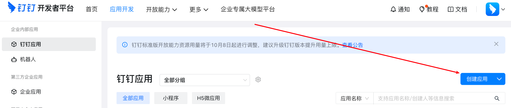
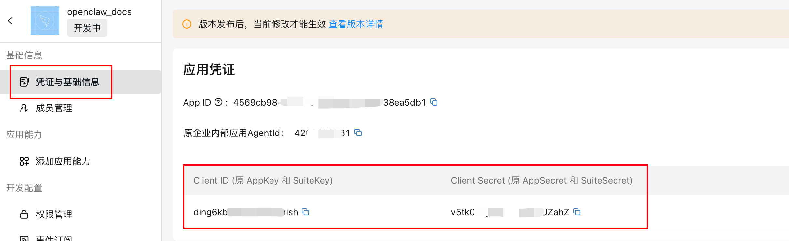
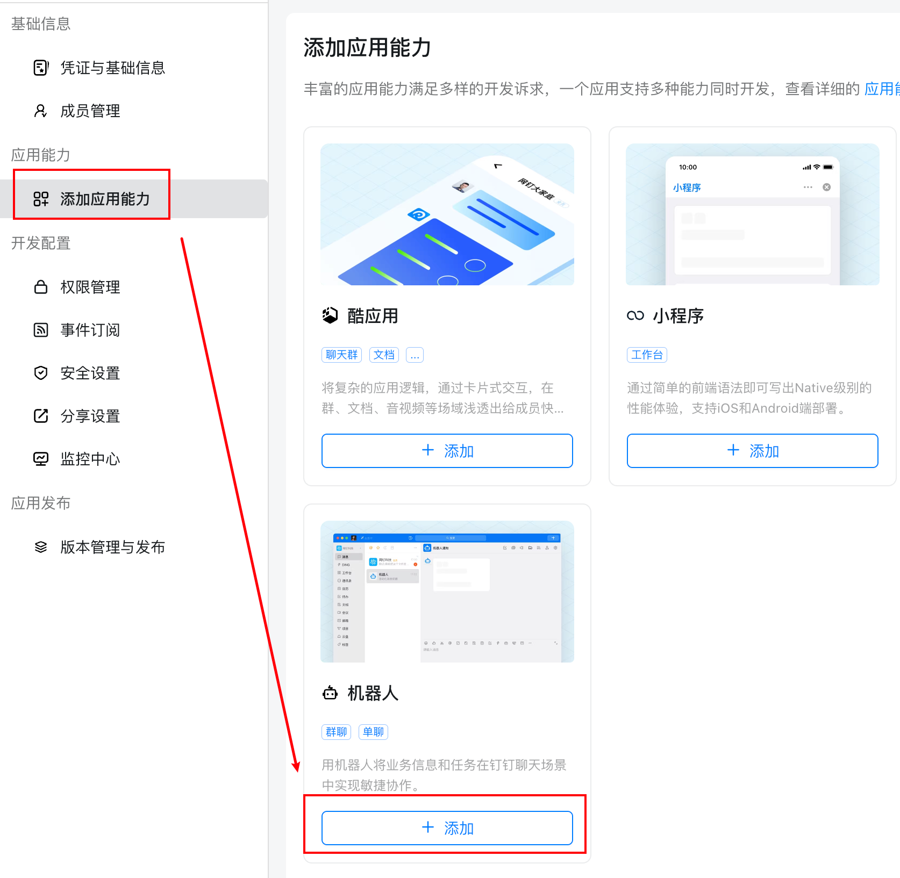
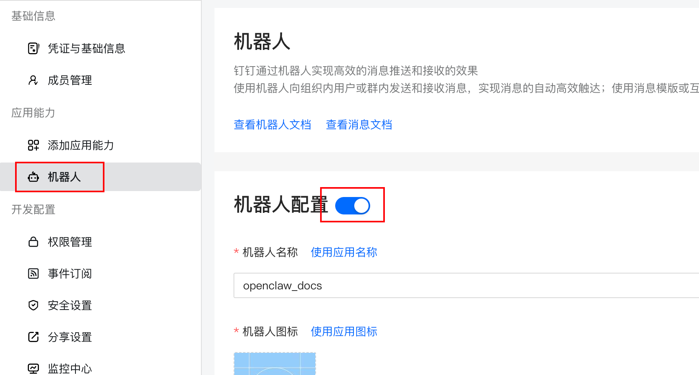
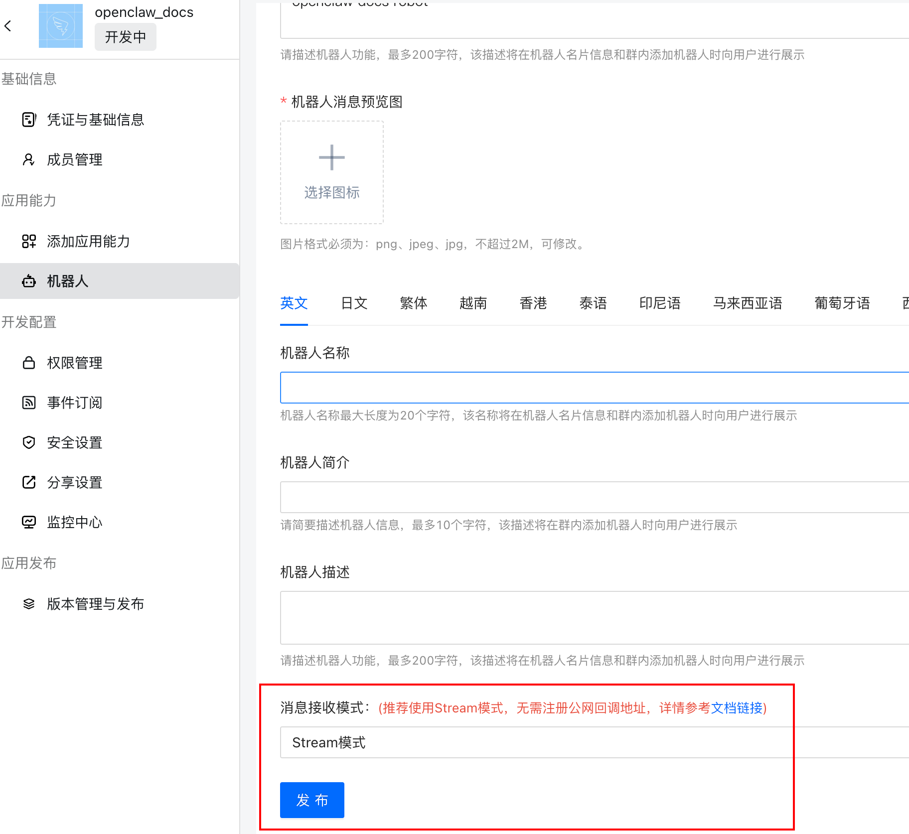
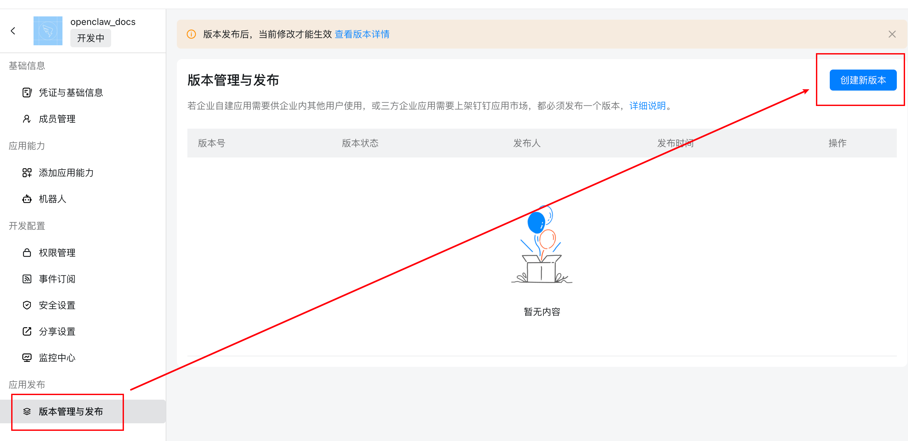
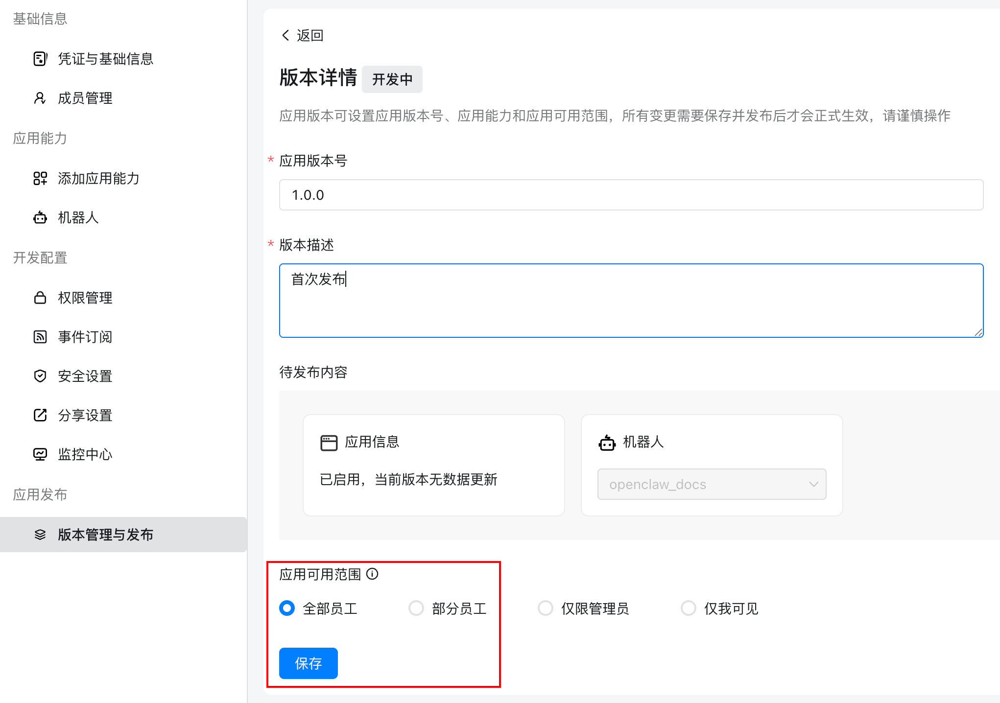
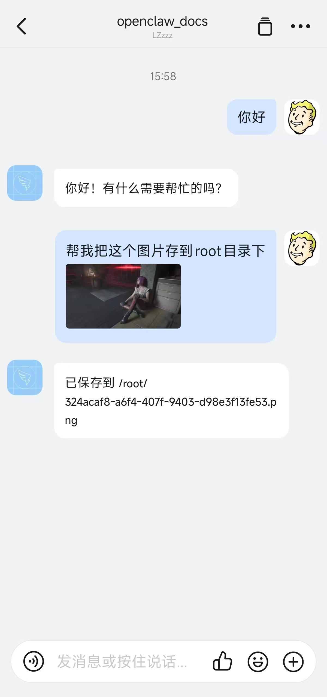

# @largezhou/ddingtalk

[English](README.en.md)

CrawClaw 钉钉（DingTalk）渠道插件，使用 Stream 模式接入企业机器人。

## 功能特点

- ✅ **Stream 模式**：无需公网 IP 和域名，开箱即用
- ✅ **多账号支持**：可同时接入多个钉钉机器人，分别配置凭证和权限
- ✅ **多 Agent 路由**：支持将不同账号、群聊、私聊绑定到不同的 Agent
- ✅ **私聊/群聊**：支持私聊，群聊（仅@机器人）
- ✅ **文本消息收发**：接收和发送文本消息
- ✅ **Markdown 回复**：机器人回复 Markdown 格式
- ✅ **图片消息收发**：接收用户发送的图片，支持发送本地/远程图片
- ✅ **音视频消息**：支持接收和发送语音、视频消息
- ✅ **文件消息**：支持接收和发送文件，以及图文混排消息
- ✅ **主动推送消息**：支持主动推送消息，可以配置提醒或定时任务
- ✅ **支持 CrawClaw 命令**：支持 /new、/compact 等 CrawClaw 官方命令

## 安装

```bash
crawclaw plugins install @largezhou/ddingtalk
```

---

## 快速开始

添加钉钉渠道有两种方式：

### 方式一：通过安装向导添加（推荐）

如果您刚安装完 CrawClaw，可以直接运行向导，根据提示添加钉钉：

```bash
crawclaw onboard
```

向导会引导您完成：

1. 创建钉钉应用机器人并获取凭证
2. 配置应用凭证
3. 启动网关

**完成配置后**，您可以使用以下命令检查网关状态：

- `crawclaw gateway status` - 查看网关运行状态
- `crawclaw logs --follow` - 查看实时日志

### 方式二：通过命令行添加

如果您已经完成了初始安装，可以用以下命令添加钉钉渠道：

```bash
crawclaw channels add
```

然后根据交互式提示选择 DingTalk，输入 AppKey (Client ID) 和 AppSecret (Client Secret) 即可。

**完成配置后**，您可以使用以下命令管理网关：

- `crawclaw gateway status` - 查看网关运行状态
- `crawclaw gateway restart` - 重启网关以应用新配置
- `crawclaw logs --follow` - 查看实时日志

---

## 第一步：创建钉钉应用

### 1. 打开钉钉开发者平台

访问 [钉钉开发者平台](https://open-dev.dingtalk.com/fe/app)，使用钉钉账号登录，选择组织进入。

### 2. 创建应用

1. 点击右上角 **创建应用**
2. 填写应用名称和描述，上传图片（可选）



### 3. 获取应用凭证

在应用的 **凭证与基础信息** 页面，复制：

- **Client ID**（格式如 `dingxxxx`）
- **Client Secret**

❗ **重要**：请妥善保管 Client Secret，不要分享给他人。



### 4. 添加应用机器人

1. 在应用的 **添加应用能力** 页面，选择 **机器人**，点击添加



2. 输入机器人相关信息，**消息接收模式** 选择 **Stream 模式**，然后保存





### 5. 配置应用权限

在应用的权限管理中，确保开通以下权限：

- 企业内机器人发送消息权限
- 根据 downloadCode 获取机器人接收消息的下载链接（用于接收图片）

### 6. 发布机器人

创建机器人版本，填入版本号、描述、应用可用范围，点击保存，点击确认发布。





---

## 第二步：配置 CrawClaw

### 通过向导配置（推荐）

运行以下命令，根据提示选择 DingTalk，粘贴 AppKey (Client ID) 和 AppSecret (Client Secret)：

```bash
crawclaw channels add
```

### 通过配置文件配置

编辑 `~/.crawclaw/crawclaw.json`：

```json
{
  "channels": {
    "ddingtalk": {
      "enabled": true,
      "clientId": "your_app_key",
      "clientSecret": "your_app_secret",
      "allowFrom": ["*"]
    }
  }
}
```

### allowFrom 白名单

`allowFrom` 控制哪些用户可以与机器人交互并执行命令：

- **默认值**：`["*"]`（不配置的情况下，默认允许所有人）
- **指定用户**：填入钉钉用户的 `staffId`，只有白名单内的用户才能使用命令（如 `/compact`、`/new` 等），白名单外的用户消息会被忽略
- `allowFrom[0]` 同时作为主动推送消息（`crawclaw send`）的默认目标

```json
{
  "allowFrom": ["用户ID_1", "用户ID_2"]
}
```

---

## 多账号配置

支持同时接入多个钉钉机器人，每个机器人对应一个独立的账号（account）。适用场景：

- 不同部门使用不同的机器人
- 同一个 CrawClaw 实例服务多个钉钉组织
- 不同机器人配置不同的权限策略

### 添加新账号

通过向导添加新账号，会交互式地提示输入账号 ID 和凭证：

```bash
crawclaw channels add
```

### 配置文件示例

编辑 `~/.crawclaw/crawclaw.json`：

```json
{
  "channels": {
    "ddingtalk": {
      "enabled": true,
      "accounts": {
        "bot-hr": {
          "name": "HR助手",
          "clientId": "dingxxxxxxxx",
          "clientSecret": "secret_1"
        },
        "bot-tech": {
          "name": "技术支持",
          "clientId": "dingyyyyyyyy",
          "clientSecret": "secret_2"
        }
      },
      "defaultAccount": "bot-hr"
    }
  }
}
```

### 群组独立配置

可以为特定群聊设置独立的权限和行为：

```json
{
  "accounts": {
    "bot-hr": {
      "enabled": true,
      "clientId": "dingxxxxxxxx",
      "clientSecret": "secret_1"
    }
  }
}
```

### 单账号兼容

如果只有一个机器人，无需使用 `accounts`，直接在顶层配置即可（兼容旧版格式）：

```json
{
  "channels": {
    "ddingtalk": {
      "enabled": true,
      "clientId": "your_app_key",
      "clientSecret": "your_app_secret"
    }
  }
}
```

---

## 多 Agent 路由

通过 CrawClaw 的路由绑定（bindings）机制，可以将不同的账号、群聊、私聊分配给不同的 Agent 处理。

> 更多关于多 Agent 的概念和用法，请参阅 [CrawClaw 官方文档 - 多 Agent](https://docs.crawclaw.ai/zh-CN/concepts/multi-agent)。

### 按账号绑定 Agent

使用命令行将不同钉钉账号绑定到不同的 Agent：

```bash
# 将 bot-hr 账号绑定到 hr-agent
crawclaw agents bind --agent hr-agent --bind ddingtalk:bot-hr

# 将 bot-tech 账号绑定到 tech-agent
crawclaw agents bind --agent tech-agent --bind ddingtalk:bot-tech

# 将整个钉钉渠道（所有账号）绑定到默认 agent
crawclaw agents bind --agent default-agent --bind ddingtalk
```

查看当前绑定：

```bash
crawclaw agents bindings
```

解除绑定：

```bash
crawclaw agents unbind --agent hr-agent --bind ddingtalk:bot-hr
```

### 按群聊/私聊绑定 Agent

CLI 命令目前仅支持 `channel[:accountId]` 级别的绑定。如需将特定群聊或私聊绑定到不同 Agent，需要手动编辑 `~/.crawclaw/crawclaw.json` 的 `bindings` 配置：

```json
{
  "agents": {
    "list": [
      { "id": "hr-agent", "name": "HR助手" },
      { "id": "tech-agent", "name": "技术支持" },
      { "id": "general-agent", "name": "通用助手" }
    ]
  },
  "bindings": [
    {
      "agentId": "tech-agent",
      "comment": "技术交流群走技术支持 Agent",
      "match": {
        "channel": "ddingtalk",
        "peer": {
          "kind": "group",
          "id": "cidTechGroup001"
        }
      }
    },
    {
      "agentId": "hr-agent",
      "comment": "张三的私聊走HR助手",
      "match": {
        "channel": "ddingtalk",
        "peer": {
          "kind": "direct",
          "id": "user_zhangsan_staffId"
        }
      }
    },
    {
      "agentId": "general-agent",
      "comment": "bot-hr 账号的其他消息走通用助手",
      "match": {
        "channel": "ddingtalk",
        "accountId": "bot-hr"
      }
    }
  ]
}
```

---

## 第三步：启动并测试

### 1. 启动网关

```bash
crawclaw gateway --verbose
```

### 2. 发送测试消息

在钉钉中找到您创建的机器人，即可正常对话。



---

## 开发

```bash
# 安装依赖
pnpm install

# 打包
pnpm pack
```

## 参考文档

- [CrawClaw 多 Agent 文档](https://docs.crawclaw.ai/zh-CN/concepts/multi-agent)
- [钉钉开放平台 - Stream 模式说明](https://opensource.dingtalk.com/developerpedia/docs/learn/stream/overview)
- [钉钉开放平台 - 机器人接收消息](https://open.dingtalk.com/document/orgapp/robot-receive-message)
- [钉钉开放平台 - 机器人发送消息](https://open.dingtalk.com/document/orgapp/robot-send-message)

## License

MIT
